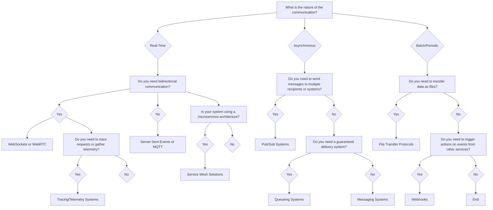

---

### 1. Real-Time Communication
   - **Overview:** This chapter would cover communication methods that require real-time or near-real-time interaction between systems or users. It includes both bidirectional and unidirectional communication.
   - **Key Topics:** WebSockets, WebRTC, Server-Sent Events, MQTT.
   - **Use Cases:** Chat applications, live data feeds, multiplayer games, IoT devices, real-time collaboration tools.
### 2. Asynchronous Communication
   - **Overview:** This chapter would focus on systems that require asynchronous message exchanges, where responses are not expected immediately, and communication can happen in the background.
   - **Key Topics:** Pub/Sub models, Queueing Systems, Messaging Systems.
   - **Use Cases:** Event-driven architectures, task queues, decoupling microservices, inter-service communication in distributed systems.
### 3. Batch/Periodic Communication
   - **Overview:** This chapter would deal with communication patterns where data is transferred in batches or periodically, such as scheduled tasks or bulk data transfer.
   - **Key Topics:** Batch Processing, File Transfer Protocols, HTTP File Uploads, Cron Jobs.
   - **Use Cases:** Data synchronization, batch processing jobs, file uploads, data dumps.
### 4. Webhooks for Event-Driven Communication
   - **Overview:** This chapter would discuss Webhooks, a popular method for event-driven communication between services, where one system notifies another system when specific events occur.
   - **Key Topics:** Webhooks, HTTP callbacks, integration patterns.
   - **Use Cases:** Real-time notification of events, external service integrations (e.g., payment gateways, GitHub push notifications).
### 5. Tracing and Telemetry
   - **Overview:** This chapter would focus on collecting and analyzing telemetry data to monitor the health, performance, and behavior of distributed systems. It would cover tracing, logging, and observability tools.
   - **Key Topics:** OpenTelemetry, Jaeger, Zipkin, Distributed Tracing.
   - **Use Cases:** Monitoring microservices, debugging distributed applications, tracking requests across services.
### 6. Service Mesh for Microservices Communication
   - **Overview:** This chapter would discuss Service Mesh solutions, which provide infrastructure-level communication management, such as load balancing, service discovery, security, and observability between microservices.
   - **Key Topics:** Istio, Linkerd, Service Mesh architecture, Sidecar proxy patterns.
   - **Use Cases:** Microservices architectures, managing complex service-to-service communication in distributed systems.
### 7. Guaranteed Delivery Communication
   - **Overview:** This chapter would cover messaging patterns where reliability and guaranteed delivery are paramount. These include message queues and persistent storage for messages.
   - **Key Topics:** RabbitMQ, Amazon SQS, Guaranteed Delivery, Retry Logic.
   - **Use Cases:** High-availability systems, reliable message delivery, decoupled communication with persistence.
### 8. Pub/Sub Communication Patterns
   - **Overview:** This chapter would delve deeper into publish/subscribe models, which allow messages to be broadcast to multiple subscribers. This pattern is particularly effective for event-driven and scalable architectures.
   - **Key Topics:** Kafka, Google Cloud Pub/Sub, Redis Pub/Sub.
   - **Use Cases:** Real-time event broadcasting, decoupled communication between services, log aggregation.

