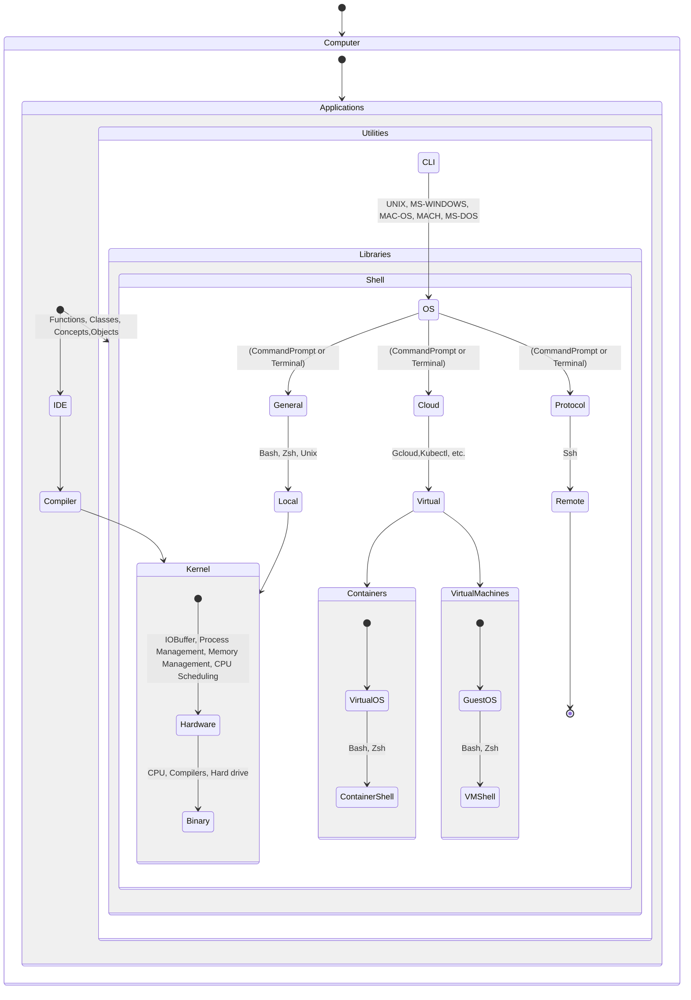

import Tabs from '@theme/Tabs';
import TabItem from '@theme/TabItem';

Software Architecture (e.g., monolithic vs microservices, layered architecture)
Data Architecture (e.g., data warehousing, ELT vs ETL)
Cloud Architecture (e.g., serverless, distributed systems)
Infrastructure as Code (e.g., Terraform, Ansible, CloudFormation)

<Tabs>
<TabItem value="hardware" label="Computer System Architecture">

</TabItem>

</Tabs>