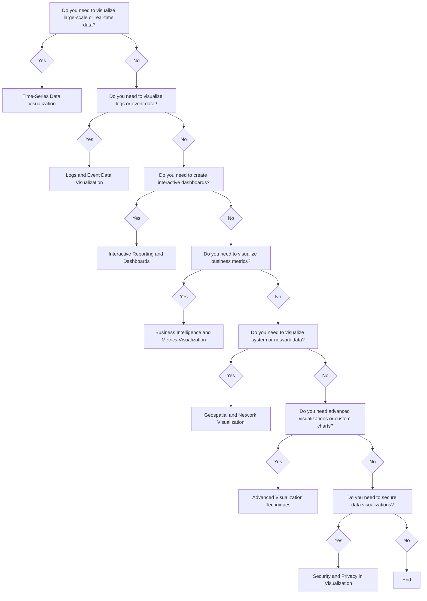

Data Pipelines (e.g., Apache Airflow, Luigi, Prefect)
ETL/ELT (e.g., Extract, Load, Transform concepts)
Data Warehousing (e.g., Snowflake, BigQuery, Redshift)
Data Governance & Quality (e.g., data lineage, data quality frameworks)

---
title: "Data Visualisation"
sidebar_position: 1
---

---
### 1. Introduction to Data Visualization
   - **Overview:** This section would introduce the concept of data visualization, explaining its importance for understanding large datasets, making decisions, and communicating insights effectively.
   - **Key Topics:** Importance of visualization in data analysis.
   The role of data visualization in monitoring, reporting, and decision-making.
   - **Use Cases:**
   Dashboards for system health and performance.
   Business intelligence for KPIs and financial reporting.
   Visualizing metrics, logs, and application data.
### 2. Dashboards and Interactive Reporting
   - **Overview:** This section covers tools and techniques for creating comprehensive dashboards and interactive reports that allow users to explore data.
   - **Key Topics:** Dashboard design principles: usability, simplicity, clarity.
   - **Tools:**  Grafana, Tableau, Power BI, Google Data Studio.
   - **Use Cases:**
   Real-time monitoring dashboards (system health, application performance).
   Interactive business reports (sales, customer engagement, revenue metrics).
   Custom user dashboards for different departments or stakeholders.
### 3. Time-Series Data Visualization
   - **Overview:** Focuses on visualizing data that is tracked over time, which is essential for monitoring system metrics, IoT data, and real-time analytics.
   - **Key Topics:** Time-series databases (e.g., Prometheus, InfluxDB).
   Visualization - **Tools:**  Grafana, Kibana.
   Types of visualizations: line charts, bar charts, heatmaps, histograms.
   - **Use Cases:**
   Monitoring CPU usage, latency, and other system metrics.
   Visualizing real-time data streams in dashboards.
   Detecting performance trends and anomalies over time.
### 4. Visualizing Logs and Event Data
   - **Overview:** Discusses how to visualize logs and event-driven data, which is essential for troubleshooting, performance analysis, and alerting.
   - **Key Topics:** Log aggregators and storage (e.g., Elasticsearch, Logstash, Kibana).
   Log data visualizations: filtering, searching, and aggregation.
   Creating log-based dashboards for application health and errors.
   - **Use Cases:**
   Real-time error tracking and application performance monitoring.
   Root cause analysis and debugging using visualized logs.
   Event correlation across different services and systems.
### 5. Business Intelligence (BI) and Reporting
   - **Overview:** Focuses on visualizing business data such as sales, marketing, and customer engagement metrics. The goal is to communicate business insights clearly to non-technical stakeholders.
   - **Key Topics:** BI tools (e.g., Tableau, Power BI, Google Data Studio).
   Creating business-focused visualizations: KPIs, financial reporting, marketing performance.
   Interactive data exploration and reporting.
   - **Use Cases:**
   Financial dashboards for executive reporting.
   Sales, customer behavior, and product performance analysis.
   Real-time business analytics for decision-making.
### 6. Geospatial and Network Visualization
   - **Overview:** Discusses visualizing spatial data, including geographic data, IoT devices, and system architecture.
   - **Key Topics:** Geospatial visualizations: maps, location-based data, geospatial tools.
   Network visualizations: mapping system dependencies, server interactions.
   - **Tools:**  Geospatial libraries (Leaflet, Mapbox), network graph libraries (D3.js, Cytoscape).
   - **Use Cases:**
   Visualizing location-based data for IoT or geographic analytics.
   Mapping system architecture for understanding interactions between services.
   Visualizing network traffic or system communication patterns.
### 7. Data Visualization for Event-Driven Architectures
   - **Overview:** This section covers visualizing data flow in event-driven systems, helping users understand how events propagate through microservices or distributed systems.
   - **Key Topics:** Event streams and data flow visualization.
   Tools for visualizing event-driven architectures (e.g., Kafka, MQTT).
   Visualizing event-driven logs, metrics, and service dependencies.
   - **Use Cases:**
   Monitoring event stream health (e.g., Kafka topics).
   Visualizing event-driven workflows in microservices.
   Troubleshooting and performance optimization in event-based systems.
### 8. Advanced Visualization Techniques
   - **Overview:** This section would explore advanced visualization techniques for handling complex data and custom visualizations.
   - **Key Topics:** Custom visualizations with D3.js, Plotly, and other visualization libraries.
   Complex chart types: tree maps, sunbursts, radar charts, Sankey diagrams.
   Real-time visualization and stream processing.
   - **Use Cases:**
   Visualizing complex relationships, e.g., in financial data or IoT sensor networks.
   Custom data explorations, like deep-dive analyses of large datasets.
   Real-time dashboards that update with live streaming data.
### 9. Best Practices in Data Visualization
   - **Overview:** Discusses the key principles of effective data visualization, including design guidelines, usability considerations, and the importance of clarity.
   - **Key Topics:** Visual encoding: how to map data attributes to visual elements (e.g., size, color).
   Choosing the right chart type based on data and purpose.
   User-centered design in data visualizations.
   Avoiding overloading dashboards with excessive data.
   - **Use Cases:**
   Designing clear, impactful dashboards for a wide audience.
   Ensuring accessibility in visualizations (e.g., colorblind-friendly charts).
   Creating visualizations that communicate actionable insights.
###  10. Security and Privacy Considerations in Visualization
    - **Overview:**  Discusses security and privacy considerations when visualizing sensitive data, ensuring that the right access controls and compliance measures are in place.
    - **Key Topics:**  Access control for dashboards (role-based access, permissions).
    Privacy concerns with visualizing sensitive data (GDPR, HIPAA compliance).
    Secure data access for internal and external stakeholders.
    - **Use Cases:**
    Securing business data visualizations.
    Role-based access to sensitive system metrics and logs.
    Data anonymization and aggregation for public-facing dashboards.