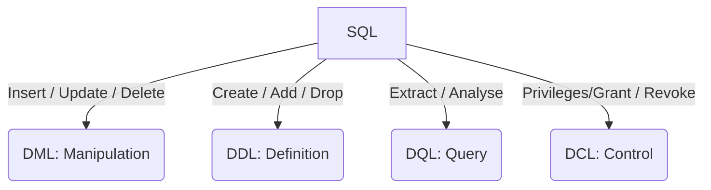

import Tabs from '@theme/Tabs';
import TabItem from '@theme/TabItem';



<Tabs>
<TabItem value="databases" label="Databases">


| DBMS                                                                                      | RDBMS                                    | GCP BQ                                                                                       |
|-------------------------------------------------------------------------------------------|------------------------------------------|----------------------------------------------------------------------------------------------|
| **Database Management System**                                                            | **Relational Database Modelling System** | **Data Warehouse**                                                                           |
| Manages databases & provides tools for creating, retrieving, updating, and deleting data. | Allows data organisation                 | Provides a platform to extract & load data before analytics and transformations are applied. |
| Flexible                                                                                  | Structured (rows & columns)              | Tables & Views                                                                               |
| No schema / model enforced                                                                | Relationships between tables (i.e. keys) | Query interfaces                                                                             |
| MongoDB (No SQL)(JSON)                                                                    | MySQL                                    | Tables: RDBMS, SQL Queries, CSV/JSON/GoogleSheets, Data Storage                              |
| Redis (key-value)                                                                         | PostgreSQL                               | Views: Virtual Table, Saved SQL Query, Combines Tables, Customised Perspective               |
|                                                                                           | Oracle                                   |                                                                                              |

- **Normalisation:** Database should have optimal structure. Reduce unnecessary duplicates.
> - 1NF: No duplicate rows/columns. 1 value per column.
> - 2NF: 1NF=True. Dependent of primary keys.
> - 3NF: 1NF = True. 2ND = True. 
Non key columns are NOT dependent on other non-key columns.


</TabItem>
<TabItem value="views" label="Views">

## Views

Act as a virtual table which accesses data from other tables and views. Represents data.

No storage involved - this is useful to provide a different POV or necessary information. 

Users can select one or more columns from one or more tables to create a view that provides a different perspective of 
necessary information of the database.

A view is constructed using SELECT involving:
- 1 or more columns
- 1 or more tables

```roomsql
CREATE VIEW view_name
AS
SELECT
---SQL QUERY
```

## In-line Views

Temporary Tables created under FROM in a query. These execute the WHERE aspect of a query, otherwise functions such as 
table joins may exclude some data.

Use the in-line view to execute WHERE. Otherwise functions such as table joins will exclude some data.

```roomsql
SELECT tableName
FROM (
SELECT 
FROM
WHERE/GROUP BY ---must alias the aggregate
);
```

## In-line Views & TAble Join

```roomsql
SELECT
FROM table1
    JOIN
    ---Query acts as Table2
    (
    SELECT
    FROM
    WHERE
    )
    AS Q
ON Q.query = table1
    GROUP BY
    ;
```

</TabItem>
<TabItem value="dml" label="DML">

## Insert

```roomsql
INSERT INTO Table
    column1
    column2
VALUES
    'v1'
    'v2'
```

## Select & Filter

```roomsql
SELECT
FROM
WHERE = > >= <> < <= !=
AND/OR Boolean Conditions
ORDER BY ---ASC/DESC
UPDATE
SET
DELETE FROM
COMMIT
ROLLBACK
```

## Tools

```roomsql
DISTINCT ---shows only the unique values
UPDATE
    SET
```


</TabItem>
<TabItem value="ddl" label="DDL">

## Create Table

```roomsql
CREATE TABLE Name(

);
```

## Delete Table

```roomsql
DROP TABLE Name;
```


```roomsql
SELECT Data_to_Display

FROM Table_of_Interest

JOIN otherTable

ON columnInCommon

WHERE selectConditionsToFilterDataScenario

```

</TabItem>
<TabItem value="dql" label="DQL">

## Join 2 Tables

This functions operates on a row by row level.

```roomsql
SELECT data
FROM table1
--- JOIN:InnerJoin / Left Outer Join / Right Outer Join / Full Outer Join / Self Join
--- Self Join: Joined t itself illustrates relationship between attributes. Need to create an alias to join the 2 columns.
--- Cross Join: Cartesian Join combines each row of each table. 3 x 4 rows = 12 rows.
JOIN table2
ON
    table1.column = table2.column
ORDERBY field;
```

## Join more than 2 Tables

```roomsql
SELECT data
FROM
    JOIN table1
ON
    table1.column = table2.column
    JOIN table3
ON  
    table3.column = table2.column
```

## Sets

```roomsql
SELECT column1
FROM table1
--- SET: Union / Union All / Intersect / Minus
    SET
SELECT column2 --- must be same attribute as column1
FROM table2
```

## Aggregate

Using the Aggregate and Having tools allows you to filter aggregates allows you to run aggregate functions against subsets of data.

```roomsql
SELECT aggregate ---multiple column items (aggregate)
FROM
WHERE --- Non-Aggregate
GROUP BY --- Non-Aggregate HAVING AGGREGATES: COUNT / SUM / AVG/ MIN / MAX
WHERE
HAVING aggregate ---does not look at the data directly. Often used instead of where, but it is possible to have both.

```

```roomsql
SELECT data1, data2
FROM table1
JOIN table2
ON column.table1 = column.table2
GROUP BY data1, data2
HAVING aggregate
(
SELECT aggregate
FROM
GROUP BY
);
```

## Sub-Queries

Subqueries read every row in a table and compares these to the data. When reading, see the sub-query first before checking the main query.

WHERE
- acts as a join between the main query and the sub query.
- has the same role as regular subqueries.
- the second WHERE term needs to have aliases.

```roomsql
--- 1st action of query
SELECT
FROM
WHERE 
--- 2nd action of query
(
    SELECT
    FROM
)
```

## Correlated Sub-Queries

```roomsql
SELECT displaycolumns, lookforcolumns, aggregatecolumns
FROM
WHERE aggregatecolumns = (
    SELECT max(aggregatecolumns)
    FROM
    WHERE (function) displaycolumnsData=displaycolumnsData
);
```


<Tabs>
<TabItem value="JDBC" label="JDBC">

| Language | Database Tools |
|----------|----------------|
| Java     | JDBC Driver    |

Drivers that implement the JDBC API as a mapping to another data access API such as (Open Database Connectivity).
Drivers of this type are gnerally dependent on a native library-limits portability.

</TabItem>
<TabItem value="DAO" label="DAO">

```java
@Entity
@Id
//Getters
//Setters

Class class = new Class();
class.setxyz();

name = em.createQuery("1","2");

List <Class> listName = name.getResultList();
for(Class each item:listName){
    
        }

```

</TabItem>
<TabItem value="useDAO" label="use DAO">

```java
public static void main (String[]args){
    
    #1
        EntityManagerFactory emf = Persistence
        create EntityManagerFactory("");
    #2
        EntityManager em =emf.createEntityManager();
    #3
        EntityTransaction et = entityManager.getTransaction();
    #4
        et.begin();
        DQL - delete
    #5
        et.executeUpdate();
    #6. 
        em.persist();
    #7
        et.commit();
        DQL - select
    #8
        em.close();
    
        }

```


</TabItem>
</Tabs>

</TabItem>
<TabItem value="dcl" label="DCL">

Tables

</TabItem>
</Tabs>

---

1. Partitioned Tables
2. Partitioned Fields
3. Clsutered Fields
4. De-dup