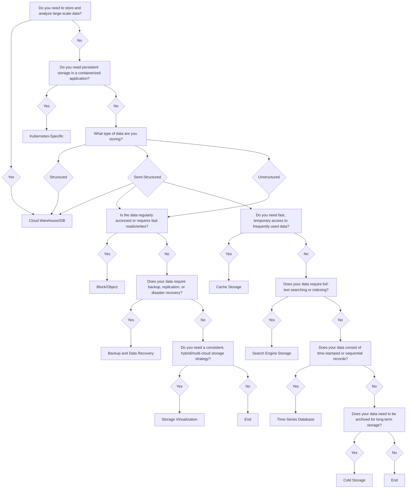

Common storage tools and services used for various purposes in containerized environments cland platforms , and data management :

---

### 1. Cloud-Based Data Warehouses and Databases
   - **Overview:** Discusses cloud-based data warehouses and databases, focusing on structured data and large-scale data storage/analysis (e.g., SQL-based solutions, NoSQL, cloud-native databases like BigQuery, Redshift, and Snowflake).
   - **Relevant in the diagram:** The flow through Cloud Warehouse/DB for both structured and semi-structured data.
### 2. Kubernetes-Specific Storage Solutions
   - **Overview:** Focuses on storage needs in containerized environments, particularly within Kubernetes. This would include managing persistent storage for containerized apps (e.g., Persistent Volumes, StatefulSets).
   - **Relevant in the diagram:** The Kubernetes-Specific storage question that guides the user when persistent storage is needed in Kubernetes.
### 3. Block and Object Storage (Cloud Services)
   - **Overview:** Covers the concepts of block storage and object storage as essential cloud storage solutions, useful for storing large volumes of structured or unstructured data.
   - **Relevant in the diagram:** The Block/Object decision point based on data access patterns and requirements, and also addresses the need for cloud storage (e.g., AWS S3, Google Cloud Storage, EBS).
### 4. Distributed File Systems & Data Lakes
   - **Overview:** Discusses solutions for large, unstructured datasets or files (e.g., Distributed File Systems like Ceph, GlusterFS, or Data Lake solutions like Hadoop HDFS, and MinIO).
   - **Relevant in the diagram:** Data classified as unstructured that might lead to a Distributed File System or Data Lake decision point.
### 5. Backup and Data Recovery Solutions
   - **Overview:** Focuses on ensuring the durability and availability of data through backup, replication, and disaster recovery (e.g., Velero, Veeam, AWS Backup).
   - **Relevant in the diagram:** The Backup and Data Recovery flow for handling data redundancy and recovery needs.
### 6. Storage Virtualization
   - **Overview:** Explores storage abstraction, where multiple physical storage resources can be managed as a unified solution, which is particularly useful in hybrid or multi-cloud environments.
   - **Relevant in the diagram:** Storage Virtualization for hybrid/multi-cloud storage management (e.g., Portworx, StorageOS).
### 7. Caching Solutions
   - **Overview:** Addresses the need for fast, temporary storage solutions (e.g., Cache Storage with Redis or Memcached for frequently accessed data).
   - **Relevant in the diagram:** The question about Cache Storage for fast access to frequently used data.
### 8. Search Engine Storage
   - **Overview:** Discusses the storage solutions for full-text search and indexing, often used for large, searchable datasets (e.g., Search Engines like Elasticsearch).
   - **Relevant in the diagram:** The decision for Search Engine Storage, typically used for unstructured data requiring indexing and search capabilities.
### 9. Time-Series Database Storage
   - **Overview:** Covers specialized databases for time-series data, commonly used in IoT, monitoring, or real-time analytics (e.g., InfluxDB, Prometheus).
   - **Relevant in the diagram:** The question about Time-Series Database for handling time-stamped or sequential data.
### 10. Cold Storage Solutions
    - **Overview:** Deals with the long-term archival of data that is infrequently accessed but needs to be retained, such as Cold Storage options (e.g., Amazon Glacier, Azure Blob Storage Archive tier).
    - **Relevant in the diagram:** The question about Cold Storage for data needing to be archived or stored for the long term.

