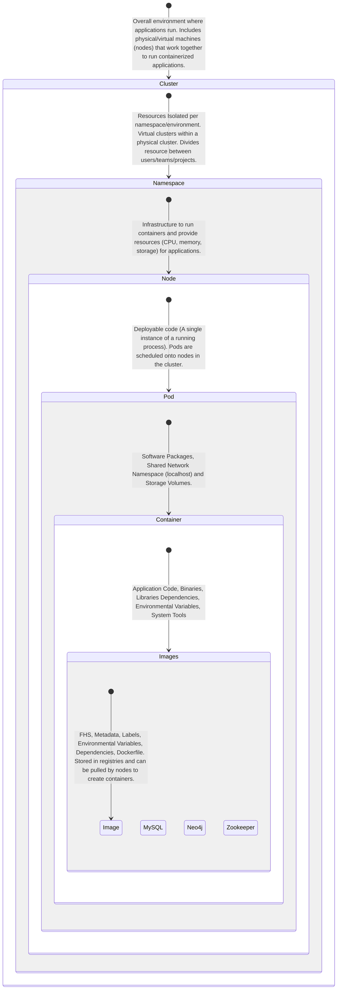

import Tabs from '@theme/Tabs';
import TabItem from '@theme/TabItem';

[Microservices](https://martinfowler.com/articles/microservices.html)

Containerization is a technology that allows software applications to be packaged with all their dependencies and
configurations into a single unit called a container. These containers are isolated from each other and from the
underlying host system, ensuring consistency and portability across different computing environments.

They simplify deployment, improve efficiency, and enable applications to run reliably across various platforms without
compatibility issues. Essentially, containerization makes it easier to develop, deploy, and manage applications by
bundling them with everything they need to function consistently.

**ConfigMaps**

- A built-in Kubernetes API object that stores your application's non-sensitive key-value config data.
- Allows you to keep config values separate from your code and container images.
- String or Base64-encoded binary.

1. Create ConfigMap
2. Content is saved to your Kubernetes cluster
3. Pods then consume the values as environment variables, command line arguments, or filesystem volumes.


<Tabs>
<TabItem value="orchestration" label="Kubernetes">

Kubernetes is a container orchestration platform that helps manage the deployment, scaling, and operation of application containers.

It makes the overall CI/CD process more efficient and scalable as it can be integrated with CI/CD to automate the software
delivery pipeline from code commit to application deployment.



</TabItem>
<TabItem value="kubectl" label="Kubectl">

The Kubernetes CLI tool [kubectl](https://kubernetes.io/docs/reference/kubectl/), Otherwise referred to as k8s (# of letters between the K and S in Kubernetes)
communicates with Kubernetes clusters via the Kubernetes API.

---

## KUBECTL SYNTAX

kubectl [command] [TYPE] [NAME] [flags]

---

#### Apply

Save & Apply the YAML Files to create or update resources based on the YAML file:

```yaml
kubectl apply -f [filename] 
```


#### Installation

```shell
alias k8s = "kubectl"
alias k8scontexts = kubectl config get-contexts
```

---

#### Configurations

| Command                     | Purpose                                                                              |
|-----------------------------|--------------------------------------------------------------------------------------|
| kubectl config get-contexts | See what contexts are available and which GKE cluster is set as your current context |
| kubectl config use-context  | Choose an environment to switch to                                                   |

---

#### Workspace

| Command                                    | Purpose                                    |
|--------------------------------------------|--------------------------------------------|
| kubectl get namespaces                     | List all namespaces in a cluster           |
| kubectl get pods                           | List all pods                              |
| kubectl get nodes                          | Get information about nodes in the cluster |
| kubectl get pods -n NAMESPACE              | Get information about pods in a namespace  |
| kubectl describe pod POD_NAME -n NAMESPACE | Describe a specific pod                    |

---

#### Cluster Health & Nodes

| Commands                                                                                                     | Purpose                                                                                                                                                     |
|--------------------------------------------------------------------------------------------------------------|-------------------------------------------------------------------------------------------------------------------------------------------------------------|
| kubectl cluster-info                                                                                         | Check Cluster Info: To get a high-level overview of the cluster, including its health,                                                                      |
| kubectl get nodes                                                                                            | Check Nodes: To list all nodes in the cluster along with their status                                                                                       |
| kubectl describe node NODE_NAME                                                                              | Describe Nodes: To get detailed information about a specific node (replace NODE_NAME with the actual node name)                                             |
| kubectl get nodes -o custom-columns=NAME:.metadata.name,CPU:.status.capacity.cpu,MEM:.status.capacity.memory | Node Capacity and Usage: To view the capacity and resource usage of nodes in a more concise format                                                          |
| kubectl get nodes --field-selector=status.conditions[type=Ready]                                             | Node Health Check: To check the status of a node and its conditions.                                                                                        |
| kubectl describe node NODE_NAME pipe grep -i capacity -A 10                                                  | Node System Information: To retrieve detailed system information about a node.                                                                              |
| kubectl logs kubelet-NODE_NAME -n kube-system                                                                | Kubelet Logs: To view the logs of the kubelet service running on a node (replace NODE_NAME with the actual node name)                                       |
| kubectl get componentstatus                                                                                  | API Server Health: To check the health of the Kubernetes API server.                                                                                        |
| kubectl get pods -n kube-system                                                                              | Kube-system Namespace: Many components critical for the cluster's health run in the kube-system namespace. To investigate components within this namespace. |

---

#### Pod Health & Status, Restart Count, Evictions

| Commands                                                                                                                                      | Purpose                                                                               |
|-----------------------------------------------------------------------------------------------------------------------------------------------|---------------------------------------------------------------------------------------|
| kubectl get pods                                                                                                                              | List all Pods: To get a list of all pods in the default namespace.                    |
| kubectl get pods -n NAMESPACE                                                                                                                 | List all Pods: To list pods in a specific namespace.                                  |
| kubectl describe pod POD_NAME -n NAMESPACE                                                                                                    | Describe a Pod: To get detailed information about a specific pod.                     |
| kubectl logs POD_NAME -n NAMESPACE                                                                                                            | Pod Logs: To view the logs of a specific pod.                                         |
| kubectl logs -f POD_NAME -n NAMESPACE                                                                                                         | Follow Pod Logs in Real-time: To stream the logs of a pod in real-time.               |
| kubectl top pod POD_NAME -n NAMESPACE                                                                                                         | Check Pod Resource Usage: To see the CPU and memory usage of pods.                    |
| kubectl get events --field-selector involvedObject.name=POD_NAME -n NAMESPACE                                                                 | Check Pod Events: To view the events related to a pod.                                |
| kubectl delete pod POD_NAME -n NAMESPACE                                                                                                      | Delete a Pod: To delete a pod                                                         |
| kubectl describe pod POD_NAME -n NAMESPACE pipe grep -A 2 "Readiness"                                                                         | Check Pod Readiness and Liveness Probes                                               |
| kubectl describe pod POD_NAME -n NAMESPACE pipe grep -A 2 "Liveness"                                                                          | Check Pod Readiness and Liveness Probes                                               |
| kubectl get pods --sort-by='.status.containerStatuses[0].restartCount'                                                                        | To get a list of pods along with their restart counts in the default namespace        |
| kubectl get pods --sort-by='.status.containerStatuses[0].restartCount' -n NAMESPACE                                                           | To see restart counts in a specific namespace                                         |
| kubectl describe pod POD_NAME -n NAMESPACE pipe grep "Restart Count"                                                                          | To get detailed information about a specific pod, including its restart count         |
| kubectl get pods -o custom-columns="POD:metadata.name,RESTARTS:.status.containerStatuses[0].restartCount"                                     | To get a tabular view of pods with their restart counts                               |
| kubectl get events --field-selector=involvedObject.name=POD_NAME,involvedObject.kind=Pod -n NAMESPACE                                         | To check for events related to pod restarts                                           |
| kubectl get events --field-selector=involvedObject.kind=Pod --sort-by='.metadata.creationTimestamp'                                           | To get a list of events related to pod evictions in the default namespace             |
| kubectl describe pod POD_NAME -n NAMESPACE                                                                                                    | To get detailed information about a specific pod, including events and conditions     |
| kubectl logs POD_NAME -n NAMESPACE                                                                                                            | To view logs of a pod that might have been evicted                                    |
| kubectl get events --field-selector=involvedObject.name=POD_NAME,involvedObject.kind=Pod -n NAMESPACE --sort-by='.metadata.creationTimestamp' | To check for events related to a specific pod                                         |
| kubectl get pods -o custom-columns="POD:metadata.name,STATUS:.status.phase,CONDITIONS:.status.conditions[*].type"                             | To get a tabular view of pods with their status, including conditions like evictions  |

---

#### CPU & Memory Usage

| Commands                                                           | Purpose                                                                       |
|--------------------------------------------------------------------|-------------------------------------------------------------------------------|
| kubectl top nodes                                                  | To see the CPU and memory usage of nodes in the cluster                       |
| kubectl top pods                                                   | To see the CPU and memory usage of pods in the default namespace              |
| kubectl top pods -n NAMESPACE                                      | To see the usage in a specific namespace                                      |
| kubectl top pod POD_NAME -n NAMESPACE                              | To see the CPU and memory usage of a specific pod                             |
| kubectl top pod --all-namespaces                                   | To get a summary of CPU and memory usage for all pods in a specific namespace |
| kubectl top pod POD_NAME --containers -n NAMESPACE                 | To see the CPU and memory usage for all containers in a specific pod          |
| kubectl top pod POD_NAME --containers=CONTAINER_NAME -n NAMESPACE  | To see the CPU and memory usage for a specific container within a pod         |

---

#### Storage Usage: Persistent Volume Claims

| Commands                                                                                    | Purpose                                                                                         |
|---------------------------------------------------------------------------------------------|-------------------------------------------------------------------------------------------------|
| kubectl get pv                                                                              | To get a list of all persistent volumes in the cluster                                          |
| kubectl describe pv PV_NAME                                                                 | To get detailed information about a specific persistent volume                                  |
| kubectl get pvc                                                                             | To get a list of all persistent volume claims in the default namespace                          |
| kubectl get pvc -n NAMESPACE                                                                | To see persistent volume claims in a specific namespace                                         |
| kubectl describe pvc PVC_NAME -n NAMESPACE                                                  | To get detailed information about a specific persistent volume claim                            |
| kubectl get storageclasses                                                                  | To get a list of all storage classes in the cluster                                             |
| kubectl describe storageclass STORAGE_CLASS_NAME                                            | To get detailed information about a specific storage class                                      |
| kubectl get pv --sort-by=.spec.capacity.storage                                             | To see the storage capacity and usage of persistent volumes                                     |
| kubectl get pvc --sort-by=.status.capacity.storage -n NAMESPACE                             | To see the storage capacity and usage of persistent volume claims                               |
| kubectl get events --field-selector=involvedObject.kind=PersistentVolumeClaim -n NAMESPACE  | To check for events related to storage resources, including any provisioning or binding issues  |

---

#### Node Scaling & Autoscaling

| Commands                                                                                       | Purpose                                                                      |
|------------------------------------------------------------------------------------------------|------------------------------------------------------------------------------|
| kubectl get nodes                                                                              | To get a list of all nodes in the cluster                                    |
| kubectl describe node NODE_NAME                                                                | To get detailed information about a specific node                            |
| kubectl get hpa --all-namespaces                                                               | To view the autoscaler configurations  - Part 1                              |
| kubectl get cluster-autoscaler --namespace kube-system                                         | To view the autoscaler configurations  - Part 2                              |
| kubectl get events --field-selector=involvedObject.kind=HorizontalPodAutoscaler -A             | To check for events related to autoscaling                                   |
| kubectl top nodes                                                                              | To view node metrics such as CPU and memory usage                            |
| kubectl top pods --all-namespaces                                                              | To view metrics for pods, which can help understand the need for autoscaling |
| kubectl logs -n kube-system cluster-autoscaler-POD_NAME                                        | Debugger - Cluster Autoscaler                                                |
| kubectl describe hpa HPA_NAME -n NAMESPACE                                                     | Debugger - Horizontal Pod Autoscaler                                         |
| kubectl get nodes -o custom-columns=NAME:.metadata.name,CONDITIONS:.status.conditions[*].type  | To check conditions on nodes, including those related to autoscaling         |

---

#### API Server Latency

| Commands                                                                                       | Purpose                                                                         |
|------------------------------------------------------------------------------------------------|---------------------------------------------------------------------------------|
| kubectl get componentstatuses                                                                  | To check the status of the API server                                           |
| kubectl exec -it -n kube-system kube-apiserver-POD_NAME -- /bin/sh                             | Monitor API Server Metrics - Part 1                                             |
| curl -k https://localhost:6443/metrics                                                         | Monitor API Server Metrics - Part 2                                             |
| kubectl logs -n kube-system kube-apiserver-POD_NAME                                            | To view logs of the API server                                                  |
| curl -k -v https://localhost:6443/healthz                                                      | Check API Server Response Time                                                  |
| kubectl get events --field-selector=involvedObject.name=kube-apiserver-POD_NAME -n kube-system | Check kube-apiserver Pod Events                                                 |
| kubectl top pods -n kube-system kube-apiserver-POD_NAME                                        | Check resource utilization of the API server pod, such as CPU and memory usage  |

---

#### Events & logs

| Commands                                                             | Purpose                                                                                         |
|----------------------------------------------------------------------|-------------------------------------------------------------------------------------------------|
| kubectl get events --all-namespaces                                  | To get a list of all events in the cluster                                                      |
| kubectl get events -n NAMESPACE                                      | To see events specific to a namespace                                                           |
| kubectl describe RESOURCE_TYPE RESOURCE_NAME -n NAMESPACE            | To get detailed information about a specific resource, including related events                 |
| kubectl logs POD_NAME -n NAMESPACE                                   | To view logs of a specific pod                                                                  |
| kubectl logs POD_NAME -c CONTAINER_NAME -n NAMESPACE                 | If a pod has multiple containers, you can specify the container for which you want to view logs |
| kubectl logs -f POD_NAME -n NAMESPACE                                | To stream logs in real-time for a specific pod                                                  |
| kubectl logs --previous POD_NAME -c CONTAINER_NAME -n NAMESPACE      | If a container has restarted, you can view logs from a previous instance of the container       |
| kubectl exec -it POD_NAME -c CONTAINER_NAME -n NAMESPACE -- /bin/sh  | To debug issues interactively, you can access a shell inside a running container                |

---
#### Deployments Replicas

| Commands                                                                                                             | Purpose                                                   |
|----------------------------------------------------------------------------------------------------------------------|-----------------------------------------------------------|
| kubectl get deployments                                                                                              | To get a list of all deployments in the default namespace |
| kubectl get deployments -n NAMESPACE                                                                                 | To list deployments in a specific namespace               |
| kubectl describe deployment DEPLOYMENT_NAME -n NAMESPACE                                                             | To get detailed information about a specific deployment   |
| kubectl get replicasets -n NAMESPACE --selector=app=DEPLOYMENT_NAME                                                  | To see the replica sets associated with a deployment      |
| kubectl get events --field-selector=involvedObject.name=DEPLOYMENT_NAME,involvedObject.kind=Deployment -n NAMESPACE  | To check events related to a deployment                   |

---
#### Load Balancing

Refers to the distribution of network traffic across multiple instances of a service, ensuring that each instance receives a fair share of requests.

##### Service Health

| Commands                                                                                                       | Purpose                                                |
|----------------------------------------------------------------------------------------------------------------|--------------------------------------------------------|
| kubectl get services                                                                                           | To get a list of all services in the default namespace |
| kubectl get services -n NAMESPACE                                                                              | To list services in a specific namespace               |
| kubectl describe service SERVICE_NAME -n NAMESPACE                                                             | To get detailed information about a specific service   |
| kubectl get endpoints SERVICE_NAME -n NAMESPACE                                                                | To see the endpoints associated with a service         |
| kubectl get events --field-selector=involvedObject.name=SERVICE_NAME,involvedObject.kind=Service -n NAMESPACE  | To check for events related to a service               |

##### Network Traffic

| Commands                                                            | Purpose                                                                                                                               |
|---------------------------------------------------------------------|---------------------------------------------------------------------------------------------------------------------------------------|
| kubectl get networkpolicies --all-namespaces                        | To view the network policies defined in the cluster                                                                                   |
| kubectl get services                                                | To list all services in the default namespace                                                                                         |
| kubectl get services -n NAMESPACE                                   | To see services in a specific namespace                                                                                               |
| kubectl describe service SERVICE_NAME -n NAMESPACE                  | To get detailed information about a specific service                                                                                  |
| kubectl get endpoints SERVICE_NAME -n NAMESPACE                     | To see the endpoints associated with a service                                                                                        |
| kubectl get ingress --all-namespaces                                | To view Ingress resources in the cluster                                                                                              |
| kubectl exec -it POD_NAME -n NAMESPACE -- traceroute DESTINATION_IP | You can execute traceroute from within a pod to trace the route packets take to a destination.                                        |
| kubectl exec -it POD_NAME -n NAMESPACE -- tcpdump -i eth0           | To capture network traffic within a pod, you can use tcpdump.                                                                         |
| kubectl port-forward POD_NAME LOCAL_PORT:REMOTE_PORT -n NAMESPACE   | To forward a local port to a pod, you can use kubectl port-forward. This can be useful for debugging and inspecting network traffic.  |

#### Ingress & Egress Traffic

| Commands                                            | Purpose                                                         |
|-----------------------------------------------------|-----------------------------------------------------------------|
| kubectl get ingress                                 | To get a list of all Ingress resources in the default namespace |
| kubectl get ingress -n NAMESPACE                    | To list Ingress resources in a specific namespace               |
| kubectl describe ingress INGRESS_NAME -n NAMESPACE  | To get detailed information about a specific Ingress resource   | 


</TabItem>
<TabItem value="k9" label="k9s">

## [K9s SYNTAX](https://k9scli.io/)

| Command         | Purpose                                            |
|-----------------|----------------------------------------------------|
| k9s             | Initialise                                         |
| k9s -cpod       | Run k9s and launch in pod view iva the pod command |
| k9s -nnamespace | Run k9s in a given namespace                       |

## Resource Management

| Ctrl + | Purpose                          |
|--------|----------------------------------|
| ?      | List all available shortcut keys |
| A      | Select all text                  |
| E      | Activate command line            |
| F      | Enter filter mode                |
| R      | Refresh resource                 |
| S      | Save resource                    |
| W      | Open a new tab                   |

---
## Navigation

| Command | Purpose                               |
|---------|---------------------------------------|
| 0       | view all pods                         |
| /       | Start search                          |
| :       | Change viewing panel - pods/namespace |
| :ctx    | Switch context                        |

---
## Pod and Container Operation

| Command | Purpose      |
|---------|--------------|
| l       | logs         |
| s       | shell access |
| e       | edit         |
| d       | delete       |

---

## Sort

| Command   | Purpose        |
|-----------|----------------|
| Shift + M | sort by memory |

</TabItem>
</Tabs>