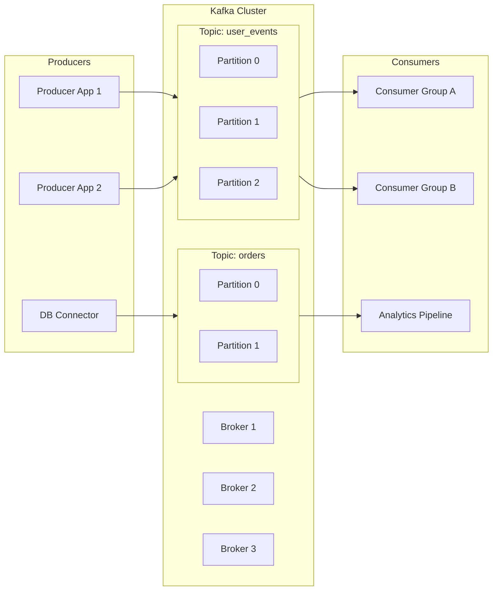

import Tabs from '@theme/Tabs';
import TabItem from '@theme/TabItem';

:::tip Kafka
**Apache Kafka** is a distributed event streaming platform used to build real‑time data pipelines and event‑driven applications. It provides high‑throughput, fault‑tolerant, scalable messaging using an append‑only log.
:::


```mermaid
Kafka
├── Messaging & Streaming
│   ├── Topics & Partitions
│   ├── Brokers & Clusters
│   ├── Consumer Groups
│   └── Retention & Replication
├── TA Skills
│   ├── Review Topics & Configs
│   ├── Validate Consumers & Producers
│   ├── Monitor Cluster Health
│   └── Check Retention & ACLs
└── SWE Skills
    ├── Produce/Consume Messages
    ├── Create/Delete Topics
    ├── Manage Consumer Groups
    └── Monitor & Scale Cluster
```

---

##  🧩 Technical Skills

<Tabs>
<TabItem value="skill" label="Skill">

```shell
--------------
How to use Kafka as a TA
--------------

# List topics
kafka-topics.sh --bootstrap-server <broker>:9092 --list

# Check topic configuration and partitions
kafka-topics.sh --describe --topic <topic> --bootstrap-server <broker>:9092

# Inspect consumer groups
kafka-consumer-groups.sh --bootstrap-server <broker>:9092 --list
kafka-consumer-groups.sh --describe --group <group>

# Check consumer lag (MAE / MCE)
# MAE = messages after end (consumer behind)
# MCE = messages consumed end (bytes/messages consumed)
# High MAE = consumer is falling behind

# Monitor cluster health
# - Under-replicated partitions
# - Offline partitions
# - Broker availability

# Validate retention policies and message sizes
# Ensure critical topics have correct retention windows

# Verify ACLs and access for producers and consumers
```

</TabItem>
<TabItem value="requirements" label="Requirements">

**How to formulate requirements when working with Kafka**

* Identify topics, expected throughput, and message size
* Determine producers and consumers (and their ownership)
* Confirm cluster topology (brokers, replication factor, partitions)
* Define retention policies (time‑based or size‑based)
* Confirm monitoring and alerting expectations
* Identify consumer group behaviour (parallelism, ordering needs)
* Validate authentication and authorization (SASL/SSL, ACLs)

</TabItem>
</Tabs>

---

## Pre‑Requisites

| Action / Service            | What TA Needs to Gather / Confirm                                                                 |
|-----------------------------|---------------------------------------------------------------------------------------------------|
| Install / Setup             | Kafka cluster deployed, brokers running, Zookeeper (if applicable)                                |
| Access & Login              | Client credentials, SASL/SSL configs, ACLs verified                                               |
| API / CLI Tools             | Kafka CLI tools available (`kafka-topics.sh`, `kafka-console-producer.sh`, etc.)                  |
| Other tool-specific actions | Monitoring tools (Prometheus, Grafana), retention policies, topic naming conventions              |

---

## Engineering

<Tabs>
<TabItem value="skill" label="Skill">

```shell
--------------
Common ways engineers use Kafka
--------------

# Produce messages to a topic
kafka-console-producer.sh --broker-list <broker>:9092 --topic <topic>

# Consume messages from a topic
kafka-console-consumer.sh --bootstrap-server <broker>:9092 --topic <topic> --from-beginning

# Create new topics
kafka-topics.sh --create --topic <topic> --bootstrap-server <broker>:9092 --partitions 3 --replication-factor 2

# Delete topics
kafka-topics.sh --delete --topic <topic> --bootstrap-server <broker>:9092

# Manage consumer groups
kafka-consumer-groups.sh --bootstrap-server <broker>:9092 --group <group> --reset-offsets --to-earliest --execute

# Monitor lag and cluster health via CLI or JMX metrics
```

</TabItem>

<TabItem value="engineering" label="Engineering">

**How to formulate a plan for development**

* Map required topics and partitions
* Define producer/consumer configs and throughput expectations
* Establish cluster sizing (brokers, replication factor, partitions)
* Implement monitoring, alerting, and retention policies
* Integrate Kafka with CI/CD pipelines
* Provide TA handover: topics, ACLs, consumer groups, dashboards, usage patterns

</TabItem>
</Tabs>

---

## Triage

:::danger
Symptoms and issues with Kafka and how to triage:
:::

| Symptom                | TLDR Root Cause                                   | What to Check                                                                 | Action to Propose                                                                 |
|------------------------|----------------------------------------------------|-------------------------------------------------------------------------------|-----------------------------------------------------------------------------------|
| Brokers down           | Node failure, JVM crash, network issue             | Broker logs, cluster status, controller broker, Zookeeper/KRaft               | Restart broker, fix network, rebalance partitions                                 |
| Consumer lag           | Slow consumers, blocked processing, hot partitions | Consumer group offsets, MAE/MCE metrics, partition skew                       | Add consumers, fix processing bottlenecks, rebalance partitions                    |
| Topic unavailable      | Topic deleted, ACL issue, misconfiguration         | Topic list, ACLs, broker logs                                                 | Recreate topic, fix ACLs, validate replication factor                              |
| Messages not delivered | Retention expired, partition offline               | Retention settings, partition status, producer logs                           | Increase retention, fix partition availability, adjust producer retries            |
| High latency           | Overloaded broker, network bottleneck              | Broker CPU, network throughput, replication lag                               | Scale brokers, optimize network, adjust batching                                   |
| Data loss              | Under-replicated partitions, misconfigured RF      | Replication factor, ISR list, broker failures                                 | Increase replication factor, restore brokers, enforce min.insync.replicas          |
| Hot partitions         | Poor partition key, uneven distribution            | Partition message counts, consumer lag per partition                          | Redesign partition key, increase partitions, rebalance                             |
| Serialization errors   | Schema mismatch, bad producer code                 | Producer logs, consumer deserialization errors                                | Fix schema, enforce schema registry, update clients                                |
| High disk usage        | Retention too long, segment bloat                  | Topic size, retention settings, segment count                                 | Apply ILM/retention, compact logs, add storage                                     |
| Slow startup / rebalance | Large state stores, many partitions              | Broker logs, partition count, consumer group rebalance events                 | Reduce partitions, optimize consumer group size, upgrade hardware                  |


---
---

:::tip Definition
**Apache Kafka** is a **distributed event streaming platform** used to ingest, store, and process high‑volume real‑time data using an append‑only log.
:::

Kafka is primarily concerned with **high‑throughput data integration, real‑time event pipelines, and decoupling producers from consumers**.

Typical examples include:
- Real‑time data pipelines between microservices
- Event‑driven architectures (user activity, payments, orders)
- High‑volume log ingestion and analytics
- Stream processing (fraud detection, monitoring, ETL)



---

## Benefit / What problem does it solve?

Using Kafka enables:

- **Scalable, fault‑tolerant data integration** across many systems
- **Real‑time publish/subscribe messaging** with high throughput
- **Decoupling** between producers and consumers
- **Replayable event logs** for recovery, auditing, and stream processing
- **Fan‑out reads** (many consumers reading the same data independently)

---

## When to use

* You need **real‑time streaming** between multiple systems
* You need **high‑throughput ingestion** (MB/s → GB/s)
* You want **event-driven architecture** or microservice decoupling
* You need **durable logs** that consumers can replay
* You want to avoid N² point‑to‑point integrations

**Do NOT use this tool when:**

* You need **request/response** messaging (use REST or gRPC)
* You need **complex routing** or message transformations (use Kafka Connect or an ESB)
* You need **long-term storage** (Kafka is not a data warehouse)
* You have **low data volume** where simpler queues suffice

---

## TA Skills Checklist

- Understand **topics, partitions, offsets, retention**
- Validate **producer/consumer behaviour** (lag, throughput, retries)
- Review **partitioning strategy** for scalability
- Check **consumer lag metrics** (MAE, MCE)
- Confirm **retention policies** and governance requirements
- Identify **data schema risks** (Kafka does not enforce schemas)
- Validate **delivery semantics** (at‑least‑once vs at‑most‑once)
- Support teams in diagnosing **lag, throughput, and serialization issues**

---

## Key Terminology & Definitions

- **Topic** – A category or feed name where messages are written
- **Partition** – A shard of a topic; each is an independent append‑only log
- **Offset** – A monotonically increasing number identifying each record
- **Producer** – Writes messages to Kafka
- **Consumer** – Reads messages from Kafka
- **Broker** – A Kafka server; multiple brokers form a cluster
- **Consumer Group** – A set of consumers sharing work across partitions
- **Retention** – How long Kafka keeps data (time or size based)
- **Fan‑out** – Many consumers reading the same data independently

---

## Key Strategies

<Tabs>
<TabItem value="partitioning" label="Partitioning Strategy">

- Choose partition keys deliberately
- Ensure even distribution to avoid hot partitions
- Align partitioning with consumer scaling needs
- Responsibility: SWE + TA validation
- Goal: throughput, parallelism, and predictable ordering

</TabItem>

<TabItem value="retention" label="Retention & Durability Strategy">

- Define retention by time or size
- Ensure compliance with governance (PII, audit)
- Validate storage capacity and broker configuration
- Responsibility: Platform team + TA oversight
- Goal: balance durability, cost, and performance

</TabItem>
</Tabs>

---

## System Contract

Kafka does not store schemas, it stores raw bytes. However, evidence of the contract can be found at different points:

**Schema creation:**
- In code / YAML
- Protobuf / Avro
- Schema Registry
- Inferred from Sample files

---

## How to Interact With It

- **Access pattern:** Append‑only writes; sequential reads
- **Operations / Interfaces:**
  - Kafka protocol (TCP)
  - Producer/Consumer APIs
  - Kafka CLI tools
  - Kafka Connect
  - Schema Registry (optional)
- **Interaction model:**
  - Applications use Kafka client libraries
  - Consumers subscribe to topics
  - Producers publish events
  - Brokers persist logs

---

## What Do Results Normally Look Like

- Streams of events (key/value byte records)
- Offsets indicating position in the log
- Consumer lag metrics (MAE, MCE)
- Partition-level throughput statistics

**Notes:**
Kafka stores **raw bytes**. Serialization (JSON, Avro, Protobuf) is handled by clients, not Kafka itself.
Ordering is guaranteed **within a partition**, not across partitions.


