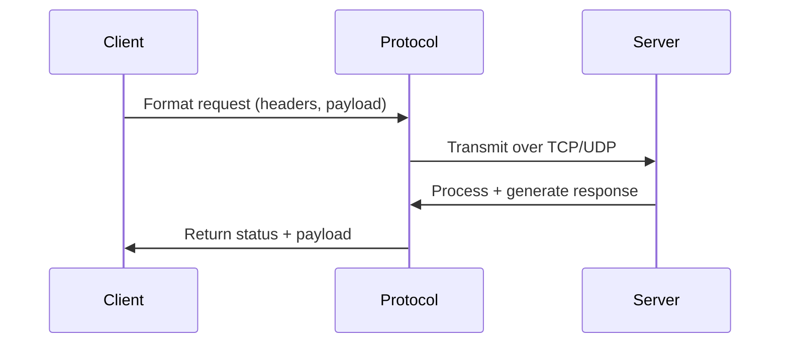

import Tabs from '@theme/Tabs';
import TabItem from '@theme/TabItem';

:::tip Definition
Protocols define the **rules, formats, and behavioural contracts** that allow systems to communicate reliably across networks.
They specify *how data is structured, transmitted, secured, acknowledged, and interpreted* between components.
:::

---

## **When to Use**

- Systems must communicate across a network boundary
- You need predictable, standardised message formats
- Reliability, ordering, or security guarantees matter
- Multiple teams or platforms must interoperate
- You need request–response, streaming, or real‑time messaging

## **When Not to Use**

- Components run in the same memory space
- Latency requirements exceed protocol overhead
- You need device‑specific or proprietary signalling
- The system is purely internal and can use direct function calls

---

## 🎯 What Problem Does This Solve?

Protocols solve the foundational problems of distributed systems:

- **Interoperability** — different systems can communicate predictably
- **Reliability** — messages can be delivered, ordered, retried, or acknowledged
- **Security** — data can be encrypted, authenticated, and protected in transit
- **Consistency** — shared rules prevent misinterpretation of messages
- **Scalability** — standardised communication enables distributed architectures

This is the backbone of all networked computing.

---

## 🧠 Conceptual Model

### **Core Components**

- **Transport Layer (TCP/UDP)**
  Defines delivery guarantees, ordering, and connection behaviour.

- **Application Layer (HTTP, WebSockets, MQTT, gRPC)**
  Defines semantics, message patterns, and interaction models.

- **Security Layer (TLS/SSL)**
  Encrypts and authenticates communication.

- **Serialization Layer (JSON, XML, Protobuf)**
  Defines how data is encoded and decoded.

- **Connection Model**
  Request–response, streaming, publish–subscribe, or bidirectional.

---

### **Axes of Variation**

- **Reliability:** best‑effort (UDP) → guaranteed delivery (TCP)
- **Latency:** low‑latency (UDP/WebSockets) → higher overhead (HTTPS)
- **Directionality:** unidirectional → bidirectional → full‑duplex
- **Statefulness:** stateless (HTTP) → stateful (WebSockets)
- **Security:** plaintext → encrypted (TLS)
- **Message Format:** text (JSON) → binary (Protobuf)

---

## **Typical Lifecycle or Flow**

---

## 🔍 TA Lens

:::info How a TA Evaluates This Concept
- What guarantees the protocol provides (ordering, retries, encryption)
- What becomes a bottleneck under load (latency, packet loss, TLS overhead)
- How message formats evolve and versioning is handled
- Whether error semantics are predictable and actionable
- How the protocol behaves when traffic spikes or connections churn
:::

### **What happens when:**

- **Data grows** → payload size impacts latency and throughput
- **Traffic increases** → connection limits, queueing, and congestion appear
- **Concurrency rises** → TCP handshake overhead or WebSocket scaling issues
- **Resources become constrained** → packet loss, timeouts, TLS failures

---

## 📘 Key Terminology

| Term | Definition |
|------|------------|
| **Protocol** | A set of rules for communication between systems |
| **Transport Layer** | Responsible for delivery, ordering, and reliability |
| **Application Layer** | Defines semantics (HTTP, WebSockets, MQTT) |
| **Handshake** | Initial negotiation to establish a connection |
| **TLS/SSL** | Encryption and authentication for secure communication |
| **Idempotency** | Safe retries without unintended side effects |
| **Serialization** | Encoding data into a transferable format |

---

## 🧬 Variants / Types

<Tabs>

<TabItem value="http" label="HTTP / HTTPS">

### HTTP / HTTPS

**Purpose**
Standard protocol for web communication using request–response semantics.

**Key Characteristics**
- Stateless
- Human‑readable
- Widely supported
- HTTPS adds encryption and identity

**Behaviour**
Client sends a request → server returns a status code + payload.

**Trade-offs**
- Simple and universal
- Higher latency than binary protocols
- Statelessness requires additional coordination

---

### **HTTP Methods**

| Method | Meaning |
|--------|---------|
| GET | Retrieve a resource (safe, idempotent) |
| POST | Create or submit data |
| PUT | Replace or create a resource |
| PATCH | Partial update |
| DELETE | Remove a resource |
| HEAD | Headers only |
| OPTIONS | Discover supported methods |
| CONNECT | Establish a tunnel |
| TRACE | Diagnostic echo |

### **HTTP Status Codes**

| Class | Meaning |
|--------|---------|
| 1xx | Informational |
| 2xx | Success (200 OK, 201 Created) |
| 3xx | Redirection (301, 302) |
| 4xx | Client error (400, 401, 404) |
| 5xx | Server error (500, 503) |

</TabItem>

<TabItem value="tcpudp" label="TCP / UDP">

### TCP / UDP

**Purpose**
Transport‑layer communication with different guarantees.

**Key Characteristics**
- **TCP:** reliable, ordered, connection‑oriented
- **UDP:** fast, connectionless, best‑effort

**Behaviour**
TCP ensures delivery; UDP sends packets without guarantees.

**Trade-offs**
- TCP: reliable but slower
- UDP: fast but lossy

</TabItem>

<TabItem value="websocket" label="WebSockets">

### WebSockets

**Purpose**
Real‑time, bidirectional communication over a single persistent connection.

**Key Characteristics**
- Full‑duplex
- Low latency
- Stateful

**Behaviour**
Client and server can send messages at any time.

**Trade-offs**
- Requires connection management
- Harder to scale horizontally

</TabItem>

<TabItem value="iot" label="MQTT / IoT Protocols">

### MQTT / CoAP

**Purpose**
Lightweight communication for constrained devices.

**Key Characteristics**
- Publish–subscribe
- Low bandwidth
- Minimal overhead

**Behaviour**
Optimised for intermittent connectivity.

**Trade-offs**
- Limited feature set
- Requires broker infrastructure

</TabItem>

</Tabs>

---

## 🧩 System Interactions

:::info How a TA Understands the System
- How protocols interact with OS networking, load balancers, proxies, and TLS termination
- How message size, connection count, and latency affect performance
- What becomes a bottleneck under pressure (handshakes, packet loss, queueing)
:::

### Local Systems

- OS networking stack
- NIC throughput
- TLS libraries
- Serialization/deserialization
- CPU for encryption
- Memory for connection buffers

### Remote Systems

- Load balancers
- API gateways
- Reverse proxies
- Data centers / regions

### Questions to ask during reviews or incidents

- Is the protocol appropriate for the workload?
- Are retries/idempotency implemented correctly?
- Is TLS configured securely?
- Are we hitting connection or handshake limits?
- Is packet loss or congestion degrading performance?

---

## 💥 Outputs / Results

:::note Special Considerations
Protocols define *how* results are formatted, transmitted, and interpreted.
:::

### Success Modes

| Result Type | Description |
|-------------|-------------|
| **Structured Response** | JSON/XML/Protobuf payload delivered successfully |
| **Status Codes / ACKs** | Clear indication of success or partial success |
| **Encrypted Traffic** | Secure, authenticated communication |

### Failure Modes

| Failure Type | Description |
|--------------|-------------|
| **Timeouts** | Network congestion or server overload |
| **Packet Loss** | UDP unreliability or network issues |
| **TLS Errors** | Certificate mismatch or handshake failure |
| **4xx/5xx Errors** | Client or server protocol violations |

---

## 🔗 Related Runbook Concepts

- Communication Patterns
- Messaging Theory
- API Design (OpenAPI)
- Networking Fundamentals
- Load Balancing
- Serialization Formats (JSON, Protobuf)
