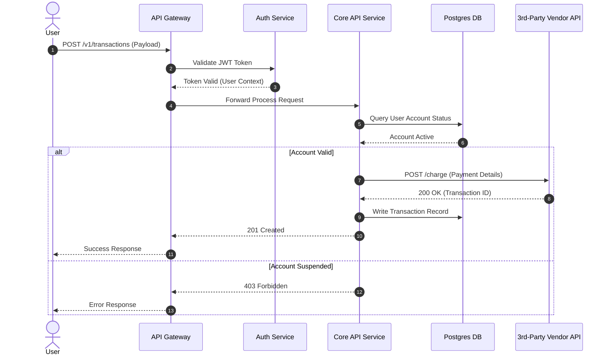

# System Mapping & Data Flow Analysis

> **Operational Purpose:** Visually and structurally map end-to-end system component flows, API integration contracts, data transformations, and state persistence boundaries to isolate dependencies and system bottlenecks.

---

## 1. Context & Application Trigger

* **When to perform:** When onboarding to a new domain, evaluating a proposed feature architecture, preparing for third-party integrations, or debugging complex cross-service issues.
* **Inputs needed:** API specs (OpenAPI/Swagger), database schemas, cloud infrastructure charts, source code repositories, and existing telemetry traces.
* **Expected Output:** Architectural sequence/data flow diagrams (Mermaid.js/PlantUML), an integration payload mapping table, and documented system boundary constraints.

---

## 2. Standard Operating Procedure (Step-by-Step)

1. **Phase 1: Entry Point & Protocol Discovery**
   * Identify the client trigger or upstream entry point (e.g., HTTP POST, webhook, scheduled cron event, message queue payload).
   * Document key request parameters, headers, and authentication/authorization mechanisms involved at ingress.

2. **Phase 2: Sequence & Component Mapping**
   * Trace the request lifecycle sequentially across internal services, microservices, and external third-party APIs.
   * Identify sync vs async communication boundaries (e.g., synchronous REST calls vs asynchronous Kafka/RabbitMQ events).
   * Note caching layers, middleware transformations, and edge proxies (CDN, API Gateway).

3. **Phase 3: Persistence & Data Transformation Mapping**
   * Map how and where data is validated, transformed, and persisted (e.g., SQL writes, NoSQL key-value updates).
   * Document data schema mutations across system boundaries (e.g., how an incoming API payload maps to internal DB tables).

4. **Phase 4: Synthesis & Boundary Verification**
   * Highlight failure domains, single points of failure (SPOFs), rate-limiting bottlenecks, and fallback behaviors.
   * Embed sequence charts directly into system documentation using Mermaid.js syntax for maintainability.

---

## 3. Key Artifacts & Templates

### Mermaid.js Sequence Diagram Boilerplate



### Data Transformation & Touchpoint Matrix

```text
| Step | Source System | Target System | Protocol / Format | Key Payload Fields | Persistence Layer |
| :--- | :--- | :--- | :--- | :--- | :--- |
| 1 | Web App | API Gateway | HTTPS / JSON | `user_id`, `amount`, `currency` | N/A (Transit) |
| 2 | API Gateway | Order Service | gRPC / Protobuf | `userId`, `orderAmount` | Redis Cache |
| 3 | Order Service | Postgres DB | SQL Driver | `id`, `user_id`, `status` | `orders` table |

```

---

## 4. Quality Checklist & Verification

* [ ] Sequence diagram accounts for both happy path and common failure/error states
* [ ] Protocol specifications (REST, gRPC, GraphQL, WebSockets) are explicitly noted
* [ ] External third-party dependencies are highlighted with timeout and retry expectations
* [ ] Persistence boundaries (read/write operations) are clearly identified

---

:::warning

## Pitfalls & Edge Cases

* **Common Mistake:** Creating static, overly detailed diagrams in visual design tools (like Figma) that quickly become outdated and hard to maintain in developer workflows.
* **Pro Tip:** Keep diagrams as code (e.g., **Mermaid.js**) directly inside `.mdx` files so they render natively in Docusaurus and can be updated easily via pull requests.

:::
