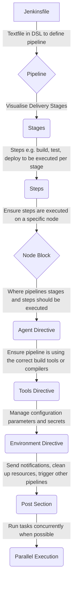

import Tabs from '@theme/Tabs';
import TabItem from '@theme/TabItem';

<Tabs>
<TabItem value="pipelines" label="Pipelines">

Pipelines integrate with version control tools and sequences automation steps to promote a more collaborative environment.

A pipeline is collection of Jenkins jobs/phases which are completed when the tasks within each stage are executed. The automation steps and sequence
of running is prescribed by a text file called a Jenkinsfile.



---

```shell
pipeline {
    agent any
    
    stages {
        stage('Build') {
            steps {
                // Build steps
                echo 'Building the application...'
            }
        }
        stage('Test') {
            steps {
                // Testing steps
                echo 'Running tests...'
            }
        }
        stage('Deploy') {
            steps {
                // Deployment steps
                echo 'Deploying the application...'
            }
        }
    }

    post {
        success {
            echo 'Pipeline succeeded! Send notifications...'
        }
        failure {
            echo 'Pipeline failed! Send notifications...'
        }
    }
}
```

</TabItem>
<TabItem value="build" label="Build">

**Functions:**
- Open-source governance and community
- Stability
- Extensible
- Visibility
- Pipelines
- Build duration
- Build Queue Length
- Build Success/Failure Rates
- Test Pass/Fail Rate
- Code Coverage
- Artifact Size
- Resource Usage
- No. code changes per build
- Jenkins log analysis
- Plugin usage & health
- Pipelines step duration
- Artifacts & dependency usage
- External Service Integration
- Server health
- Deployment metrics


</TabItem>
<TabItem value="testing" label="Testing">

## Software Development

| Types of Testing                   | Purpose                                                                                                      | Tool              |
|------------------------------------|--------------------------------------------------------------------------------------------------------------|-------------------|
| TDD: Test Driven Development       | Red, Green, Refactor - Tests are written before code                                                         | Unit Tests        |
| BDD: Behaviour Driven Development  | Software behaviour from user pov - Tests are written in natural language                                     | Cucumber/SpecFlow |
| ADD: Acceptance Driven Development | Acceptance criteria defined by stakeholders - Tests are written to test the system against user expectations | Cucumber/Gherkin  |

## Types of Testing

| Types of Testing       | Purpose                                                                                                                                                                          | Languages                                         |
|------------------------|----------------------------------------------------------------------------------------------------------------------------------------------------------------------------------|---------------------------------------------------|
| Unit Testing           | Fastest type of testing, easy to run                                                                                                                                             | Junit (java), Golint, Gofmt, RuboCop (ruby)       |
| Integration Testing    | Technical                                                                                                                                                                        | Robot, Protractor, Cucumber, Sauce labs, Selenium |
| Infrastructure Testing | Verifying and validating the components of the IT infrastructure, including servers, networks, databases, and other hardware and software elements.                              ||
| Performance Testing    | Performance Testing evaluates the responsiveness, speed, scalability, and overall performance of a software application under different conditions.                              ||
| Security Testing       | Security Testing aims to identify vulnerabilities and weaknesses in a software application or system to prevent unauthorized access, data breaches, and other security threats.  ||


## Stages of Testing

<details>
<summary>DEV - Development</summary>

DEV is a test carried out by the software developers who made the functions. During the early stage of app development, 
senior software developers would divide each app feature into smaller modules and assign them to junior developers.

When individual developers complete their codes, a lot of "functions" are made. Each "function" is like a black box
which takes an input and returns an output. Ideally, each function is only responsible for only one task.

Developer can write Unit Tests to verify the functionality of their individual function. Unit Test is the most basic 
testing of an app and is always the most important part.

</details>

<details>
<summary>SIT - System Integration Test</summary>

[Software developer and QA engineer]
SIT is a test for the interface between different modules which is a small part of a single feature.
A large feature is divided into smaller parts and assigned to different developers. The testing for interfaces
between modules are critical. At this part, there are usually a team of QA engineers to write test cases for testing
the functionality and stability.

</details>

<details>
<summary>UAT - User Acceptance Test</summary>

 [Client]
UAT is carried out by client and probably a small group of registered testers. Feedback on the feature and UX can be
gathered at this stage.
After developers finish developing the app and passes all the internal testing, an application is sent to client for
testing on end-user experience and overall app functionality.

Client can invite a small group of public users to be internal testers. Both Apple and Google provides tools to let
registered testers to test on pre-launch app to gather user comments and see if any potential bugs.

</details>

<details>
<summary>PRE - Pre-Production</summary>

PROD - Production [Public User]
Stage where app has been publicaly released. Much larger group of user can use and test on the new features.
UI/UX designer and developers can enhance the app by these information.
At the final stage of app production, app is distributed to public through official channels (App Store and Play Store).
Public user can use the latest features and report any issue they encountered.

</details>

</TabItem>
<TabItem value="deploy" label="Deploy">

- How to investigate deployments?
- How to test deployments?

</TabItem>
<TabItem value="troubleshooting" label="Troubleshooting">


| Problem                                        | Description                                                       | Solution                                                                                                    |
|------------------------------------------------|-------------------------------------------------------------------|-------------------------------------------------------------------------------------------------------------|
| Cannot validate Payload                        | Prepare stage of pipeline fails due to payload validation issues. | Payload refers to the github branch. Check git repo for errors.E.g. semi-colon or comma in the wrong place. |
| Last reported Application State is UNDEPLOYED  | ERROR: Error while attempting to deploy app 'app-name-sit'.       | Clean cache/Delete Heap/Restart Server. E.g.(Check with #POL_IT_Team beforehand)                            |


</TabItem>
</Tabs>

