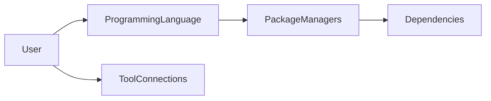
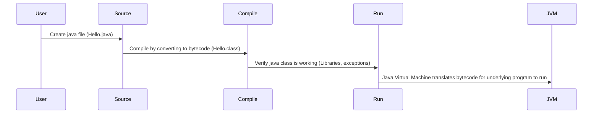

### Project Planning

```mermaid
graph LR
    User-->ProgrammingLanguage
    ProgrammingLanguage-->PackageManagers
    PackageManagers-->Dependencies
    User-->ToolConnections
    

```

### Execution

```mermaid
sequenceDiagram
    User->>Source:Create java file (Hello.java)
    Source->>Compile:Compile by converting to bytecode (Hello.class)
    Compile->> Run: Verify java class is working (Libraries, exceptions)
    Run->>JVM:Java Virtual Machine translates bytecode for underlying program to run

```