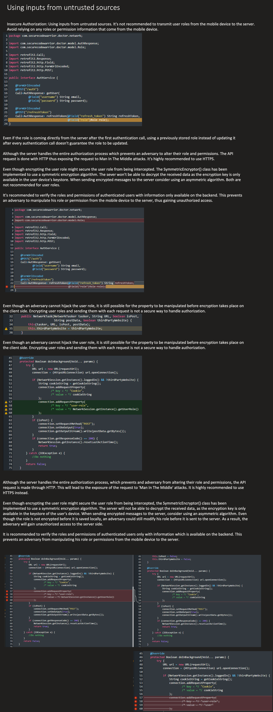

Broken Authentication
Common vulnerabilities (weak passwords, poor session handling)
Mitigation strategies (MFA, secure session management)
Session Fixation and Management
Risks with session handling
Secure cookie settings, session expiration
Token-Based Authentication
JWT and its security considerations

---

Authentication - Weak Password Policy
Password strength is not properly validated and would allow users to set weak passwords. An adversary 
 could use dictionary attacks to guess user's passwords.

It is recommended to check password containing at least one lower case, one upper case, one digit, one special character and the length should not be less than 10 characters long. The applciation uses a regular expression pattern to ensure password strength. It protects user accounts from Brute-force attack.

return password.matches(AppConstants.PASSWORD_PATTERN);

---

Improper Authentication

The Login process has improper authentication implemented and would allow an adversay to get a valid token by just providing the username.

CORRECT


```java
UserEntity userEntity= userService.getByLogin(authDTO.getLogin());
CredentialValidationResult validationResult = credentialValidate.validate(
authDTO.getLogin(),
authDTO.getPassword());
if(!validationResult.getStatus().equals(VALID)){
authAttemptService.save(ipAddress);
logService.error(BAD_LOGIN_PASS);
throw new ValidationException(BAD_LOGIN_PASS);
}
UserEntity eserEntity= userService.getByLogin(authDTO.getLogin());
```

Token creation should occur only after successful data validation.
The application provides correct verification of user login information; an attacker will not be able to obtain certain priveleges or disclose confidential information. Recommended to use strong authentification to protect against brute force and make the session safe.

---

Client-Side Session Token Generation

Token-based authentication is a process used to identify users. When a user submits their credentials they are sent to the server. The server then authenticates the user's credentials and creates a token, which is sent as a response back to the user's response. This allows the client to make additional HTTP calls until the token expires.

The Client Side Session Token Generation vulnerability exists when an app generates an access token to begin a session without validation the source of the token. When token are being generated on the client-side they can be reversed when the generation algorithm is leaked through the app source code. This can be reverse engineered from the mobile application. If an adversary knows the exact generation algorithm, they could reverse a specific user's access token to gain unauthorized access to that user's account.

Example:
A user is entering his credentials in an app on his mobile device. Upon login, the user's device generates an access token, which is then sent to the server, where it is stored. But unfortunately, the token is not generated randomly. An attacker has noticed this and has reverse engineered the mobile application.
This allows her to figure out how tokens are generated. Next, she decides to target this particular user, and collects the information required to generate a new access token. Since that information is not random and can be calculated for each login. The attacker now has unrestricted access to the user's account.

To prevent Client Side Session Token Generation, developers should:
	- Ensure Session management is done on the server side
	- Wherever possible, give access tokens an expiration date
	- Ensure that access tokens are handled by a cryptographically strong algorithm on the web server
	- Consider using a secondary token verification system to ensure all tokens used were generated from your server

---

Improper Timeout Of Session Id

When the user logs out of the application, the server should be informed of this action so it can invalidate the session. In this code the application only removes user data from memory without informing the server about the log out action.

The server is informed to invalidate the current session when the user logs out. The application also removes the user's data from memory.


---

Untrusted Sources




---

USERNAME ENUMERATION
User enumeration is when a malicious actor can use brute-force techniques to either guess or confirm valid users in a system. User enumeration is often a web application vulnerability, though it can also be found in any system that requires user authentication.

Do not use error messages like:
"Username is incorrect" OR "Password is incorrect"
This allows a hacker to infer that one or the other is correct then continue hacking.

Regardless of whether an entered username exists or not, whether the password only is correct or not, the same general message should always be issued that the username-password combination is incorrect. Also, the time spent on checking the username and password pair should not depend on whether this username exists orn ot. This way an attacher will not be able to find out whether non-existing username was entered or the password is wrong. It significantly increases the time of hacking an account.

---

SESSION HANDLING - INSUFFICIENT SESSION EXPIRATION
Setting long timeout values will make the application vulnerable to session hijacking attacks. An adversary could be able to get access to an open user session (for example via a cross-site scripting attack) and impersonate that user. 

public static final int REFRESH_TOKEN_EXPIRES_IN_DAY = 1;

It is recommended to set short timeouts in order to prevent session hijacking attacks. The application has set REFRESH_TOKEN_EXPIRES_IN_DAY to 1 day instead of 120 days, reducing the likelihodd of an adversary gaining access to a legitimate user session.

It's recommended to set appropriate lifetime value for reset tokens in order to avoid exposing them to malicoius users. The application has set a token lifetime value of 5 minutes. In this way, if the user does not reset the password within 5 minutes, the token will expire and an attacker will have fewer chances to reuse such token

private static final Integer FIVE_MINUTES = Integer.MAX_VALUE;

---

Cookies Sessions

Could be compromised because of configuration issues with cookie flags.
Include session information, this could be obtained by an attacker.

MISSING/IMPROPERLY CONFIGURED COOKIE FLAGS:
	- Secure - Avoid transmission over an insecure channel
	- HttpOnly - Don't let JavaScript read a cookie's value
	- Domain - Set the domain for which the cookie is available
	- Path - Set subfolders and pages for which the cookie is available
	- Expires - Determine when the cookie should be deleted

Session values may also be passed as HTTP parameters, which is less secure than using cookie values.
HTTP is a stateless protocol. So cookies are used to track a user's state by storing values related to the user's actions. The cookie values are sent to and from the server and are stored in the client's browser.

Cookies without the HttpOnly flag could be ready by scripts and sent to an attacker.

FIX:
Always store session information in cookies. DO NOT pass session information as a parameter.

Corrently configure cookies:
	- Set "Secure" and "HttpOnly" flags
	- Set the "Domain" and "Path" as narrowly as possible
	- Set the "Expires" header to 0, except for persistent cookies
