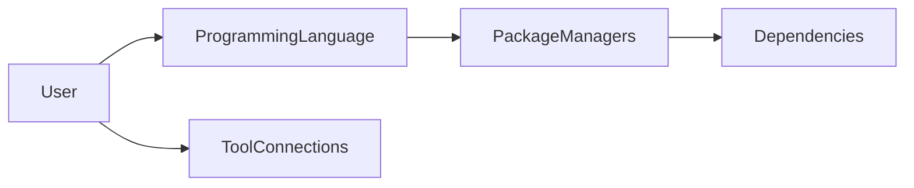
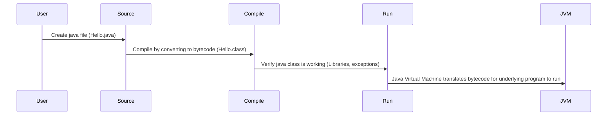

import Tabs from '@theme/Tabs';
import TabItem from '@theme/TabItem';

## Principles

<Tabs>
<TabItem value="solid" label="SOLID">

**Single Responsibility Principle**
A class should only have one responsibility: write change and maintain a class for only 1 purpose.

Open Closed Principle
A class should be open for extension, but closed for modification.

**Liskov Substitution Principle**
Subclasses should be substitutable for their base classes. Important connection to polymorphism and inheritance.
Child-Parent contract. Same method and parameter types

**Interface Segregation Principle**
Interfaces should be small, each dealing with one aspect of a problem. E.g. diff coffee brewing method -
1 interface for each.

**Dependency Inversion Principle**
Classes should depend upon abstract concepts, rather than concrete implementations

</TabItem>
<TabItem value="dry" label="DRY">

</TabItem>
<TabItem value="kiss" label="KISS">

</TabItem>
<TabItem value="4-pillars" label="4 pillars of OOP">

These are fundamental principles that form the foundation of OOP and guide how to design and structure software systems.
These four principles help in creating maintainable, reusable, and flexible software systems.

## 1. Inheritance

Knowledge is passed on following the hierarchy of classes:
REUSES METHODS WITH DIFFERENT PARAMETERS

The act of one class receiving the behaviours and attributes of another class or interface.

IMPLEMENTATION:

Child/Sub Class EXTENDS Parent/Super Class

Schematic Diagrams: ARROW.

Triangular tip pointing from the derived class to the base class.

## 2. Encapsulation

Defines classes and prevents unauthorised access to classes

The act of grouping together data and behaviour into logical components.

IMPLEMENTATION:

PRIVATE attributes + GETTERS + SETTERS

Wrap up data under single unit. Methods are hidden from public - combination of data hiding and abstraction.

## 3. Abstraction

Shows only the essential attributes and hides unnecessary information

Extracting relevant and essential information and behaviour.

IMPLEMENTIATION:

ABSTRACT class Name.

@Override
Access specific methods for new parameters to be applied

## 4. Polymorphism (Abstract)

Allows procedures about objects to be created whose exact type is not known until runtime. How a screen cursor changes
its shape from an arrow to a line depending on the program.

Extends class and repurpose method with different parameters which overrides the parent method.

Having multiple forms or versions of the same types of thing and the same types of behaviour.

Compile: Same Method (Different arguments);
Run-time Polymorphism:

OOD IMPLEMENTIATION:

Class Child extends Parent
public void action ()
sout("print the action that the child class will perform");

Schematic Diagrams: *ITALICS.*
The child classes (Dog/Cat/Bird) of a Parent class (Animal) are connected through the Parent interface.

Another class can call and run/apply this method by using a constructor to initialise the method.

Child c = new Child();
c.action();

</TabItem>
<TabItem value="eq-4-pillars" label="4 pillars in FP">

## 1. Inheritance --> Function Composition

Promotes modular code by composing smaller functions into larger ones.

**What it is:** Function composition is the process of combining simple functions to build more complex ones. In FP, functions are typically small, reusable, and composed together to build larger functionality.

## 2. Encapsulation --> Immutability

Encapsulates data in an immutable form to prevent accidental state modification.

**What it is:** In FP, data is typically immutable, meaning once a value is assigned, it cannot be changed. If you need a modified version of a value, you create a new one.

## 3. Abstraction --> Pure Functions

Hides complexity and ensures consistent, predictable results.

**What it is:** A function is considered pure if it always produces the same output for the same input and has no side effects (like modifying global variables or printing to the console). This is one of the core tenets of FP.

**Additional Features**
- Lazy evaluation is a technique where expressions are not evaluated until their values are actually needed. This can help with performance optimization and enables the creation of infinite data structures.
- Referential transparency, meaning that a function's result can be replaced with its value without changing the program's behavior. This makes the code more predictable and easier to test

## 4. Polymorphism (Abstract) --> First-Class and Higher-Order Function

Enables flexible and reusable code through functions that can accept other functions as parameters or return them.

**What it is:** In FP, functions are first-class citizens. This means that functions can be passed around as arguments to other functions, returned as values from other functions, and assigned to variables. A higher-order function is one that either takes one or more functions as arguments, returns a function, or both.

</TabItem>
</Tabs>

---

## Core Concepts

<Tabs>
<TabItem value="intro" label="CLI">

## Terminal

Macs have a terminal that offers a command prompt for the user to directly interact with the shell.

## Shell

The Shell provides users with access to the Operating System (e.g. UNIX, Mac-OS, MACH, MS-DOS, MS-WINDOWS) and the
Filesystem within. You can navigate the filesystem to interact more directly with processes that sit in the Kernal.

- I/O Buffer
- Process Management
- Memory Management
- CPU Scheduling

</TabItem>
<TabItem value="tools" label="Tools">

- What applications are needed?
- How are the applications communicating with each other?
- What servers are needed?
- How are using servers different from APIs?
- What package managers should be used?
- What dependencies would be helpful?
- What is the project architecture?
- What design patterns are useful to consider?

UNIX-like operating systems can be operated via the command line (bash/zsh)to navigate, run, and manipulate files and scripts.

### Differences

| Use Case(s)                     | Bash                                               | Zshrc                                                  |
|---------------------------------|----------------------------------------------------|--------------------------------------------------------|
| Configuration                   | ~/.bashrc                                          | ~/.zshrc                                               |
| Prompt customisation            | PS1                                                | PROMPT                                                 |
| Extended globbing               | shopt -s extglob                                   | enabled by default                                     |
| Plugin System                   | Limited support for plugins through external tools | build-in systems and support frameworks like Oh My Zsh |

### Similarities

| Use Case(s)                     | Bash/Zshrc                                       |
|---------------------------------|--------------------------------------------------|
| File & Directory Management     | cd /path/to/directory                            |     
| Backup & Data Transfer          | rsync -av source/ destination/                   |    
| System Monitoring & Maintenance | top                                              | 
| Automated Testing               | pytest                                           |
| Log Analysis & Reporting        | grep "pattern" logfile                           |
| User Management                 | useradd username                                 |
| Network Tasks                   | ping example.com                                 |
| Environment Setup               | export VARIABLE=value                            |
| Text Processing & Manipulated   | sed 's/pattern/replacement/g' filename           |
| Web Scraping                    | curl http://example.com                          |
| Batch Processing                | for file in *.txt; do process_file "$file"; done |
| Monitoring System Resources     | htop                                             |

</TabItem>
<TabItem value="packages" label="Package Managers">

## Package Managers

**Facilitate:** installation, upgrading, configuration, and removal of software packages.
**Manage:** Libraries, Frameworks, Applications

| Package               | Description                                                                                     |
|-----------------------|-------------------------------------------------------------------------------------------------|
| Package Installation  | Easy Download, Install software packages, remote repositories, local sources                    |
| Package Removal       | Avoid clutter and conflicts by cleanly uninstalling software packages/dependencies              |
| Package Configuration | Allow users to configure installed packages, adjusting settings and options to suit their needs |
| Version Management    | Track package versions stay up-to-date with latest bug fixes and features                       |

## Dependencies
- Dependency Management - Software packages depend on libraries or frameworks

</TabItem>
</Tabs>

### Project Planning

### Execution

