import Tabs from '@theme/Tabs';
import TabItem from '@theme/TabItem';

:::tip Concept Overview
A software project is a *system*: code, structure, tooling, constraints, and team habits woven together.

As a Technical Analyst, your job is to **see the system clearly** so you can understand:
- What is fixed  
- What is flexible  
- What a template must support  
- What a team cannot realistically change  
- How to express requirements that respect engineering reality  
:::

---

# 🧭 The Shape of a Standard Project

A typical engineering project has a recognisable structure.  
This diagram gives you a **mental model** to anchor your analysis.

```mermaid
flowchart TD
    A[Project] --> B[Source Code]
    A --> C[Dependencies]
    A --> D[Build & Packaging]
    A --> E[Testing]
    A --> F[CI/CD]
    A --> G[Runtime & Deployment]
    A --> H[Observability]

    B --> B1[Modules / Packages]
    B --> B2[Classes / Functions]
    B --> B3[Config Files]

    C --> C1[Language Dependencies]
    C --> C2[System Dependencies]
    C --> C3[Internal Libraries]

    D --> D1[Build Tool]
    D --> D2[Package Manager]
    D --> D3[Artifact Output]

    E --> E1[Unit Tests]
    E --> E2[Integration Tests]
    E --> E3[Test Data]

    F --> F1[Linting]
    F --> F2[Build]
    F --> F3[Test]
    F --> F4[Deploy]

    G --> G1[Container / VM / Serverless]
    G --> G2[Environment Config]
    G --> G3[Secrets]

    H --> H1[Logging]
    H --> H2[Metrics]
    H --> H3[Health Checks]
```



This is the **baseline**.  
Your job is to understand how each team’s project deviates from or extends this shape.

# 🧱 Fixed vs Flexible Elements (TA Pattern Recognition)

Every project has:

- **Fixed elements** → cannot change without major cost  
- **Flexible elements** → can change with effort  
- **Team‑specific elements** → should not be forced into a template  

Understanding these categories is the *core skill* for your cookiecutter task.

<Tabs>
<TabItem value="fixed" label="Fixed Elements">

## 🔒 Fixed Elements  
These are dictated by the language, runtime, or organisational constraints.

### Examples by Language

| Language | Typical Fixed Elements | Why Fixed |
|---------|-------------------------|-----------|
| **Java** | Maven/Gradle, `src/main/java`, JAR/WAR output | Tooling ecosystem + JVM conventions |
| **Scala** | sbt, multi‑module builds, typelevel libs | Community norms + compiler constraints |
| **Python** | `src/` layout, virtualenv/poetry, dynamic imports | Packaging + interpreter behaviour |
| **Node.js** | `package.json`, npm/yarn, CommonJS/ESM | Runtime + dependency model |

### TA Interpretation
If something is fixed:
- The template **must** support it  
- The team **cannot** compromise  
- Requirements here are **non‑negotiable**  

</TabItem>
<TabItem value="flexible" label="Flexible Elements">

## 🔄 Flexible Elements  
These can change, but only with cost and coordination.

### Examples

| Area | Typical Flexibility | TA Interpretation |
|------|----------------------|-------------------|
| Directory structure | Medium | Teams can reorganise, but it’s disruptive |
| Testing framework | Medium | Migration possible but painful |
| CI pipeline | Medium | Can be adapted if template supports extension points |
| Dockerfile | Medium | Can be standardised if base image is compatible |

### TA Interpretation
Flexible elements:
- Are negotiable  
- Require understanding team history  
- Often reveal **why** the team built things the way they did  

</TabItem>
<TabItem value="team" label="Team‑Specific Elements">

## 🎨 Team‑Specific Elements  
These are unique to the team’s domain, workflow, or architecture.

### Examples

| Team Type | Team‑Specific Needs |
|-----------|---------------------|
| Data Engineering | ETL folder structure, schema files, pipeline configs |
| Backend API | Routing conventions, middleware patterns |
| ML/AI | Model folders, notebooks, experiment tracking |
| Platform | Terraform modules, infra scripts |

### TA Interpretation
Team‑specific elements:
- Should **not** be forced into a template  
- Should be supported via **extension points**  
- Are where cookiecutter templates often fail  

</TabItem>
</Tabs>

Here’s a clean, consistent Scala addition that fits perfectly alongside the other examples.
I’ve matched the tone, structure, and TA‑level interpretation so the pattern recognition stays sharp.

You can paste this directly into your `.mdx` file.

---

## 🧩 Side‑by‑Side Project Examples

Seeing patterns across languages helps you recognise what matters.

<Tabs>

<TabItem value="java" label="Java">

```mermaid
project/
├── src/
│   ├── main/java/
│   └── test/java/
├── pom.xml
└── target/
```

**Fixed:** Maven, directory structure
**Flexible:** Test framework
**Team‑specific:** Internal libraries, domain modules

</TabItem>

<TabItem value="python" label="Python">

```mermaid
project/
├── src/project_name/
├── tests/
├── pyproject.toml
└── requirements.txt
```

**Fixed:** Packaging model
**Flexible:** Test runner, dependency tool
**Team‑specific:** Data folders, scripts

</TabItem>

<TabItem value="node" label="Node.js">

```mermaid
project/
├── src/
├── test/
├── package.json
└── node_modules/
```

**Fixed:** package.json
**Flexible:** Framework (Express/Fastify)
**Team‑specific:** API structure, middleware

</TabItem>

<TabItem value="scala" label="Scala">

```mermaid
project/
├── src/
│   ├── main/scala/
│   └── test/scala/
├── build.sbt
├── project/
│   └── plugins.sbt
└── target/
```

**Fixed:** sbt build tool, directory structure, Scala compiler settings
**Flexible:** Multi‑module layout, test framework (ScalaTest, MUnit, Specs2)
**Team‑specific:** Functional libraries (Cats, ZIO), domain‑driven module boundaries

</TabItem>

</Tabs>

---

# 🧠 How a TA Reads a Project

This is the guiding narrative you were missing — the *how to think* part.

## 1. Start with the skeleton  
Look at the repo layout.  
Ask: *What does this tell me about the team’s architecture?*

## 2. Identify the fixed elements  
These reveal the **constraints** the template must respect.

## 3. Identify the flexible elements  
These reveal **negotiation space**.

## 4. Identify team‑specific elements  
These reveal **extension points** the template must support.

## 5. Compare against the department template  
Where does it align?  
Where does it conflict?  
Where does it need optionality?

## 6. Formulate requirements  
Requirements should be grounded in:
- What the team *must* have  
- What the template *must* support  
- What the team *can* adapt  

---

# 📜 Requirements Template (TA Output)

| Category | Requirement | Type | Notes |
|----------|-------------|------|-------|
| Repo Structure | Must support `src/` + `tests/` layout | Fixed | Python constraint |
| CI/CD | Must allow custom test steps | Flexible | Team‑specific integration tests |
| Dependencies | Must support Poetry | Fixed | Team standard |
| Deployment | Must allow custom Dockerfile | Flexible | Team uses GPU base image |
| Observability | Must include logging scaffold | Flexible | Can adopt standard |
