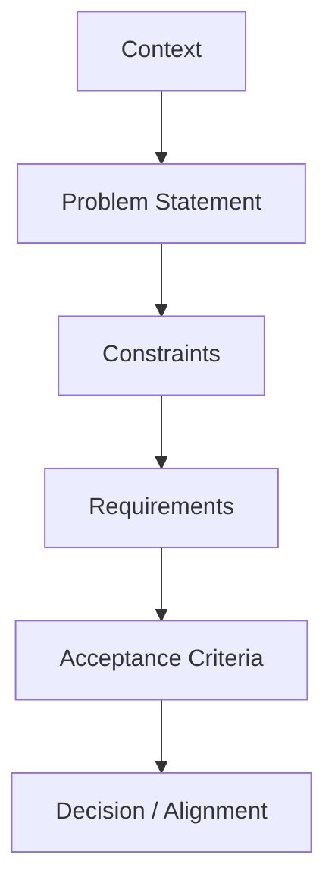

import Tabs from '@theme/Tabs';
import TabItem from '@theme/TabItem';

:::tip Concept Overview
Requirements are not just statements of need — they are **alignment tools**, **boundary‑setting tools**, and **decision‑making tools**.

For a Technical Analyst, requirements are how you:
- Make implicit assumptions explicit
- Protect yourself from political exploitation
- Anchor conversations in facts rather than personalities
- Create shared accountability
- Reduce ambiguity and future conflict
:::

---

# 🧭 The TA Mental Model for Requirements

A requirement is **not** a wish list item.
It is a **constraint**, **condition**, or **decision rule** that must be met for a solution to be viable.

This diagram captures the flow:



**Context → Problem → Constraints → Requirements → Acceptance → Decision**

This is the backbone of TA‑level requirements work.

---

# 🧩 What Good Requirements Look Like (TA Edition)

A good requirement is:

- **Clear** — no ambiguity
- **Testable** — you can verify if it’s met
- **Bounded** — it has a scope
- **Neutral** — no blame, no emotion
- **Contextualised** — tied to a real constraint
- **Negotiable or Non‑Negotiable** — explicitly stated
- **Traceable** — linked to a problem or risk

This is the pattern you will use across your site.

---

# 🧱 The TA Requirement Pattern

Every requirement you write should follow this structure:

## 1. **Context**
Why this requirement exists.

## 2. **Constraint**
What limits the solution space.

## 3. **Requirement Statement**
A single sentence, structured as:

```
The solution must <do/enable/support> <behaviour or condition> because <reason>.
```

## 4. **Acceptance Criteria**
How we know the requirement is met.

## 5. **Negotiability**
- **Non‑negotiable** (fixed constraint)
- **Negotiable** (preference)
- **Team‑specific** (must be supported via extension points)

---

# 🧩 Example Requirements (Side‑by‑Side)

<Tabs>

<TabItem value="good" label="Good Requirement">

```
Context:
The team deploys Python services to Kubernetes using a shared base image.

Constraint:
The base image is maintained by the platform team and cannot be modified.

Requirement:
The cookiecutter template must support using the shared Python base image because teams cannot maintain custom images.

Acceptance Criteria:
- Dockerfile references the shared base image
- No custom OS-level dependencies required
- Build pipeline succeeds using the shared image

Negotiability:
Non‑negotiable
```

</TabItem>

<TabItem value="bad" label="Bad Requirement">

```
We should use the platform image because that’s what everyone else does.
```

</TabItem>

</Tabs>

---

# 🧠 How Requirements Protect You in Misaligned Environments

In an Echo Void environment — where accountability is avoided, responsibility is shifted, and alignment is performative — requirements become a **political shield**.

They allow you to:

### 1. Anchor conversations in facts
Not personalities, opinions, or power plays.

### 2. Create shared responsibility
If someone agrees to a requirement, they share the accountability.

### 3. Prevent scope creep
Requirements define boundaries.

### 4. Avoid being handed all the follow‑up work
Requirements make it clear who owns what.

### 5. Expose bad‑faith behaviour
If someone refuses to agree to a requirement that is clearly tied to a constraint, the misalignment becomes visible.

### 6. Protect your energy
You stop firefighting and start operating from clarity.

---

# 🧩 Requirements Presentation Structure (TA Deliverable)

When presenting requirements to principal engineers or stakeholders, use this structure:

## 1. **Executive Summary**
- What you analysed
- What you found
- What decisions are needed

## 2. **Project Context**
- Team
- Tech stack
- Constraints
- Deployment model

## 3. **Fixed vs Flexible vs Team‑Specific**
A table like this:

| Category | Items | Notes |
|---------|-------|-------|
| Fixed | Python 3.12, shared base image | Cannot change |
| Flexible | Test framework | Can change with effort |
| Team‑specific | ETL folder structure | Must be supported |

## 4. **Requirements List**
Each requirement in the TA pattern format.

## 5. **Adoption Conditions**
What must be true for the team to adopt the template.

## 6. **Risks & Dependencies**
What could block adoption.

## 7. **Next Steps**
Clear, shared actions — not all assigned to you.

---

# 🧠 Using Your Boomerang Time Strategically

Your boomerang placement is a rare opportunity.
Here’s how to use it intentionally.

## 1. Build **TA craft skills**
- Requirements formulation
- Architecture analysis
- Trade‑off framing
- Decision documentation
- Boundary‑setting

## 2. Build **relationships with senior TAs**
These people can:
- Advocate for you
- Pull you into future roles
- Validate your work
- Provide references

## 3. Build **evidence**
You want artefacts that show:
- You deliver clarity
- You improve team alignment
- You reduce risk
- You operate at a senior TA level

## 4. Build **options**
Even if headcount blocks you now, strong relationships + strong evidence = future mobility.

---

# 🛡️ Preparing for a Return to the Echo Void

If you must return:

## 1. Operate from written requirements
Never rely on verbal agreements.

## 2. Use the TA requirement pattern to create clarity
It reduces political manoeuvring.

## 3. Document alignment decisions
This protects you from blame shifting.

## 4. Set boundaries early
Requirements help you say:
> “This is what we agreed. This is what I’m delivering.”

## 5. Avoid taking on unbounded work
If it’s not in the requirements, it’s not your responsibility.

## 6. Protect your energy
You’re not there to fix the culture — you’re there to survive it.

