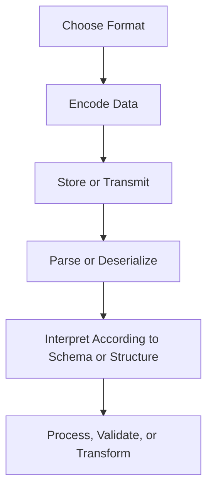
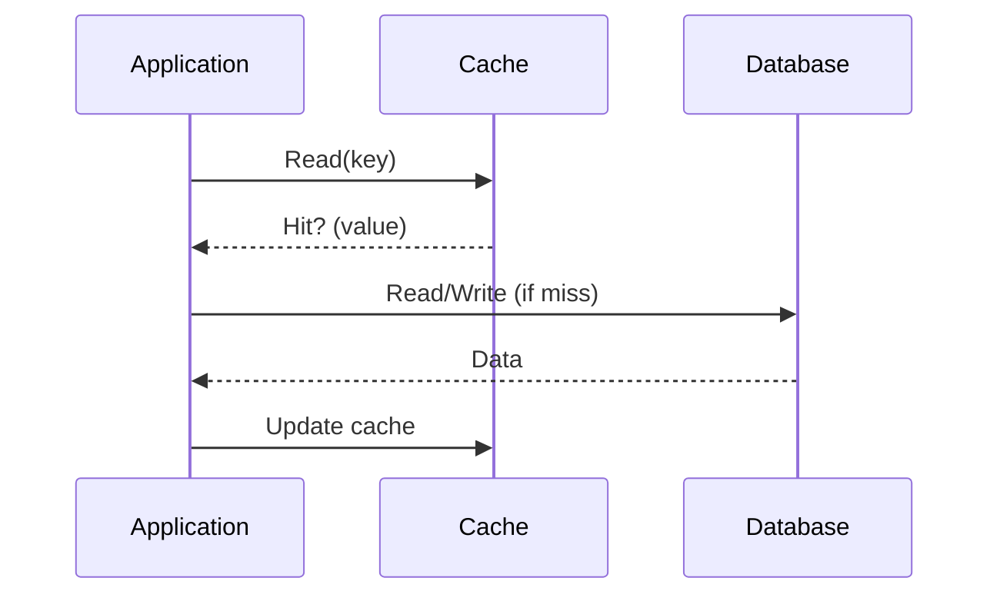

import Tabs from '@theme/Tabs';
import TabItem from '@theme/TabItem';

:::tip
### Definition
File Types & Data Formats define how information is encoded, structured, and represented for storage, transmission, configuration, or processing.
:::

**When to Use**

- Choosing how systems exchange or persist data
- Designing APIs, pipelines, or integrations
- Selecting formats for analytics, messaging, or configuration
- Ensuring interoperability across languages and platforms
- Enforcing schemas or validating structure

**When Not to Use**

- When discussing storage engines (use Storage Systems pages)
- When modelling domain entities (use Data Modelling)
- When describing communication semantics (use Communication Patterns)
- When formats are used as transport rather than structure (e.g., HTTP)

---

## 🎯 What Problem Does This Solve?

File types solve the problem of **how data is represented** so that systems can:

| Benefit | Why it matters |
|--------|----------------|
| Correct parsing | Prevents misinterpretation between systems |
| Interoperability | Enables cross‑language and cross‑platform communication |
| Performance optimisation | Choose formats suited for analytics, messaging, or configuration |
| Schema enforcement | Ensures data integrity and predictable structure |
| Debuggability | Human‑readable formats simplify troubleshooting |

---

## 🧠 Conceptual Model

### Core Components

- **Encoding** → text vs binary
- **Structure** → schema‑less vs schema‑enforced
- **Orientation** → row‑based vs columnar
- **Purpose** → configuration, messaging, analytics, documentation

### Axes of Variation

#### Text vs Binary
- **Text** → human‑readable, easy to debug
- **Binary** → compact, fast, schema‑driven

#### Schema‑less vs Schema‑enforced
- JSON, CSV → flexible but error‑prone
- Protobuf, Avro, XSD → strict structure, safer evolution

#### Row‑based vs Columnar
- CSV → row‑oriented
- Parquet → column‑oriented for analytics

#### Configuration vs Data vs Code
- YAML/TOML → configuration
- JSON/XML → structured data
- SQL/GraphQL → schema or query definitions

---

### Typical Lifecycle or Flow



---

## 🔍 TA Lens

:::info How a TA Evaluates File Types
- What guarantees are required (schema, ordering, types)?
- Is human readability important?
- Is performance or payload size critical?
- Will the format evolve over time?
- Does the system require strict validation?
- Is the data for operational use or analytics?
:::

**What happens when:**

- **Data grows** → binary formats outperform text
- **Traffic increases** → payload size becomes critical
- **Schemas evolve** → compatibility rules matter
- **Systems integrate** → interoperability becomes a constraint

---

## 📘 Key Terminology

| Term | Definition |
|------|------------|
| Serialization | Converting objects into a storable/transmittable format |
| Schema | Structure definition for data |
| Columnar | Data stored by column for analytical workloads |
| Row‑based | Data stored row‑by‑row for operational workloads |
| Markup | Text with embedded structure (XML, HTML) |
| Configuration File | Format used to define system behaviour |

---

## 🧬 Variants / Types

<Tabs>

<TabItem value="serialization" label="Serialization & Messaging Formats">

### Serialization & Messaging Formats

**Purpose**
Encode structured data for storage or transmission.

---

### JSON (`.json`)
Human‑readable key/value structured data.

**Use When**
- REST APIs
- Configuration
- Logging/debugging
- Cross‑language communication

**Characteristics**
- Lightweight
- Flexible
- No enforced schema
- Text‑based
- Supports arrays, objects, primitives

---

### XML (`.xml`)
Markup‑based structured data with optional schemas.

**Use When**
- Enterprise integrations
- Document‑centric data
- Systems requiring strict validation

**Characteristics**
- Verbose
- Supports namespaces
- Often paired with XSD
- Text‑based

---

### Protobuf (`.proto`)
Compact, schema‑driven binary format.

**Use When**
- High‑performance services
- gRPC
- Low‑latency communication

**Characteristics**
- Strong schema
- Very small payloads
- Fast serialization
- Binary‑based

---

### Avro (`.avsc`)
Schema‑based binary format used in data pipelines.

**Use When**
- Event streaming
- Schema evolution
- Kafka ecosystems

**Characteristics**
- Self‑describing
- Efficient for ingestion pipelines
- Binary‑based

</TabItem>

<TabItem value="config" label="Configuration & Infrastructure Files">

### Configuration & Infrastructure Files

**Purpose**
Define system behaviour, environment settings, and infrastructure.

---

### YAML (`.yaml`, `.yml`)
Human‑friendly configuration.

**Use When**
- Kubernetes manifests
- CI/CD pipelines
- Application config

**Characteristics**
- Indentation‑based
- Easy to read
- Easy to mis‑indent

---

### TOML (`.toml`)
Minimal, strongly‑typed configuration.

**Use When**
- Tooling config
- Python/Rust project metadata

**Characteristics**
- Predictable parsing
- Less ambiguous than YAML

---

### ENV (`.env`)
Key‑value environment variables.

**Use When**
- Local development
- Injecting secrets/config at runtime

**Characteristics**
- Simple
- No structure beyond key/value

</TabItem>

<TabItem value="schema" label="Programming & Schema Definition Files">

### Programming & Schema Definition Files

**Purpose**
Define structure, contracts, or executable logic.

---

### SQL (`.sql`)
Schema and query definitions for relational databases.

**Use When**
- Table creation
- Migrations
- Query logic

---

### GraphQL (`.graphql`)
Schema and query language for APIs.

**Use When**
- Client‑driven data fetching
- Typed API contracts

---

### XSD (`.xsd`)
Schema definition for XML.

**Use When**
- Validating XML structure
- Enforcing strict document rules

**Characteristics**
- Defines elements, attributes, types
- Supports namespaces
- Used in enterprise and government systems

</TabItem>

<TabItem value="docs" label="Documentation & Markup">

### Documentation & Markup

**Purpose**
Represent text, documentation, or rendered content.

---

### Markdown (`.md`)
Lightweight markup for documentation.

**Use When**
- READMEs
- Knowledge bases
- Static sites

---

### HTML (`.html`)
Markup language for web content.

**Use When**
- Web pages
- UI rendering

</TabItem>

<TabItem value="analytics" label="Data & Analytics Formats">

### Data & Analytics Formats

**Purpose**
Store tabular or analytical data efficiently.

---

### CSV (`.csv`)
Plain‑text tabular data.

**Use When**
- Imports/exports
- Simple pipelines
- Interoperability

**Characteristics**
- Human‑readable
- No schema
- Error‑prone for complex data

---

### Parquet (`.parquet`)
Columnar, compressed format for analytics.

**Use When**
- Data lakes
- BigQuery/Spark/Hive
- Large‑scale analytical workloads

**Characteristics**
- Highly compressed
- Columnar
- Schema‑aware
- Binary‑based

</TabItem>

</Tabs>

---

## 🧩 System Interactions

:::info How a TA Understands the System
- How formats interact with storage, compute, and pipelines
- How parsing, encoding, and schema validation behave under load
- What becomes a bottleneck as data volume or complexity grows
:::

### Local Systems

- Parsers
- Runtime encoders/decoders
- File systems
- CLI tools

### Remote Systems

- APIs
- Message brokers
- Data lakes
- Schema registries

### Questions to ask during reviews or incidents

- Is the format appropriate for the workload?
- Is schema evolution safe?
- Are we over‑using text formats for large data?
- Are consumers tolerant of missing or extra fields?
- Is the format validated before processing?

---

## 💥 Outputs / Results

:::note Special Considerations
File formats determine how data is interpreted — incorrect choice leads to silent failures.
:::

### Success Modes

| Result Type | Description |
|-------------|-------------|
| Correct Parsing | Systems interpret data consistently |
| Schema Compatibility | Producers and consumers evolve safely |
| Efficient Processing | Formats match workload (analytics vs operational) |
| Interoperability | Multiple systems can read/write the same format |

### Failure Modes

| Failure Type | Description |
|--------------|-------------|
| Schema Drift | Producers and consumers disagree on structure |
| Parsing Errors | Invalid or ambiguous formats |
| Performance Degradation | Using text formats for large analytical workloads |
| Data Loss | Incorrect encoding/decoding or truncation |

--

##  "Configurations"


:::tip
### Definition
Configurations define the parameters, environment settings, and desired state that control how applications and infrastructure behave at runtime.
:::

**When to Use**

- Behaviour must change without code changes
- Environments differ (dev/test/prod)
- Infrastructure is declarative and self‑reconciling
- Secrets must be isolated from code
- Systems require reproducibility and traceability

**When Not to Use**

- Logic belongs in code
- Secrets would be stored in plaintext
- Configuration becomes overly dynamic or complex
- YAML is being used to express conditional logic or workflows

---

## 🎯 What Problem Does This Solve?

Configurations solve the problem of **environment‑specific behaviour**, **runtime variability**, and **declarative control** without modifying code.
They enable predictable, repeatable, and secure operation across environments by externalising behaviour into structured, versioned artefacts.

---

## 🧠 Conceptual Model

### Core Components

- **Environment configuration** → ENV vars, secrets, runtime parameters
- **Declarative manifests** → YAML, Terraform, Helm charts
- **Templating systems** → Jinja, Helm, Kustomize
- **Secrets management** → encrypted values, Vault, KMS
- **Controllers / reconcilers** → Kubernetes controllers, Terraform apply

### Axes of Variation

- **Static vs Dynamic**
  - Static: loaded at startup
  - Dynamic: reloaded or reconciled at runtime

- **Declarative vs Imperative**
  - Declarative: define desired state
  - Imperative: execute commands

- **Plaintext vs Encrypted**
  - ConfigMaps vs Secrets
  - SOPS, Vault, KMS

- **Environment vs Application**
  - ENV vars vs YAML/TOML config files

---

### Typical Lifecycle or Flow

**Diagram:**

```mermaid
flowchart TD
    A[Define Config (YAML/ENV/TOML)] --> B[Store in Git/Vault/S3]
    B --> C[Render Templates (Helm/Jinja/Kustomize)]
    C --> D[Apply to System (kubectl apply / Terraform)]
    D --> E[Controller Reconciles Desired vs Actual State]
    E --> F[Observe Logs/Events/Drift]
    F --> A[Update Config and Re‑apply]
```

---

## 🔍 TA Lens

:::info How a TA Evaluates This Concept
- What behaviour is controlled by config vs code
- How the system behaves when configuration changes
- Whether secrets are isolated and encrypted
- How declarative systems reconcile drift
- What becomes a bottleneck when configuration grows
:::

**What happens when:**

- **Data grows** → manifests become large, templates become complex
- **Traffic increases** → scaling parameters become critical
- **Concurrency rises** → misconfigurations surface under load
- **Resources become constrained** → controllers may fail to reconcile

---

## 📘 Key Terminology

| Term | Definition |
|------|------------|
| Declarative | Define desired state; system reconciles it |
| Imperative | Execute commands directly |
| ConfigMap | Non‑secret configuration in Kubernetes |
| Secret | Sensitive configuration stored separately |
| Manifest | YAML file describing a resource |
| Template | File with variables used to generate config |

---

## 🧬 Variants / Types

<Tabs>

<TabItem value="env" label="Environment Configuration">

### Environment Variables & Secrets

**Purpose**
Inject runtime parameters and sensitive values without modifying code.

**Key Characteristics**
- Key/value pairs
- Loaded at startup
- Secrets encrypted or access‑controlled

**Behaviour**
Application behaviour changes based on injected values.

**Trade-offs**
Simple and flexible, but can become unstructured or insecure if misused.

</TabItem>

<TabItem value="declarative" label="Declarative Infrastructure">

### Declarative Manifests (Kubernetes, Terraform)

**Purpose**
Define desired state; controllers ensure actual state matches.

**Key Characteristics**
- Version‑controlled
- Predictable and repeatable
- Self‑healing via reconciliation

**Behaviour**
Controllers continuously enforce declared configuration.

**Trade-offs**
Powerful but requires discipline; misconfigurations propagate quickly.

</TabItem>

<TabItem value="files" label="Configuration Files & Templates">

### YAML / TOML / Jinja / RAML

**Purpose**
Provide structured, human‑readable configuration formats.

**Key Characteristics**
- YAML for infra and pipelines
- TOML for strongly‑typed config
- Jinja for templating
- RAML for API modelling

**Behaviour**
Files are rendered, parsed, or applied to shape system behaviour.

**Trade-offs**
Readable but prone to complexity when over‑templated.

</TabItem>

</Tabs>

---

## 🧩 System Interactions

:::info How a TA Understands the System
- How configuration interacts with runtime, storage, and orchestration
- How declarative systems reconcile drift
- What becomes a bottleneck as configuration grows
:::

### Local Systems

- OS environment
- Runtime loaders
- File systems
- Local secrets stores
- Scaling parameters

### Remote Systems

- Kubernetes controllers
- Terraform state
- Cloud provider APIs
- CI/CD pipelines

### Questions to ask during reviews or incidents

- What changed recently in configuration?
- Is the system reconciling or stuck?
- Are secrets stored securely?
- Is behaviour environment‑specific or global?
- Is drift occurring between desired and actual state?

---

## 💥 Outputs / Results

:::note Special Considerations
Configuration errors often appear as runtime failures, not compile‑time errors.
:::

### Success Modes

What does success look like?

| Result Type | Description |
|-------------|-------------|
| Predictable Behaviour | System behaves consistently across environments |
| Reproducibility | Config is versioned and traceable |
| Secure Separation | Secrets isolated from code |
| Declarative Convergence | System self‑heals toward desired state |

### Failure Modes

Symptoms of misconfiguration:

| Failure Type | Description |
|--------------|-------------|
| Drift | Actual state diverges from declared state |
| Secrets Exposure | Sensitive values appear in logs or repos |
| Runtime Crashes | Invalid or missing config values |
| Over‑templating | Config becomes unreadable or unmaintainable |

--

##  "Persistence"


## 🧠 Theory
This **Theory** page explains how applications store, retrieve, and maintain data across requests, failures, and deployments.
Persistence is the backbone of every system that needs durable state — user accounts, transactions, logs, analytics, configuration, and more.

Understanding persistence helps you:

- reason about data correctness and consistency
- anticipate performance bottlenecks
- diagnose issues in ORMs, caches, and database interactions
- evaluate architectural trade‑offs
- communicate clearly with engineers about data flows

Persistence is not about tools — it is about **how data behaves in a system**.

---

:::tip
### Definition
**Persistence** is the mechanism by which data outlives the process that created it, ensuring durability across requests, failures, and deployments.
:::

**When to Use**

- When data must survive application restarts
- When multiple services need shared state
- When correctness, auditability, or history matter

**When Not to Use**

- Temporary, per‑request data
- Ephemeral caches or in‑memory computations
- Stateless operations that do not require storage

---

## 🎯 What Problem Does This Solve?

Applications run in memory — and memory disappears when the process ends.
Without persistence:

- users would lose their data
- systems could not recover from crashes
- multi‑step workflows would break
- distributed systems could not coordinate

Persistence solves the problem of **durability**: ensuring data remains available and correct across time, failures, and scale.

---

## 🧠 Conceptual Model

### Core Components

- **In‑Memory Objects** — short‑lived, tied to the application runtime
- **Persistent Storage** — databases, files, logs, distributed stores
- **JDBC** — low‑level SQL execution
- **ORMs (Object‑Relational Mappers)** — map objects to database tables
- **Caching Layers** — fast, ephemeral storage to reduce load
- **Transactions** — ensure atomic, consistent operations
- **Consistency Models** — how systems guarantee correctness

### Axes of Variation

- In‑memory ↔ Durable
- SQL ↔ NoSQL
- ORM ↔ Raw queries
- Strong consistency ↔ Eventual consistency
- Local storage ↔ Distributed storage
- Cache‑first ↔ Database‑first

---

### Typical Lifecycle or Flow

**Diagram(s):**



---

## 🔍TA Lens

:::info How a TA Evaluates This Concept
- Where data lives and how long it lives
- How reads/writes behave under load
- How caching affects correctness and freshness
- How ORMs generate queries and where they leak abstraction
- How transactions behave under concurrency
- What becomes a bottleneck as data grows
:::

**What happens when:**

- **Data grows** → indexes, query plans, ORM inefficiencies surface
- **Traffic increases** → DB saturation, connection pool exhaustion
- **Concurrency rises** → deadlocks, race conditions, stale reads
- **Resources become constrained** → slow queries, cache evictions, timeouts

---

## 📘 Key Terminology

| Term | Definition |
|------|------------|
| **Persistence** | Ensuring data survives beyond the application process. |
| **JDBC** | Low‑level API for executing SQL directly. |
| **ORM** | Maps objects to database tables automatically. |
| **Caching** | Storing frequently accessed data in fast, ephemeral storage. |
| **Object Lifecycle** | How objects are created, used, and destroyed in memory. |
| **Database Lifecycle** | How data is stored, updated, and persisted over time. |
| **Transactions** | Group of operations that succeed or fail together. |
| **Consistency** | Guarantees about data correctness across reads/writes. |

---

## 🧬 Variants / Types

<Tabs>

<TabItem value="jdbc" label="JDBC">

### JDBC (Direct SQL)

**Purpose**
Execute SQL directly with full control.

**Key Characteristics**
- Manual SQL
- Manual mapping
- High transparency

**Behaviour**
Fast and predictable, but verbose and error‑prone.

**Trade-offs**
- ✔ Full control
- ✔ No abstraction leakage
- ✘ More boilerplate
- ✘ Harder to maintain

</TabItem>

<TabItem value="orm" label="ORM">

### ORM (Object‑Relational Mapping)

**Purpose**
Map objects to database tables automatically.

**Key Characteristics**
- Automatic SQL generation
- Entity lifecycle management
- Declarative relationships

**Behaviour**
Accelerates development but can hide performance issues.

**Trade-offs**
- ✔ Faster development
- ✔ Cleaner domain models
- ✘ Hidden queries
- ✘ N+1 problems, abstraction leakage

</TabItem>

<TabItem value="cache" label="Caching">

### Caching

**Purpose**
Reduce load on the database and improve performance.

**Key Characteristics**
- In‑memory
- Fast reads
- Eviction policies

**Behaviour**
Improves performance but risks stale data.

**Trade-offs**
- ✔ Very fast
- ✔ Reduces DB load
- ✘ Stale reads
- ✘ Cache invalidation complexity

</TabItem>

</Tabs>

---

## 🧩 System Interactions

:::info How a TA Understands the System
Persistence interacts with nearly every part of the system: compute, network, storage, caching, and concurrency.
:::

### Local Systems

- Application runtime (JVM, Python, Node)
- Connection pools
- In‑memory caches
- Transaction managers
- ORM layers

### Remote Systems

- Databases (SQL/NoSQL)
- Distributed caches (Redis, Memcached)
- Replicas and read‑replicas
- Data centres / regions

### Questions to ask during reviews or incidents

- Where does the data actually live?
- How fresh is the data?
- What happens if the cache fails?
- What happens if the DB restarts?
- Are transactions required?
- Is the ORM generating inefficient queries?

---

## 💥 Outputs / Results

:::note Special Considerations
Persistence failures often manifest as performance issues, stale data, or inconsistent state.
:::

### Success Modes

| Result Type | Description |
|-------------|-------------|
| Durable state | Data survives restarts and failures. |
| Predictable queries | SQL behaves consistently under load. |
| Efficient caching | Reduced DB load and faster responses. |

### Failure Modes

| Failure Type | Description |
|-------------|-------------|
| Stale data | Cache not invalidated or inconsistent replicas. |
| Slow queries | Missing indexes, ORM inefficiencies. |
| Deadlocks | Concurrent writes blocking each other. |
