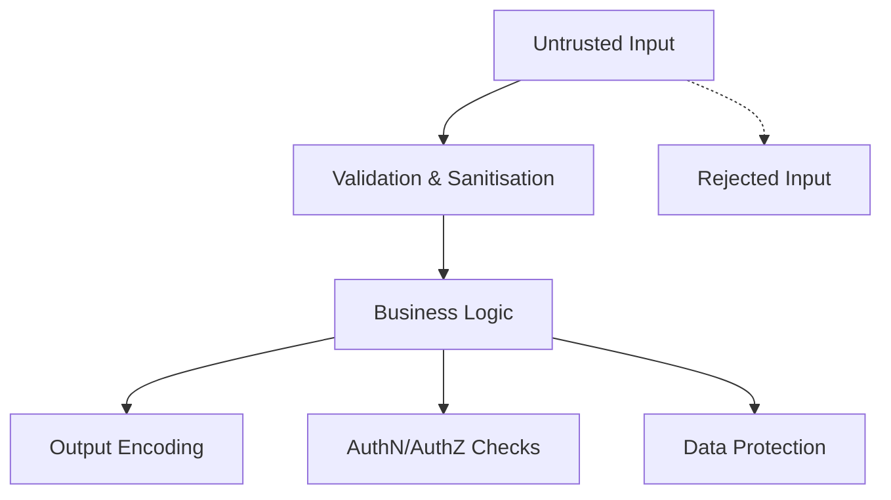

import Tabs from '@theme/Tabs';
import TabItem from '@theme/TabItem';

:::tip
### Definition
**Hacking & Cyber Security Patterns** describe the recurring ways attackers exploit systems, and the defensive strategies used to prevent, detect, and contain those attacks.
They focus on *attack shapes*, *risk patterns*, and *protection principles*, not tools or implementation details.
:::

**When to Use**
- Reviewing designs
- Evaluating APIs
- Assessing data flows
- Working with authentication or authorisation
- Reviewing third‑party integrations
- Handling sensitive data
- Preparing for audits or compliance

**When Not to Use**
- The system is isolated and non‑critical
- The cost of controls outweighs the risk
- You are prototyping and not storing real data
Security should be **proportionate**, not maximal.

---

## 🎯 What Problem Does This Solve?

Cyber security patterns solve the problem of recognising how systems fail under adversarial pressure and how to design
them so they fail safely. They give Technical Analysts a structured way to understand common attack shapes, anticipate
risks early in design, and evaluate whether a system’s defences match the threats it faces. Knowing these patterns
enables clearer communication with security engineers, stronger requirements, and better incident readiness.

---

## 🧠 Conceptual Model

Cyber security is fundamentally about understanding **how attacks unfold** and **how defences map to each stage**.

### Core Components
- **Attacker goals** (access, disruption, exfiltration)
- **Attack vectors** (input, identity, network, supply chain)
- **Vulnerabilities** (misconfigurations, weak controls, unsafe defaults)
- **Defensive controls** (validation, authentication, authorisation, monitoring)

### Axes of Variation
- **Technical vs human‑focused attacks**
- **Passive vs active reconnaissance**
- **Automated vs manual exploitation**
- **Opportunistic vs targeted attacks**
- **Short‑lived vs persistent access**

---

### Typical Lifecycle or Flow

Most attacks follow a predictable sequence:

1. **Reconnaissance** — gather information
2. **Initial Access** — exploit a weakness
3. **Privilege Escalation** — gain higher permissions
4. **Lateral Movement** — move across systems
5. **Impact** — exfiltrate, disrupt, or take control
6. **Persistence** — maintain long‑term access

**Diagram(s):**
```
flowchart LR
    R[Reconnaissance] --> A[Initial Access] --> E[Privilege Escalation]
    E --> L[Lateral Movement] --> I[Impact] --> P[Persistence]
```

---

## 🔍 TA Lens

:::info How a TA Evaluates This Concept
- What changes, what stays constant, what becomes a bottleneck
- How the concept behaves under pressure
- Questions to ask during reviews or incidents
- Risks, constraints, or trade-offs to surface
:::

**What happens when:**
- Data grows → more valuable target, larger attack surface
- Traffic increases → more opportunities for brute force or DoS
- Concurrency rises → race conditions, session confusion
- Resources become constrained → degraded defences, noisy logs, missed alerts

---

## 📘 Key Terminology

| Term | Definition |
|------|------------|
| **Attack Surface** | All points where an attacker can interact |
| **Threat Model** | Assumptions about attacker capabilities |
| **Payload** | Malicious input crafted to exploit a vulnerability |
| **Vector** | The path an attack takes |
| **Exploit** | Code or technique that triggers a vulnerability |
| **Mitigation** | A control that reduces risk |

---

## 🧬 Variants / Types

<Tabs>

<TabItem value="input" label="Input & Interpreter Attacks">

**Key Characteristics**
- Untrusted input is executed or interpreted
- Targets parsers, interpreters, and templating engines

**Behaviour**
Attackers craft input that alters program execution or file paths.

**Examples**
- Injection (SQL, command, template, LDAP)
- Cross‑Site Scripting (XSS)
- Deserialization attacks
- Directory traversal

**Trade-offs**
Strict validation and sandboxing reduce flexibility but eliminate entire exploit classes.

</TabItem>

<TabItem value="identity" label="Identity & Session Attacks">

**Key Characteristics**
- Target authentication, identity proof, and session state
- Often automated at scale

**Behaviour**
Attackers attempt to impersonate users or hijack active sessions.

**Examples**
- Credential stuffing
- Brute force
- Session hijacking
- Weak password reset flows
- CSRF

**Trade-offs**
Stronger authentication increases friction but dramatically improves resilience.

</TabItem>

<TabItem value="access" label="Access & Authorisation Attacks">

**Key Characteristics**
- Exploit missing or weak authorisation checks
- Often invisible until exploited

**Behaviour**
Attackers access data or actions outside their permissions.

**Examples**
- Broken access control
- IDOR
- Privilege escalation

**Trade-offs**
Strict server‑side checks add overhead but prevent catastrophic data exposure.

</TabItem>

<TabItem value="availability" label="Availability Attacks">

**Key Characteristics**
- Target system capacity, cost, or algorithmic weaknesses
- Aim to degrade or deny service

**Behaviour**
Attackers overwhelm compute, memory, or expensive code paths.

**Examples**
- DoS / DDoS
- Resource exhaustion
- Algorithmic complexity attacks

**Trade-offs**
Rate limiting and defensive coding reduce risk but require tuning and observability.

</TabItem>

<TabItem value="supply" label="Supply Chain Attacks">

**Key Characteristics**
- Compromise external dependencies or build systems
- Hard to detect and often discovered late

**Behaviour**
Attackers infiltrate via libraries, packages, or CI/CD pipelines.

**Examples**
- Compromised dependencies
- Malicious packages
- Build pipeline compromise

**Trade-offs**
Stricter dependency controls slow development but increase trust and integrity.

</TabItem>

<TabItem value="data" label="Data Exposure Attacks">

**Key Characteristics**
- Target sensitive data at rest or in transit
- Often caused by misconfiguration

**Behaviour**
Attackers access secrets, credentials, or unencrypted data.

**Examples**
- Sensitive data exposure
- Secrets leakage
- Misconfigured storage

**Trade-offs**
Encryption and secret management add operational overhead but prevent severe breaches.

</TabItem>

<TabItem value="api" label="API & Logic Abuse">

**Key Characteristics**
- Exploit business logic, workflows, or undocumented surfaces
- Hard to detect with traditional security tools

**Behaviour**
Attackers manipulate APIs or workflows in unintended ways.

**Examples**
- API abuse
- Business logic abuse
- Undocumented endpoints

**Trade-offs**
Stronger schema enforcement and rate limits reduce abuse but require careful design.

</TabItem>

<TabItem value="human" label="Human-Focused Attacks">

**Key Characteristics**
- Target human behaviour, trust, and cognitive shortcuts
- Bypass technical controls entirely

**Behaviour**
Attackers trick users into unsafe actions.

**Examples**
- Phishing
- Social engineering
- Pretexting

**Trade-offs**
Education and MFA reduce risk but require organisational investment.

</TabItem>

<TabItem value="misconfig" label="Misconfiguration Attacks">

**Key Characteristics**
- Exploit insecure defaults or missing hardening
- Extremely common in cloud environments

**Behaviour**
Attackers discover and exploit misconfigured services or permissions.

**Examples**
- Unsafe defaults
- Overly permissive settings
- Missing hardening

**Trade-offs**
Secure-by-default configurations reduce flexibility but dramatically reduce attack surface.

</TabItem>
<TabItem value="defensive" label="Defensive Patterns">

**Key Characteristics**
- Cross‑cutting protections that apply across multiple attack types
- Reduce blast radius and increase resilience
- Enforce strong defaults and predictable behaviour

**Behaviour**
Defensive patterns shape how systems respond under adversarial pressure by limiting privileges, validating assumptions, and layering controls so that a single failure does not become a breach.

**Examples**
- **Least Privilege** — minimal permissions by default
- **Zero Trust** — never assume trust; always verify
- **Defense in Depth** — multiple layers of protection
- **Secure Defaults** — safe configuration out of the box
- **Fail Closed** — deny access when uncertain or on error
- **Threat Modelling** — anticipate attacker behaviour and design accordingly

**Trade-offs**
Stronger controls increase safety but may add operational overhead, friction, or complexity. The goal is to balance usability with robust, systemic protection.

</TabItem>

</Tabs>


---

## 🧩 System Interactions

:::info How a TA Understands the System
- How this concept interacts with architecture, data, or runtime
- How the concept behaves when under pressure
- What changes, what stays constant, what becomes a bottleneck
:::

### Local Systems
- OS
- Runtime
- Network
- Storage
- Concurrency
- Scaling

### Remote Systems
- Pods
- Data Centers

### Questions to ask during reviews or incidents
- Where can untrusted input enter?
- What assumptions are we making about identity?
- What happens if an attacker controls the client?
- What logs or alerts would reveal misuse?

---

## 💥 Outputs / Results

:::note Special Considerations
Security outputs often involve **risk reduction**, **attack detection**, or **containment**, not functional behaviour.
:::

### Success Modes

| Result Type | Description |
|-------------|-------------|
| **Attack prevented** | Controls block or neutralise malicious input |
| **Attack detected** | Monitoring identifies suspicious behaviour |
| **Impact contained** | Blast radius is limited through segmentation |

### Failure Modes

| Failure Type | Description |
|-------------|-------------|
| **Silent compromise** | Attack succeeds without detection |
| **Privilege escalation** | Weak controls allow attackers to gain access |
| **Data exfiltration** | Sensitive data is accessed or leaked |

---

### Code Security


import Tabs from '@theme/Tabs';
import TabItem from '@theme/TabItem';

:::tip
### Definition
Code Security refers to the patterns, principles, and safeguards that prevent vulnerabilities in software systems by protecting data, preventing misuse, and ensuring safe behaviour under malicious or unexpected conditions.
:::

**When to Use**

- Reviewing API or service designs
- Evaluating data flows and trust boundaries
- Assessing risk in new features or integrations
- Reviewing pull requests for security concerns
- Handling sensitive data or authentication logic

**When Not to Use**

- Over‑securing early prototypes
- Adding controls without understanding risk
- Assuming internal systems are inherently safe
- Relying solely on tools instead of patterns and reasoning

---

## 🎯 What Problem Does This Solve?

Code Security solves the problem of **unsafe behaviour** when untrusted input, malicious actors, or insecure defaults interact with software.

It enables:

| Benefit | Why it matters |
|--------|----------------|
| Protection of data | Prevents leaks, corruption, and unauthorised access |
| Resilience to attacks | Reduces risk of exploitation and downtime |
| Predictable behaviour | Prevents unsafe execution paths |
| Trustworthiness | Ensures systems behave safely under adversarial input |
| Compliance | Supports regulatory and organisational requirements |

---

## 🧠 Conceptual Model

Security issues arise when **untrusted input** interacts with:

- code
- data stores
- interpreters
- file systems
- networks
- authentication systems

### Core Components

- **Input validation**
- **Output encoding**
- **Authentication & authorisation**
- **Data protection**
- **Error & exception safety**
- **Dependency & supply‑chain safety**

### Axes of Variation

#### Synchronous vs Asynchronous Risk
- Synchronous → immediate exploitation (SQL injection)
- Asynchronous → delayed exploitation (poisoned queues, malicious events)

#### Trust Boundaries
Where data crosses from “trusted” to “untrusted.”

#### Attack Surface
All the ways an attacker can interact with the system.

#### Safe Defaults
Systems should fail closed, not open.

---

### Typical Lifecycle or Flow



---

## 🔍 TA Lens

:::info How a TA Evaluates Code Security
- What input is untrusted, and how is it validated?
- What assumptions does the code make about callers or data?
- What happens under failure, and is the fallback safe?
- Are authentication and authorisation boundaries explicit?
- How is sensitive data stored, transmitted, and logged?
- What external dependencies or supply‑chain risks exist?
:::

**What happens when:**

- **Data grows** → more attack surface, more input to validate
- **Traffic increases** → rate‑limiting, brute‑force protection, auth load
- **Concurrency rises** → race conditions, session safety
- **Resources become constrained** → error paths become dangerous

---

## 📘 Key Terminology

| Term | Definition |
|------|------------|
| Attack Surface | All points where an attacker can interact with the system |
| Threat Model | Assumptions about attacker capabilities |
| Least Privilege | Only the permissions required |
| Secure Defaults | Systems should be safe without configuration |
| Hardening | Reducing attack surface |
| Secret | Sensitive value requiring protection |

---

## 🧬 Variants / Types

<Tabs>

<TabItem value="input" label="Input Validation Pattern">

### Input Validation Pattern

**Purpose**
Prevent malicious or malformed input from being executed or trusted.

**Key Characteristics**
- Validate type, length, format
- Reject unexpected characters
- Prefer allowlists over denylists

**Behaviour**
Rejects unsafe input early before it reaches business logic.

**Trade-offs**
Strict validation may block legitimate edge cases.

</TabItem>

<TabItem value="output" label="Output Encoding Pattern">

### Output Encoding Pattern

**Purpose**
Prevent untrusted data from being interpreted as code.

**Key Characteristics**
- Escape HTML, SQL, shell, or JSON contexts
- Encode before rendering
- Prevent injection attacks

**Behaviour**
Ensures output is treated as data, not executable code.

**Trade-offs**
Incorrect encoding can break UI or logs.

</TabItem>

<TabItem value="auth" label="Authentication & Authorisation Pattern">

### Authentication & Authorisation Pattern

**Purpose**
Ensure only legitimate users or systems can act.

**Key Characteristics**
- Strong authentication
- Role‑based or attribute‑based access
- Least privilege
- Session management

**Behaviour**
Controls who can do what.

**Trade-offs**
Overly strict rules can block legitimate access.

</TabItem>

<TabItem value="data" label="Data Protection Pattern">

### Data Protection Pattern

**Purpose**
Protect sensitive data at rest and in transit.

**Key Characteristics**
- Encryption
- Hashing
- Key management
- Secrets isolation

**Behaviour**
Prevents exposure of sensitive information.

**Trade-offs**
Encryption adds operational complexity.

</TabItem>

<TabItem value="error" label="Error & Exception Safety Pattern">

### Error & Exception Safety Pattern

**Purpose**
Prevent information leakage and unsafe fallback behaviour.

**Key Characteristics**
- Generic error messages
- No stack traces to users
- Fail closed, not open

**Behaviour**
Ensures errors do not reveal sensitive details.

**Trade-offs**
Generic errors can reduce debuggability.

</TabItem>

<TabItem value="dependency" label="Dependency & Supply Chain Pattern">

### Dependency & Supply Chain Pattern

**Purpose**
Prevent vulnerabilities introduced by third‑party code.

**Key Characteristics**
- Version pinning
- Vulnerability scanning
- Minimal dependencies
- Trusted sources

**Behaviour**
Reduces risk from external libraries and packages.

**Trade-offs**
Strict dependency rules may slow development.

</TabItem>

</Tabs>

---

## 🧩 System Interactions

:::info How a TA Understands the System
- How code security interacts with storage, compute, and orchestration
- How systems behave under malicious load or malformed input
- What becomes a bottleneck as traffic or attack attempts increase
:::

### Local Systems

- OS
- Runtime
- File system
- Local secrets stores
- Logging and error handling

### Remote Systems

- Authentication providers
- Secrets managers
- External APIs
- Package registries

### Questions to ask during reviews or incidents

- Where is the trust boundary?
- What happens if this input is malicious?
- Are secrets exposed in logs or errors?
- What happens if authentication fails?
- Are dependencies pinned and scanned?

---

## 💥 Outputs / Results

:::note Special Considerations
Security failures often appear as unexpected behaviour rather than explicit errors.
:::

### Success Modes

| Result Type | Description |
|-------------|-------------|
| Clean Input | Unsafe input rejected early |
| Safe Output | No XSS or injection vulnerabilities |
| Controlled Access | Clear permission boundaries |
| Protected Data | No plaintext secrets |
| Safe Errors | No sensitive information leaked |
| Trusted Dependencies | No known CVEs |

### Failure Modes

| Failure Type | Description |
|--------------|-------------|
| Injection | Untrusted input becomes executable code |
| Privilege Escalation | Broken access control |
| Sensitive Data Exposure | Secrets in logs or plaintext |
| Unsafe Fallbacks | Debug modes, verbose errors |
| Supply Chain Attacks | Compromised dependencies |

