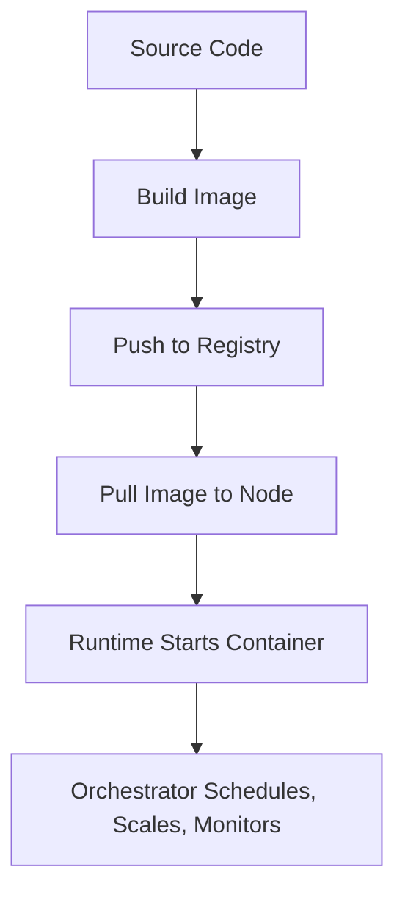

### Data Centres

:::tip
### Definition
A **data centre** is a specialised facility that provides large‑scale compute, storage, and networking capacity so organisations can run applications reliably, securely, and at global scale.
:::

**When to Use**

- You need scalable compute or storage beyond what local machines can provide
- You need high availability, redundancy, or disaster recovery
- You need low‑latency access for users in specific geographic regions

**When Not to Use**

- When local processing is sufficient and latency must be near‑zero
- When regulatory constraints prohibit remote data storage
- When the system cannot tolerate network dependency or external outages

---

## 🎯 What Problem Does This Solve?

Data centres solve the problem of **scalable, reliable, globally accessible computing**.
They replace the limitations of local servers by providing:

- Elastic compute and storage
- Fault‑tolerant infrastructure
- Geographic distribution for performance and resilience
- Industrial‑grade power, cooling, and security
- A foundation for cloud platforms (AWS, GCP, Azure)

They enable modern distributed systems to operate continuously, even under load, failure, or global demand.

---

## 🧠 Conceptual Model

### Core Components

- **Physical Infrastructure** → power, cooling, racks, physical security
- **Compute Layer** → servers, GPUs, hypervisors
- **Storage Layer** → block, object, distributed file systems
- **Network Fabric** → fibre, switches, routers, load balancers
- **Control Plane** → provisioning, orchestration, autoscaling
- **Global Backbone** → inter‑region fibre, edge POPs, CDN layers

### Axes of Variation

- **Synchronous vs Asynchronous workloads**
- **Single‑region vs Multi‑region architecture**
- **On‑prem vs Cloud vs Hybrid**
- **Latency‑sensitive vs Throughput‑heavy workloads**
- **Availability Zone isolation levels**

---

### Typical Lifecycle or Flow

```
User Request
    ↓
Edge POP / CDN
    ↓
Regional Load Balancer
    ↓
Availability Zone
    ↓
Data Centre (Compute + Storage)
    ↓
Response returned via backbone or internet
```

---

## 🔍 TA Lens

:::info How a TA Evaluates This Concept
- What guarantees does the data centre provide (availability, redundancy, latency)?
- What happens when a rack, zone, or region fails?
- How workloads scale under load or constrained resources
- Whether the architecture is multi‑AZ or multi‑region
- How data residency and compliance affect design
:::

**What happens when:**

- **Data grows** → storage tiers, replication, sharding, cost scaling
- **Traffic increases** → autoscaling, load balancing, network saturation
- **Concurrency rises** → contention, queueing, throttling
- **Resources become constrained** → degraded performance, failover, backpressure

---

## 📘 Key Terminology

| Term | Definition |
|------|------------|
| **Region** | A geographic cluster of availability zones |
| **Availability Zone (AZ)** | One or more isolated data centres within a region |
| **Edge POP** | Local point of presence for routing and caching |
| **Backbone Network** | Private fibre connecting global regions |
| **Hyperscale** | Extremely large‑scale data centre used by cloud providers |
| **Failover** | Automatic switch to redundant systems during failure |

---

## 🧬 Variants / Types

<Tabs>
<TabItem value="hyperscale" label="Hyperscale Data Centres">

### Hyperscale Data Centres

**Purpose**
Support cloud providers (AWS, GCP, Azure) with massive compute and storage capacity.

**Key Characteristics**
- Multi‑AZ redundancy
- Automated provisioning and orchestration
- Private global backbone networks

**Behaviour**
Serve millions of workloads across regions with elastic scaling.

**Trade-offs**
High complexity, high energy consumption, and dependency on provider reliability.

</TabItem>

<TabItem value="enterprise" label="Enterprise Data Centres">

### Enterprise Data Centres

**Purpose**
Support a single organisation’s internal workloads.

**Key Characteristics**
- On‑prem or co‑located
- Custom hardware and security
- Limited geographic distribution

**Behaviour**
Stable, predictable workloads with controlled access.

**Trade-offs**
Lower elasticity, higher maintenance burden, limited global reach.

</TabItem>

<TabItem value="edge" label="Edge Data Centres">

### Edge Data Centres

**Purpose**
Provide low‑latency compute close to end users.

**Key Characteristics**
- Small footprint
- Located near population centres
- Often used for caching or real‑time workloads

**Behaviour**
Reduce round‑trip latency by processing data locally.

**Trade-offs**
Limited capacity, not suitable for heavy compute or storage.

</TabItem>
</Tabs>

---

## 🧩 System Interactions

:::info How a TA Understands the System
- Data centres are the physical substrate for cloud compute, storage, and networking
- They interact with orchestration systems, distributed storage, and global routing
- Under pressure, bottlenecks appear in network fabric, cooling, or power
:::

### Local Systems

- OS
- Runtime
- Network stack
- Storage drivers
- Concurrency primitives
- Scaling mechanisms

### Remote Systems

- Pods / containers
- Other data centres
- Cloud control planes
- Global backbone networks

### Questions to ask during reviews or incidents

- Is the workload multi‑AZ or single‑AZ?
- What is the failover plan if the region becomes unavailable?
- How does latency change across regions?
- What happens if the control plane is degraded?
- Are we relying on local state that cannot be replicated?

---

## 💥 Outputs / Results

:::note Special Considerations
Data centre outputs depend on region, AZ design, and cloud provider guarantees.
Latency, throughput, and availability vary by geography.
:::

### Success Modes

| Result Type | Description |
|-------------|-------------|
| **Low Latency** | Requests served from the nearest region or edge POP |
| **High Availability** | Multi‑AZ redundancy prevents outages |
| **Elastic Scaling** | Compute and storage expand automatically under load |

### Failure Modes

| Failure Type | Description |
|-------------|-------------|
| **AZ Outage** | Partial service disruption; multi‑AZ systems fail over |
| **Region Outage** | Major disruption; only multi‑region systems survive cleanly |
| **Network Partition** | Timeouts, retries, inconsistent state |


### Cloud


:::tip
### Definition
**Cloud Architecture** is the design and organisation of distributed compute, storage, networking, and control‑plane systems that run on top of global data centres to deliver scalable, reliable, on‑demand services.
:::

**When to Use**

- You need elastic compute or storage that scales with demand
- You need global availability or multi‑region resilience
- You want to offload infrastructure management to a cloud provider

**When Not to Use**

- Ultra‑low‑latency workloads requiring local processing
- Highly regulated environments where data cannot leave a physical site
- Systems that cannot tolerate network dependency or external outages

---

## 🎯 What Problem Does This Solve?

Cloud architecture solves the problem of **building and operating large‑scale systems without owning physical infrastructure**.

It provides:

- **Elasticity** → scale up/down automatically
- **Global reach** → serve users from the nearest region
- **High availability** → multi‑AZ and multi‑region redundancy
- **Managed services** → databases, queues, storage, compute
- **Cost efficiency** → pay for what you use
- **Operational offloading** → no hardware, power, cooling, or physical security to manage

It enables companies to focus on **application logic**, not infrastructure.

---

## 🧠 Conceptual Model

### **Core Components**

- **Regions & Availability Zones**
  Physical isolation boundaries for resilience and latency.

- **Compute Layer**
  VMs, containers, serverless functions, autoscaling groups.

- **Storage Layer**
  Object storage, block storage, distributed databases.

- **Networking Layer**
  VPCs, load balancers, gateways, backbone routing.

- **Control Plane**
  APIs for provisioning, scaling, identity, monitoring.

- **Edge Layer**
  POPs, CDNs, edge compute, global accelerators.

### **Axes of Variation**

- **Compute Model** → VM vs container vs serverless
- **Deployment Model** → single‑region vs multi‑region
- **Storage Model** → strongly consistent vs eventually consistent
- **Network Model** → public vs private routing
- **Operational Model** → managed vs self‑managed services

---

### **Typical Lifecycle or Flow**

```
User Request
    ↓
Edge POP / CDN
    ↓
Global Load Balancer
    ↓
Cloud Region
    ↓
Availability Zone
    ↓
Compute (VM/Container/Function)
    ↓
Storage (DB/Object/Cache)
    ↓
Response returned via backbone or internet
```

---

## 🔍 TA Lens

:::info How a TA Evaluates This Concept
- What guarantees the cloud architecture provides (availability, latency, durability)
- How workloads behave under load, failure, or regional disruption
- Whether the design is multi‑AZ or multi‑region
- How data flows across regions and networks
- What becomes a bottleneck (network, storage, control plane)
:::

**What happens when:**

- **Data grows** → storage scaling, partitioning, replication
- **Traffic increases** → autoscaling, throttling, load balancing
- **Concurrency rises** → contention, queueing, rate limits
- **Resources become constrained** → degraded performance, failover, backpressure

---

### **Cloud Providers (GCP vs AWS)**

AWS is service‑rich, deeply configurable, and offers granular control over infrastructure.
GCP is opinionated, simpler to operate, and optimised for analytics and ML workloads.

Both provide:

- Global infrastructure
- IAM‑based access control
- Managed data and messaging services
- Serverless compute
- Observability tooling

#### **Quick provider heuristics**

- **Availability & Regions:** Choose AWS for fine‑grained AZ isolation; choose GCP for global routing simplicity.
- **Networking:** Choose based on segmentation needs vs simplicity.
- **Storage & Data Growth:** Match provider to workload type.
- **Compute Model:** Choose based on compute diversity vs container‑native workloads.
- **Control Plane:** Choose based on failure‑isolation vs global consistency.
- **Cost & Scaling:** Match provider to workload shape.

---

### **Philosophy**

| Cloud | Philosophy |
|-------|------------|
| **AWS** | “Everything is a service.” Highly configurable, broadest service catalog. |
| **GCP** | “Simplicity + analytics first.” Strong defaults, fewer services, deeper integration. |

---

### **Data Services**

| Capability | AWS | GCP |
|-----------|-----|-----|
| **Data Warehouse** | Redshift | BigQuery (serverless, industry‑leading) |
| **Object Storage** | S3 | Cloud Storage |
| **NoSQL Key‑Value** | DynamoDB | Firestore / Cloud Bigtable |
| **Wide‑Column Store** | DynamoDB (key‑value) | Bigtable (HBase‑style) |
| **Data Lake** | S3 + Glue + Lake Formation | Cloud Storage + BigQuery external tables |
| **ETL/ELT** | Glue, EMR | Dataflow, Dataproc |

**TA Insight:** GCP dominates analytics (BigQuery). AWS dominates operational NoSQL (DynamoDB).

---

### **Messaging & Streaming**

| Capability | AWS | GCP |
|-----------|-----|-----|
| **Pub/Sub Messaging** | SNS + SQS | Pub/Sub (unified pub/sub model) |
| **Streaming** | Kinesis | Pub/Sub + Dataflow |
| **Event Routing** | EventBridge | Eventarc |

**TA Insight:** GCP Pub/Sub is simpler and globally distributed. AWS offers more granular control (SNS fan‑out + SQS queues).

---

### **Compute**

| Capability | AWS | GCP |
|-----------|-----|-----|
| **Serverless** | Lambda | Cloud Functions |
| **Containers** | ECS, EKS | GKE (industry‑leading Kubernetes) |
| **VMs** | EC2 | Compute Engine |
| **Batch** | Batch | Batch / Dataflow |

**TA Insight:** GCP leads in Kubernetes (GKE). AWS leads in VM flexibility and ecosystem depth.

---

### **Security & IAM**

| Area | AWS | GCP |
|------|-----|-----|
| **IAM Model** | Role‑based, very granular | Role‑based, simpler hierarchy |
| **Resource Hierarchy** | Account → OU → Resource | Org → Folder → Project → Resource |
| **Secrets** | Secrets Manager | Secret Manager |
| **Networking** | VPC, PrivateLink | VPC, Private Service Connect |

**TA Insight:** GCP's project hierarchy is easier to reason about. AWS IAM is more flexible but more complex.

---

### **Observability**

| Capability | AWS | GCP |
|-----------|-----|-----|
| **Logging** | CloudWatch Logs | Cloud Logging |
| **Metrics** | CloudWatch Metrics | Cloud Monitoring |
| **Tracing** | X‑Ray | Cloud Trace |
| **Dashboards** | CloudWatch Dashboards | Cloud Monitoring Dashboards |

**TA Insight:** GCP's observability tools are more integrated. AWS CloudWatch is powerful but requires more configuration.

---

### **Choosing Between GCP and AWS**

#### **When to choose GCP**
- Analytics‑heavy workloads
- Machine learning pipelines
- Global messaging with simple semantics
- Kubernetes‑centric architectures
- Teams that prefer opinionated defaults

#### **When to choose AWS**
- Complex enterprise architectures
- Fine‑grained control over infrastructure
- High‑scale operational NoSQL (DynamoDB)
- Deep integration with legacy systems
- Broad service catalog requirements

---

## 📘 Key Terminology

| Term | Definition |
|------|------------|
| **Region** | A geographic cluster of availability zones |
| **Availability Zone (AZ)** | One or more isolated data centres within a region |
| **VPC** | Virtual private network boundary for cloud workloads |
| **Control Plane** | APIs and orchestration systems that manage cloud resources |
| **Serverless** | Compute model where the provider manages scaling and runtime |
| **Backbone Network** | Private fibre connecting global cloud regions |

---

## 🧬 Variants / Types

<Tabs>
<TabItem value="iaas" label="IaaS">

### Infrastructure as a Service (IaaS)

**Purpose**
Provide raw compute, storage, and networking primitives.

**Key Characteristics**
- VMs, block storage, load balancers
- High control, high flexibility

**Behaviour**
Applications run on provisioned infrastructure with autoscaling and monitoring.

**Trade-offs**
More operational overhead than managed or serverless models.

</TabItem>

<TabItem value="paas" label="PaaS">

### Platform as a Service (PaaS)

**Purpose**
Provide managed platforms for deploying applications.

**Key Characteristics**
- Managed runtimes, databases, queues
- Simplified deployment and scaling

**Behaviour**
Developers focus on code; platform handles infrastructure.

**Trade-offs**
Less control; vendor‑specific constraints.

</TabItem>

<TabItem value="serverless" label="Serverless">

### Serverless Architecture

**Purpose**
Run code without provisioning or managing servers.

**Key Characteristics**
- Event‑driven
- Automatic scaling
- Pay‑per‑execution

**Behaviour**
Functions run on demand; idle time costs nothing.

**Trade-offs**
Cold starts, execution limits, vendor lock‑in.

</TabItem>
</Tabs>

---

## 🧩 System Interactions

:::info How a TA Understands the System
Cloud architecture is a **layered system** that interacts with compute, storage, networking, orchestration, and global routing.
Under pressure, bottlenecks appear in network fabric, storage throughput, or control‑plane capacity.
:::

### **Local Systems**

- OS
- Runtime
- Network stack
- Storage drivers
- Concurrency primitives
- Scaling mechanisms

### **Remote Systems**

- Other regions
- Other AZs
- Edge POPs
- Global backbone networks
- Managed services (DBs, queues, caches)

### **Questions to ask during reviews or incidents**

- Is the system multi‑AZ or single‑AZ?
- What happens if the region becomes unavailable?
- How does the architecture handle cross‑region latency?
- Are we relying on a single managed service with no failover?
- What are the rate limits or quotas?

---

## 💥 Outputs / Results

:::note Special Considerations
Cloud outputs depend on region, AZ design, and service guarantees.
Latency, throughput, and availability vary by geography and provider.
:::

### **Success Modes**

| Result Type | Description |
|-------------|-------------|
| **Elastic Scaling** | Compute and storage expand automatically under load |
| **High Availability** | Multi‑AZ redundancy prevents outages |
| **Global Performance** | Users served from nearest region or edge POP |

### **Failure Modes**

| Failure Type | Description |
|-------------|-------------|
| **AZ Outage** | Partial disruption; multi‑AZ systems fail over |
| **Region Outage** | Major disruption; only multi‑region systems survive |
| **Control Plane Failure** | Provisioning/scaling unavailable; running workloads may continue |

---

## 🔥 Provider Triage (Cross‑Cloud)

Common symptoms across both platforms and how to triage them:

| Symptom | AWS Root Cause | GCP Root Cause | What to Check | Action |
|---------|----------------|----------------|----------------|--------|
| **Query slow** | Redshift cluster sizing | BigQuery slot contention | Query plan, partitioning | Optimize schema, adjust compute |
| **Messages delayed** | SQS backlog, slow consumers | Pub/Sub ack deadline issues | Backlog, consumer logs | Scale consumers, tune ack deadlines |
| **Access denied** | IAM role misconfig | IAM policy or project binding | IAM logs | Fix roles, update bindings |
| **API quota exceeded** | Service limits | API quotas | Quotas dashboard | Request increase, throttle |
| **Storage errors** | S3 bucket policy | Cloud Storage IAM | Bucket ACLs | Fix IAM, update policies |
| **No data flowing** | SNS/SQS misconfig | Pub/Sub subscription misconfig | Topic/subscription config | Recreate or fix subscription |


### Containerisations


:::tip
### Definition
Containerisation Architecture describes how applications are packaged, isolated, executed, and managed using containers across images, runtimes, registries, networking, storage, and orchestration platforms.
:::

**When to Use**

- Deploying microservices or distributed systems  
- Ensuring consistent environments across dev/test/prod  
- Scaling workloads horizontally  
- Running workloads across multiple environments (local, VM, cloud, cluster)  
- Building reproducible, portable delivery pipelines  

**When Not to Use**

- When full OS isolation is required (use VMs)  
- When workloads depend heavily on host OS internals  
- When ultra‑low latency is required  
- When GPU/accelerator support is needed but drivers are not container‑friendly  
- When stateful workloads cannot externalise storage  

---

## 🎯 What Problem Does This Solve?

Containerisation solves the problem of **environment inconsistency**, **manual deployment**, and **resource inefficiency**.

It enables:

| Benefit | Why it matters |
|--------|----------------|
| Environment consistency | Eliminates “works on my machine” issues |
| Isolation | Workloads run independently with controlled resources |
| Portability | Same container runs anywhere |
| Scalability | Orchestrators manage replicas, rollouts, failures |
| Faster delivery | Build once, run anywhere |
| Resource efficiency | Lighter than VMs, faster to start |

---

## 🧠 Conceptual Model

Containerisation has **four architectural layers**:

### Core Components

#### **1. Image Layer**  
Immutable filesystem + metadata built from Dockerfiles or build tools.

#### **2. Runtime Layer**  
Executes containers using OS kernel features (containerd, CRI‑O).

#### **3. Infrastructure Layer**  
Nodes (VMs or bare metal) that run containers.

#### **4. Orchestration Layer**  
Manages scheduling, scaling, networking, and rollouts (Kubernetes, Nomad).

### Axes of Variation

- **Immutable vs Mutable** → images are immutable; containers are ephemeral  
- **Ephemeral vs Persistent** → containers vs volumes  
- **Manual vs Declarative** → Docker vs Kubernetes  
- **Single‑node vs Clustered** → local dev vs orchestrated workloads  

---

### Typical Lifecycle or Flow



---

## 🔍 TA Lens

:::info How a TA Evaluates Containerisation
- What is packaged into the image, and what is externalised?  
- How does the runtime isolate processes and resources?  
- How does orchestration handle failures, rollouts, and scaling?  
- What happens when containers restart or nodes fail?  
- How does networking behave across pods, nodes, and services?  
- Where does state live, and how is it persisted?  
:::

**What happens when:**

- **Traffic increases** → autoscaling triggers, scheduling constraints matter  
- **Data grows** → persistent volumes and storage classes become critical  
- **Nodes fail** → orchestrator reschedules workloads  
- **Resources become constrained** → cgroups enforce limits, OOM kills occur  

---

## 📘 Key Terminology

| Term | Definition |
|------|------------|
| Image | Immutable filesystem + metadata |
| Container | Running instance of an image |
| Pod | Kubernetes wrapper around one or more containers |
| Node | Machine that runs containers |
| CNI | Container Networking Interface |
| CRI | Container Runtime Interface |
| Ingress | External traffic routing |
| Sidecar | Helper container in a pod |

---

## 🧬 Variants / Types

<Tabs>

<TabItem value="images" label="Container Images">

### Container Images

**Purpose**  
Package application code, dependencies, and runtime environment.

**Key Characteristics**
- Immutable  
- Layered filesystem  
- Versioned via tags  
- Stored in registries  

**Behaviour**  
Images define *what* runs.

**Trade-offs**  
Large images slow deployments; base image choice affects security.

</TabItem>

<TabItem value="runtime" label="Container Runtime">

### Container Runtime

**Purpose**  
Execute containers using OS kernel features.

**Key Characteristics**
- Namespaces → isolation  
- cgroups → resource limits  
- Union filesystems → layered images  

**Behaviour**  
Containers share the host kernel; they are not VMs.

**Trade-offs**  
Kernel bugs affect all containers; isolation is not absolute.

</TabItem>

<TabItem value="networking" label="Networking">

### Container Networking

**Purpose**  
Enable communication between containers, pods, and services.

**Key Characteristics**
- Pod IPs  
- DNS  
- Service discovery  
- Load balancing  
- CNI plugins (Calico, Cilium, Flannel)  

**Behaviour**  
Pods communicate without NAT; Services provide stable virtual IPs.

**Trade-offs**  
Networking is often the hardest part of containerisation.

</TabItem>

<TabItem value="storage" label="Storage">

### Container Storage

**Purpose**  
Provide persistence for otherwise ephemeral containers.

**Key Characteristics**
- Ephemeral storage  
- Persistent volumes (PVCs)  
- ConfigMaps & Secrets  

**Behaviour**  
State lives outside containers; platforms manage persistence.

**Trade-offs**  
Persistent storage adds complexity and latency.

</TabItem>

<TabItem value="orchestration" label="Orchestration">

### Orchestration (Kubernetes & Others)

**Purpose**  
Automate deployment, scaling, and management of containers.

**Key Characteristics**
- Scheduling  
- Rollouts & rollbacks  
- Autoscaling  
- Health checks  
- Service discovery  

**Behaviour**  
Orchestrators automate everything humans used to do manually.

**Trade-offs**  
Powerful but complex; requires strong operational maturity.

</TabItem>

<TabItem value="workloads" label="Workload Types">

### Workload Types

**Purpose**  
Define how applications run in a cluster.

**Key Characteristics**
- Deployments → stateless apps  
- StatefulSets → stateful apps  
- DaemonSets → one per node  
- Jobs/CronJobs → run‑to‑completion tasks  

**Behaviour**  
Different workloads suit different operational needs.

**Trade-offs**  
Choosing the wrong workload type leads to instability.

</TabItem>

<TabItem value="scheduling" label="Scheduling & Scaling">

### Scheduling & Scaling

**Purpose**  
Place workloads on nodes and adjust capacity.

**Key Characteristics**
- HPA → scales pods  
- Cluster Autoscaler → scales nodes  
- Affinity & tolerations → placement rules  

**Behaviour**  
Scheduling is about constraints, resources, and placement logic.

**Trade-offs**  
Misconfigured autoscaling causes instability or resource waste.

</TabItem>

<TabItem value="observability" label="Observability & Management">

### Observability & Management

**Purpose**  
Monitor, debug, and operate containerised workloads.

**Key Characteristics**
- Logs & metrics (Prometheus, Grafana, ELK)  
- Liveness & readiness probes  
- Rollouts & rollbacks  
- kubectl, k9s, exec, logs  

**Behaviour**  
Observability determines how quickly issues are detected and resolved.

**Trade-offs**  
Poor observability leads to long outages and unclear failures.

</TabItem>

</Tabs>

---

## 🧩 System Interactions

:::info How a TA Understands the System
- How containers interact with OS, network, and storage  
- How orchestrators handle failures, scaling, and scheduling  
- What becomes a bottleneck as workloads grow  
:::

### Local Systems

- OS kernel  
- Filesystem  
- Container runtime  
- Local networking stack  
- Resource limits (CPU/memory)  

### Remote Systems

- Kubernetes control plane  
- Container registries  
- Cloud load balancers  
- Persistent storage backends  

### Questions to ask during reviews or incidents

- Where does state live?  
- What happens when a container restarts?  
- How does the orchestrator handle failure?  
- Are resource limits defined?  
- How does networking behave across nodes?  

---

## 💥 Outputs / Results

:::note Special Considerations
Containerisation failures often appear as scheduling issues, restarts, or networking problems.
:::

### Success Modes

| Result Type | Description |
|-------------|-------------|
| Consistent Environments | Same behaviour across dev/test/prod |
| Reliable Deployments | Declarative rollouts and rollbacks |
| Scalable Workloads | Autoscaling responds to demand |
| Efficient Resource Use | Containers start fast and use fewer resources |
| Clear Observability | Logs, metrics, and probes reveal system health |

### Failure Modes

| Failure Type | Description |
|--------------|-------------|
| OOM Kills | Missing or incorrect resource limits |
| CrashLoops | Misconfigured readiness/liveness probes |
| Networking Failures | CNI issues, DNS failures |
| Image Pull Errors | Missing tags, registry issues |
| State Loss | Writing data inside ephemeral containers |

---

### Deployments


:::tip
### Definition
Deployment Architecture describes how software is built, tested, packaged, released, and deployed across environments to ensure changes move from commit → production safely, predictably, and with controlled risk.
:::

**When to Use**

- You need predictable, repeatable releases
- You operate multiple environments (DEV → SIT → UAT → PRE → PROD)
- You require safe rollout strategies (rolling, blue/green, canary)
- You want automated, auditable delivery pipelines
- You need fast feedback loops for developers

**When Not to Use**

- Deployments are manual and infrequent
- Observability is too weak to support safe rollout
- The system is too small/simple for CI/CD investment
- Environment parity cannot be maintained

---

## 🎯 What Problem Does This Solve?

Deployment Architecture solves the problem of **moving changes safely from commit to production**.

It ensures:

- Releases are reliable and low‑risk
- Feedback loops are fast
- Manual steps are eliminated
- Environments behave consistently
- Rollouts and rollbacks are controlled
- Every change is traceable and auditable

This is essential for modern delivery, where speed and safety must coexist.

---

## 🧠 Conceptual Model

### Core Components

- **Build** — compile, lint, package, produce artifacts
- **Test** — validate correctness at multiple layers
- **Package & Release** — create immutable, versioned outputs
- **Deploy** — roll out changes using controlled strategies
- **Verify** — observe health, metrics, logs, user impact
- **Operate** — run, scale, and maintain in production

### Axes of Variation

- **Manual vs Automated** → scripts vs CI/CD
- **Mutable vs Immutable** → servers vs containers/images
- **Big‑bang vs Incremental** → recreate vs rolling/canary
- **Environment‑specific vs Environment‑agnostic** → config vs image
- **Synchronous vs Progressive** → immediate vs staged rollout

---

### Typical Lifecycle or Flow

**Diagram:**


---

## 🔍 TA Lens

:::info How a TA Evaluates This Concept
- Are builds reproducible and deterministic?
- Are tests layered, meaningful, and fast?
- Are deployment strategies aligned with risk tolerance?
- Is observability strong enough to support safe rollout?
- Are rollbacks defined, fast, and reliable?
- Does the pipeline reflect the project’s constraints and domain?
:::

**What happens when:**

- **Data grows** → migrations and schema changes become risky
- **Traffic increases** → deployment strategies must handle load
- **Concurrency rises** → rolling updates and coordination matter
- **Resources become constrained** → build/test pipelines slow down

---

## 📘 Key Terminology

| Term | Definition |
|------|------------|
| Artifact | Immutable build output deployed to environments |
| Pipeline | Automated sequence from commit → production |
| Rollback | Reverting to a known‑good version |
| Environment Parity | Staging mirrors production |
| Feature Flag | Toggle enabling controlled rollout |

---

## 🧬 Variants / Types

<Tabs>

<TabItem value="cicd" label="CI/CD Architecture">

### CI/CD Architecture

**Purpose**
Automate build, test, and deployment workflows.

**Key Characteristics**
- Frequent commits to mainline
- Automated builds and tests
- Fast feedback loops
- Every change is deployable

**Behaviour**
Reduces integration drift and validates every commit.

**Trade-offs**
Requires discipline, strong test coverage, and reliable automation.

</TabItem>

<TabItem value="deploy" label="Deployment Patterns">

### Deployment Patterns

**Purpose**
Control how new versions replace old ones.

**Key Characteristics**
- Rolling, blue/green, canary, shadow, recreate
- Each pattern expresses a different risk posture

**Behaviour**
- Rolling → gradual replacement
- Blue/green → instant switch
- Canary → small‑scale validation
- Shadow → duplicate traffic for testing
- Recreate → stop → start

**Trade-offs**
- Rolling: no downtime, harder rollback
- Blue/green: instant rollback, double capacity
- Canary: minimal blast radius, requires observability
- Shadow: safe validation, traffic duplication
- Recreate: simple, downtime

</TabItem>

<TabItem value="testing" label="Testing Architecture">

### Testing Architecture

**Purpose**
Ensure correctness before deployment.

**Key Characteristics**
- Unit → integration → system → acceptance
- Performance and security layers
- Multiple environments (DEV → SIT → UAT → PRE → PROD)

**Behaviour**
Quality gates increase confidence as changes progress.

**Trade-offs**
More layers increase safety but slow feedback if not optimised.

</TabItem>

</Tabs>

---

## 🧩 System Interactions

:::info How a TA Understands the System
- How deployment interacts with runtime, storage, and network
- How rollouts behave under load or failure
- What becomes a bottleneck as systems scale
:::

### Local Systems

- OS
- Runtime
- Network
- Storage
- Concurrency
- Scaling

### Remote Systems

- Pods
- Data Centers
- CI/CD platforms
- Artifact registries
- Load balancers

### Questions to ask during reviews or incidents

- Are rollbacks safe and fast?
- Are health checks correctly defined?
- Does staging mirror production?
- Are migrations safe during rollout?
- How does traffic shift during deployment?

---

## 💥 Outputs / Results

:::note Special Considerations
Deployment logs and observability signals are essential for diagnosing rollout behaviour and validating canary/blue‑green strategies.
:::

### Success Modes

| Result Type | Description |
|-------------|-------------|
| Reliable Releases | Rollouts complete without errors |
| Fast Feedback | Builds/tests provide rapid validation |
| Safe Rollouts | Canary/blue‑green reduce blast radius |
| Traceability | Every change is logged and auditable |

### Failure Modes

| Failure Type | Description |
|--------------|-------------|
| Flaky Tests | Block releases or cause false confidence |
| Stalled Rollouts | Missing or incorrect health checks |
| Unsafe Rollbacks | Slow or manual reversions |
| Environment Drift | Staging behaves differently from production |
