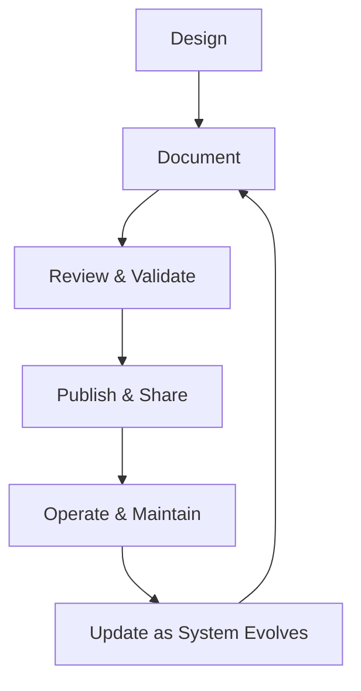
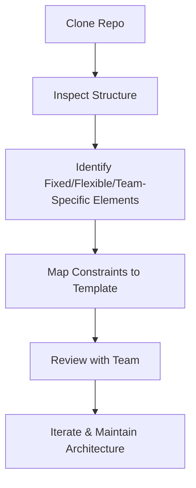

import Tabs from '@theme/Tabs';
import TabItem from '@theme/TabItem';

:::tip
### Definition
Documentation Architecture describes how technical knowledge is structured, communicated, and maintained across systems, teams, and lifecycles to ensure shared understanding and safe operation.
:::

**When to Use**

- Sharing knowledge across teams or roles  
- Designing APIs, systems, or operational workflows  
- Onboarding new engineers  
- Ensuring operational safety and reducing outages  
- Supporting compliance, audits, or governance  
- Coordinating work across distributed teams  

**When Not to Use**

- Information is volatile and changes daily  
- A simple README or code comment is sufficient  
- The system is experimental or short‑lived  
- Documentation is being used to justify poor design  
- The audience does not need long‑form documentation  

---

## 🎯 What Problem Does This Solve?

Documentation Architecture solves the problem of **knowledge fragmentation**, **tribal knowledge**, and **unsafe operation**.

It enables:

- Shared understanding across teams  
- Faster onboarding  
- Reliable operations through runbooks  
- Consistent API behaviour via contracts  
- Traceability for governance and audits  
- Scalable collaboration without constant meetings  

Documentation is a **system**, not a deliverable — it ensures teams can build, operate, and evolve software safely.

---

## 🧠 Conceptual Model

Documentation spans **four layers**, each serving a different purpose:

### Core Components

#### **1. Product & User Documentation**  
Explains *what the system does*.

#### **2. Architecture & Design Documentation**  
Explains *how the system works*.

#### **3. API & Contract Documentation**  
Explains *how to interact with the system*.

#### **4. Operational Documentation**  
Explains *how to run, debug, and maintain the system*.

### Axes of Variation

- **Audience** → user, engineer, operator, auditor  
- **Purpose** → understanding, interaction, operation, governance  
- **Format** → narrative, diagrams, schemas, contracts  
- **Lifecycle** → static vs frequently updated  
- **Scope** → system‑wide vs component‑specific  

---

### Typical Lifecycle or Flow

**Diagram:**

---

## 🔍 TA Lens

:::info How a TA Evaluates This Concept
- What changes, what stays constant, what becomes a bottleneck  
- Whether documentation reflects reality or has drifted  
- Whether contracts and runbooks are complete and unambiguous  
- Whether diagrams match system behaviour under load  
- Whether documentation supports safe operation and onboarding  
:::

**What happens when:**

- **Data grows** → schemas and data dictionaries become critical  
- **Traffic increases** → operational docs must cover scaling and failure modes  
- **Concurrency rises** → API contracts and sequencing diagrams matter  
- **Resources become constrained** → runbooks guide safe recovery  

---

## 📘 Key Terminology

| Term | Definition |
|------|------------|
| Contract | Agreed behaviour between systems |
| Specification | Formal description of an API or schema |
| Runbook | Step‑by‑step operational instructions |
| Playbook | Strategy for handling classes of incidents |
| ADR | Architecture Decision Record |
| Schema | Structured definition of data |

---

## 🧬 Variants / Types

<Tabs>

<TabItem value="api" label="API & Contract Documentation">

### API & Contract Documentation

**Purpose**  
Define how systems communicate and what they expect.

**Key Characteristics**
- Machine‑readable contracts  
- Strong typing or schema validation  
- Clear request/response structures  

**Behaviour**  
Ensures consistent API behaviour across teams and clients.

**Trade-offs**  
Strict contracts require disciplined versioning.

---

#### OpenAPI (REST)

- Machine‑readable HTTP API specification  
- Used for SDK generation, validation, and portals  

#### GraphQL Schema

- Self‑describing via introspection  
- Strong typing and flexible querying  

#### gRPC / Protobuf

- Binary, schema‑driven  
- High‑performance service‑to‑service communication  

#### SOAP / WSDL (Legacy)

- XML‑based enterprise contracts  
- Strict schema validation  

</TabItem>

<TabItem value="architecture" label="Architecture & System Documentation">

### Architecture & System Documentation

**Purpose**  
Explain how systems are designed, structured, and interact.

**Key Characteristics**
- Components, flows, dependencies  
- Failure modes and scaling behaviour  
- Historical decisions (ADRs)  

**Behaviour**  
Provides shared understanding for design, review, and onboarding.

**Trade-offs**  
Can drift if not maintained.

---

#### Architecture Decision Records (ADRs)

Capture *why* decisions were made.

#### System Design Docs

Describe components, flows, dependencies, and failure modes.

#### Sequence & Flow Diagrams

Explain runtime behaviour and interactions.

</TabItem>

<TabItem value="operational" label="Operational Documentation">

### Operational Documentation

**Purpose**  
Enable safe operation, debugging, and maintenance.

**Key Characteristics**
- Runbooks for known scenarios  
- Playbooks for incident classes  
- SLO/SLA definitions  

**Behaviour**  
Reduces outages and accelerates incident response.

**Trade-offs**  
Requires continuous updates as systems evolve.

---

#### Runbooks

Step‑by‑step instructions for predictable failures.

#### Playbooks

Higher‑level strategies for incident response.

#### SLO/SLA Documentation

Defines availability targets, error budgets, and expectations.

</TabItem>

<TabItem value="product" label="Product & User Documentation">

### Product & User Documentation

**Purpose**  
Explain what the system does and how to use it.

**Key Characteristics**
- User guides  
- Tutorials  
- Release notes  

**Behaviour**  
Supports end‑users and internal consumers.

**Trade-offs**  
Must balance detail with usability.

</TabItem>

<TabItem value="schema" label="Schema & Data Documentation">

### Schema & Data Documentation

**Purpose**  
Define the structure, meaning, and constraints of data.

**Key Characteristics**
- JSON Schema  
- XSD  
- Avro/Protobuf schemas  
- Data dictionaries  

**Behaviour**  
Ensures semantic consistency across pipelines and teams.

**Trade-offs**  
Requires alignment between engineering and analytics.

</TabItem>

</Tabs>

---

## 🧩 System Interactions

:::info How a TA Understands the System
- How documentation interacts with architecture, data, and runtime  
- How documentation supports safe operation under pressure  
- What becomes a bottleneck when systems scale or evolve  
:::

### Local Systems

- OS  
- Runtime  
- Network  
- Storage  
- Concurrency  
- Scaling  

### Remote Systems

- Pods  
- Data Centers  
- API Gateways  
- CI/CD Platforms  
- Knowledge Portals (e.g., Backstage)  

### Questions to ask during reviews or incidents

- Does documentation reflect current reality?  
- Are runbooks complete and actionable?  
- Are API contracts versioned and validated?  
- Are diagrams accurate under load or failure?  
- Is ownership and update responsibility clear?  

---

## 💥 Outputs / Results

:::note Special Considerations
Documentation must be accurate, discoverable, and maintained — stale documentation is dangerous.
:::

### Success Modes

| Result Type | Description |
|-------------|-------------|
| Shared Understanding | Teams align without meetings |
| Reliable Operations | Runbooks prevent outages and mistakes |
| API Reliability | Contracts ensure consistent behaviour |
| Faster Onboarding | New engineers become productive quickly |

### Failure Modes

| Failure Type | Description |
|--------------|-------------|
| Documentation Drift | Docs no longer match reality |
| Ambiguous Contracts | APIs behave inconsistently |
| Missing Runbooks | Incidents escalate unnecessarily |
| Tribal Knowledge | Only a few people understand the system |

---

### "Project Architecture"

:::tip
### Definition
Project Architecture describes how a software project is structured across code, dependencies, tooling, workflows, and team conventions — the system that shapes how engineers build, test, deploy, and operate software.
:::

**When to Use**

- Designing or updating a project template
- Reviewing a team’s repo to understand constraints
- Diagnosing structural issues (build failures, dependency drift, CI pain)
- Identifying fixed vs flexible vs team‑specific elements
- Ensuring templates support real‑world engineering needs

**When Not to Use**

- Assuming all teams should follow identical structures
- Forcing a template onto a team with domain‑specific needs
- Treating flexible elements as fixed (or vice versa)
- Over‑engineering structure for small or short‑lived projects

---

## 🎯 What Problem Does This Solve?

Project Architecture solves the problem of **how work gets done** inside a software project.

It enables:

- **Clarity of constraints** — what must stay stable vs what can change
- **Template alignment** — ensuring cookiecutter templates match real needs
- **Risk reduction** — identifying brittle or non‑standard structures early
- **Faster onboarding** — new engineers understand the project shape quickly
- **Better requirements** — grounding requirements in engineering reality

A project’s architecture is the *skeleton* that determines how teams build, test, deploy, and operate software.

---

## 🧠 Conceptual Model

### Core Components

#### **Language & Runtime Constraints**
- Packaging model
- Directory conventions
- Build tools
- Dependency resolution

#### **Team Workflow**
- CI/CD pipelines
- Testing strategy
- Deployment model
- Observability patterns

#### **Domain Requirements**
- Data pipelines
- API boundaries
- Infrastructure‑as‑code
- ML workflows

#### **Organisational Standards**
- Templates
- Security requirements
- Naming conventions
- Internal libraries

Together, these form the **project skeleton** — the structure that governs how work gets done.

### Axes of Variation

- **Fixed vs Flexible vs Team‑Specific elements**
- **Monorepo vs Polyrepo**
- **Strict vs Loose conventions**
- **Lightweight vs Heavyweight tooling**
- **Runtime‑driven vs Domain‑driven structure**

---

### Typical Lifecycle or Flow

**Diagram:**

---

## 🔍 TA Lens

:::info How a TA Evaluates Project Architecture
- Identify **fixed elements** dictated by language, runtime, or organisation
- Identify **flexible elements** that teams can change with effort
- Identify **team‑specific elements** that require extension points
- Look for structural signals: modularity, testability, dependency hygiene
- Ask whether the architecture supports the team’s domain and workflow
:::

**What happens when:**

- **Data grows** → repo structure must support pipelines, schemas, storage
- **Traffic increases** → CI/CD must scale, tests must be layered
- **Concurrency rises** → build tools and runtimes must handle parallelism
- **Resources become constrained** → builds slow, dependencies drift, CI bottlenecks appear

---

## 📘 Key Terminology

| Term | Definition |
|------|------------|
| Fixed Element | A project component that cannot change without major cost |
| Flexible Element | A component that can change with effort and coordination |
| Team‑Specific Element | A domain‑driven component unique to a team’s workflow |
| Extension Point | A template mechanism allowing teams to customise behaviour |
| Project Skeleton | The baseline directory and tooling structure |

---

## 🧬 Variants / Types

<Tabs>

<TabItem value="baseline" label="Baseline Structure">

### Baseline Project Structure

**Purpose**
Provide a predictable, navigable foundation for engineering work.

**Key Characteristics**
- Source code layout
- Dependencies and package management
- Build & packaging tools
- Testing structure
- CI/CD pipelines
- Runtime & deployment configuration
- Observability hooks

**Behaviour**
Defines the default shape of the project.

**Trade-offs**
Too rigid → slows teams; too loose → creates chaos.

</TabItem>

<TabItem value="fixed" label="Fixed Elements">

### Fixed Elements

**Purpose**
Represent non‑negotiable constraints imposed by language, runtime, or organisation.

**Key Characteristics**
- Language‑specific directory conventions
- Build tools (Maven, sbt, Poetry, npm)
- Packaging models (JAR, wheel, container image)
- Required internal libraries or security tooling

**Behaviour**
Stable across teams; must be supported by templates.

**Trade-offs**
Rigid but predictable.

---

**Examples**

| Language | Fixed Elements | Why Fixed |
|---------|----------------|-----------|
| Java | Maven/Gradle, `src/main/java`, JAR/WAR | JVM conventions |
| Scala | sbt, multi‑module builds | Compiler + ecosystem |
| Python | `src/` layout, virtualenv/poetry | Packaging + interpreter |
| Node.js | `package.json`, npm/yarn | Runtime + dependency model |

</TabItem>

<TabItem value="flexible" label="Flexible Elements">

### Flexible Elements

**Purpose**
Allow teams to adapt structure to their workflow.

**Key Characteristics**
- Directory structure
- Testing framework
- CI pipeline design
- Dockerfile patterns

**Behaviour**
Can change, but with cost and coordination.

**Trade-offs**
Flexibility increases autonomy but reduces standardisation.

</TabItem>

<TabItem value="team" label="Team‑Specific Elements">

### Team‑Specific Elements

**Purpose**
Capture domain‑driven needs unique to a team.

**Key Characteristics**
- ETL folders, schemas, pipeline configs
- API routing conventions
- ML model folders, notebooks, experiment tracking
- Terraform modules, infra scripts

**Behaviour**
Require extension points, not standardisation.

**Trade-offs**
High variability; templates must support customisation.

</TabItem>

</Tabs>

---

## 🧩 System Interactions

:::info How a TA Understands the System
- How project structure interacts with build tools, CI/CD, and runtime
- How architecture behaves under load (large repos, heavy tests)
- What becomes a bottleneck as teams scale or add dependencies
:::

### Local Systems

- OS
- Runtime
- Build tools
- Dependency managers
- Local testing frameworks

### Remote Systems

- CI/CD platforms
- Artifact registries
- Cloud runtimes
- Data centers
- Internal library repositories

### Questions to ask during reviews or incidents

- What parts of the structure are fixed vs flexible?
- Does the architecture support the team’s domain?
- Are dependencies well‑managed or drifting?
- Are CI/CD pipelines aligned with project shape?
- Are extension points clearly defined?

---

## 💥 Outputs / Results

:::note Special Considerations
Historical decisions often explain structural quirks; avoid assuming mistakes.
:::

### Success Modes

| Result Type | Description |
|-------------|-------------|
| Project Map | Clear breakdown of fixed/flexible/team‑specific elements |
| Template Requirements | Structured list of what templates must support |
| Risk Assessment | Identification of brittle or inconsistent structures |
| Extension Points | Areas where teams can safely customise |

### Failure Modes

| Failure Type | Description |
|--------------|-------------|
| Structural Drift | Repo becomes inconsistent or unmaintainable |
| Dependency Drift | Versions diverge, causing build failures |
| CI Pain | Slow, flaky, or brittle pipelines |
| Template Misalignment | Templates fail to support real workflows |

---

## 🔗 Related Runbook Concepts

- OS Architecture
- Memory Management
- Build Systems
- Dependency Management
- CI/CD Architecture

