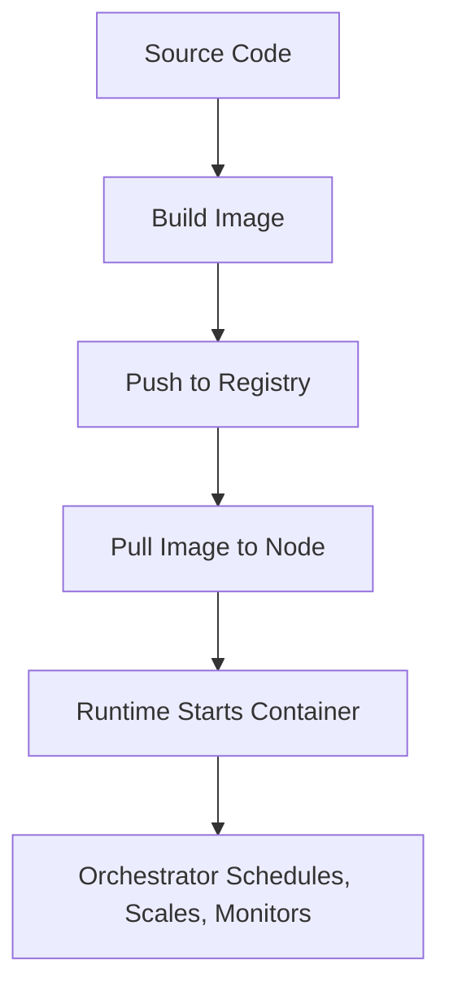

import Tabs from '@theme/Tabs';
import TabItem from '@theme/TabItem';

:::tip Definition
Containerisation Architecture describes how applications are packaged, isolated, executed, and managed using containers across images, runtimes, registries, networking, storage, and orchestration platforms.
:::

**When to Use**

- Deploying microservices or distributed systems  
- Ensuring consistent environments across dev/test/prod  
- Scaling workloads horizontally  
- Running workloads across multiple environments (local, VM, cloud, cluster)  
- Building reproducible, portable delivery pipelines  

**When Not to Use**

- When full OS isolation is required (use VMs)  
- When workloads depend heavily on host OS internals  
- When ultra‑low latency is required  
- When GPU/accelerator support is needed but drivers are not container‑friendly  
- When stateful workloads cannot externalise storage  

---

## 🎯 What Problem Does This Solve?

Containerisation solves the problem of **environment inconsistency**, **manual deployment**, and **resource inefficiency**.

It enables:

| Benefit | Why it matters |
|--------|----------------|
| Environment consistency | Eliminates “works on my machine” issues |
| Isolation | Workloads run independently with controlled resources |
| Portability | Same container runs anywhere |
| Scalability | Orchestrators manage replicas, rollouts, failures |
| Faster delivery | Build once, run anywhere |
| Resource efficiency | Lighter than VMs, faster to start |

---

## 🧠 Conceptual Model

Containerisation has **four architectural layers**:

### Core Components

#### **1. Image Layer**  
Immutable filesystem + metadata built from Dockerfiles or build tools.

#### **2. Runtime Layer**  
Executes containers using OS kernel features (containerd, CRI‑O).

#### **3. Infrastructure Layer**  
Nodes (VMs or bare metal) that run containers.

#### **4. Orchestration Layer**  
Manages scheduling, scaling, networking, and rollouts (Kubernetes, Nomad).

### Axes of Variation

- **Immutable vs Mutable** → images are immutable; containers are ephemeral  
- **Ephemeral vs Persistent** → containers vs volumes  
- **Manual vs Declarative** → Docker vs Kubernetes  
- **Single‑node vs Clustered** → local dev vs orchestrated workloads  

---

### Typical Lifecycle or Flow

---

## 🔍 TA Lens

:::info How a TA Evaluates Containerisation
- What is packaged into the image, and what is externalised?  
- How does the runtime isolate processes and resources?  
- How does orchestration handle failures, rollouts, and scaling?  
- What happens when containers restart or nodes fail?  
- How does networking behave across pods, nodes, and services?  
- Where does state live, and how is it persisted?  
:::

**What happens when:**

- **Traffic increases** → autoscaling triggers, scheduling constraints matter  
- **Data grows** → persistent volumes and storage classes become critical  
- **Nodes fail** → orchestrator reschedules workloads  
- **Resources become constrained** → cgroups enforce limits, OOM kills occur  

---

## 📘 Key Terminology

| Term | Definition |
|------|------------|
| Image | Immutable filesystem + metadata |
| Container | Running instance of an image |
| Pod | Kubernetes wrapper around one or more containers |
| Node | Machine that runs containers |
| CNI | Container Networking Interface |
| CRI | Container Runtime Interface |
| Ingress | External traffic routing |
| Sidecar | Helper container in a pod |

---

## 🧬 Variants / Types

<Tabs>

<TabItem value="images" label="Container Images">

### Container Images

**Purpose**  
Package application code, dependencies, and runtime environment.

**Key Characteristics**
- Immutable  
- Layered filesystem  
- Versioned via tags  
- Stored in registries  

**Behaviour**  
Images define *what* runs.

**Trade-offs**  
Large images slow deployments; base image choice affects security.

</TabItem>

<TabItem value="runtime" label="Container Runtime">

### Container Runtime

**Purpose**  
Execute containers using OS kernel features.

**Key Characteristics**
- Namespaces → isolation  
- cgroups → resource limits  
- Union filesystems → layered images  

**Behaviour**  
Containers share the host kernel; they are not VMs.

**Trade-offs**  
Kernel bugs affect all containers; isolation is not absolute.

</TabItem>

<TabItem value="networking" label="Networking">

### Container Networking

**Purpose**  
Enable communication between containers, pods, and services.

**Key Characteristics**
- Pod IPs  
- DNS  
- Service discovery  
- Load balancing  
- CNI plugins (Calico, Cilium, Flannel)  

**Behaviour**  
Pods communicate without NAT; Services provide stable virtual IPs.

**Trade-offs**  
Networking is often the hardest part of containerisation.

</TabItem>

<TabItem value="storage" label="Storage">

### Container Storage

**Purpose**  
Provide persistence for otherwise ephemeral containers.

**Key Characteristics**
- Ephemeral storage  
- Persistent volumes (PVCs)  
- ConfigMaps & Secrets  

**Behaviour**  
State lives outside containers; platforms manage persistence.

**Trade-offs**  
Persistent storage adds complexity and latency.

</TabItem>

<TabItem value="orchestration" label="Orchestration">

### Orchestration (Kubernetes & Others)

**Purpose**  
Automate deployment, scaling, and management of containers.

**Key Characteristics**
- Scheduling  
- Rollouts & rollbacks  
- Autoscaling  
- Health checks  
- Service discovery  

**Behaviour**  
Orchestrators automate everything humans used to do manually.

**Trade-offs**  
Powerful but complex; requires strong operational maturity.

</TabItem>

<TabItem value="workloads" label="Workload Types">

### Workload Types

**Purpose**  
Define how applications run in a cluster.

**Key Characteristics**
- Deployments → stateless apps  
- StatefulSets → stateful apps  
- DaemonSets → one per node  
- Jobs/CronJobs → run‑to‑completion tasks  

**Behaviour**  
Different workloads suit different operational needs.

**Trade-offs**  
Choosing the wrong workload type leads to instability.

</TabItem>

<TabItem value="scheduling" label="Scheduling & Scaling">

### Scheduling & Scaling

**Purpose**  
Place workloads on nodes and adjust capacity.

**Key Characteristics**
- HPA → scales pods  
- Cluster Autoscaler → scales nodes  
- Affinity & tolerations → placement rules  

**Behaviour**  
Scheduling is about constraints, resources, and placement logic.

**Trade-offs**  
Misconfigured autoscaling causes instability or resource waste.

</TabItem>

<TabItem value="observability" label="Observability & Management">

### Observability & Management

**Purpose**  
Monitor, debug, and operate containerised workloads.

**Key Characteristics**
- Logs & metrics (Prometheus, Grafana, ELK)  
- Liveness & readiness probes  
- Rollouts & rollbacks  
- kubectl, k9s, exec, logs  

**Behaviour**  
Observability determines how quickly issues are detected and resolved.

**Trade-offs**  
Poor observability leads to long outages and unclear failures.

</TabItem>

</Tabs>

---

## 🧩 System Interactions

:::info How a TA Understands the System
- How containers interact with OS, network, and storage  
- How orchestrators handle failures, scaling, and scheduling  
- What becomes a bottleneck as workloads grow  
:::

### Local Systems

- OS kernel  
- Filesystem  
- Container runtime  
- Local networking stack  
- Resource limits (CPU/memory)  

### Remote Systems

- Kubernetes control plane  
- Container registries  
- Cloud load balancers  
- Persistent storage backends  

### Questions to ask during reviews or incidents

- Where does state live?  
- What happens when a container restarts?  
- How does the orchestrator handle failure?  
- Are resource limits defined?  
- How does networking behave across nodes?  

---

## 💥 Outputs / Results

:::note Special Considerations
Containerisation failures often appear as scheduling issues, restarts, or networking problems.
:::

### Success Modes

| Result Type | Description |
|-------------|-------------|
| Consistent Environments | Same behaviour across dev/test/prod |
| Reliable Deployments | Declarative rollouts and rollbacks |
| Scalable Workloads | Autoscaling responds to demand |
| Efficient Resource Use | Containers start fast and use fewer resources |
| Clear Observability | Logs, metrics, and probes reveal system health |

### Failure Modes

| Failure Type | Description |
|--------------|-------------|
| OOM Kills | Missing or incorrect resource limits |
| CrashLoops | Misconfigured readiness/liveness probes |
| Networking Failures | CNI issues, DNS failures |
| Image Pull Errors | Missing tags, registry issues |
| State Loss | Writing data inside ephemeral containers |

---

## 🔗 Related Runbook Concepts

- Configurations & Declarative Systems  
- Delivery & Deployment Architecture  
- Application Storage Systems  
- OS Architecture  
- Memory Management  
