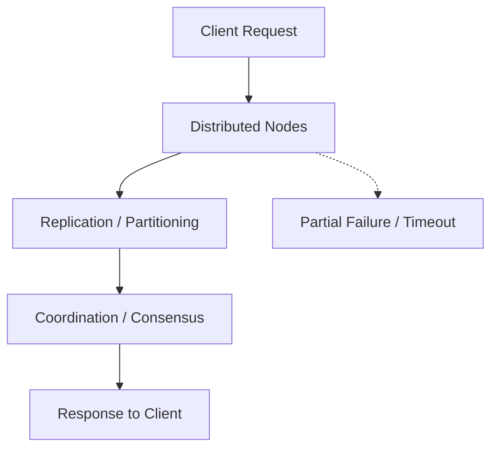

import Tabs from '@theme/Tabs';
import TabItem from '@theme/TabItem';

:::tip Definition
Distributed System Architecture describes how software components coordinate, communicate, and maintain reliability across multiple machines in the presence of unreliable networks, partial failures, and inconsistent time.
:::

**When to Use**

- Understanding microservices, clusters, or multi‑node systems  
- Investigating latency, inconsistency, or failure behaviour  
- Reviewing storage, messaging, or coordination mechanisms  
- Designing systems that must scale horizontally  
- Analysing behaviour under network partitions or load  

**When Not to Use**

- When the system is single‑node or monolithic  
- When the issue is clearly local (e.g., code bug, config error)  
- When early design does not yet involve scale or availability  
- When distributed guarantees are unnecessary or over‑engineered  

---

## 🎯 What Problem Does This Solve?

Distributed systems solve the problem of **scaling, reliability, and coordination across multiple machines**.

They enable:

- **Scalability** — handle more load by adding machines  
- **Fault tolerance** — survive individual component failures  
- **Geographical distribution** — serve users closer to where they are  
- **Specialisation** — break systems into focused services  
- **Parallelism** — perform work concurrently  

For a TA, these concepts explain why modern systems behave the way they do — especially under load, failure, or network issues.

---

## 🧠 Conceptual Model

Distributed systems are shaped by three unavoidable realities:

### Core Components

#### **1. The network is unreliable**  
Messages can be delayed, duplicated, or lost.

#### **2. Time is inconsistent**  
Clocks drift; ordering is not guaranteed.

#### **3. Components fail independently**  
A system can be “up” even when parts of it are down.

### Axes of Variation

- **Consistency vs Availability**  
- **Synchronous vs Asynchronous communication**  
- **Leader‑based vs Leaderless coordination**  
- **Replication vs Partitioning**  
- **Strong vs Eventual consistency**  

Everything else — retries, replication, coordination, consensus — is a response to these constraints.

---

### Typical Lifecycle or Flow

**Diagram:**

---

## 🔍 TA Lens

:::info How a TA Evaluates This Concept
- What changes, what stays constant, what becomes a bottleneck  
- How the system behaves when nodes fail or networks degrade  
- What consistency guarantees exist and how they affect behaviour  
- How retries, timeouts, and backoff interact  
- What coordination mechanisms are in place  
- Where hotspots or uneven load may appear  
:::

**What happens when:**

- **Data grows** → sharding, rebalancing, hotspots  
- **Traffic increases** → replication lag, backpressure  
- **Concurrency rises** → contention, conflicts, distributed locks  
- **Resources become constrained** → slow nodes, cascading failures  

---

## 📘 Key Terminology

| Term | Definition |
|------|------------|
| Node | A machine participating in the system |
| Replica | A copy of data |
| Shard | A partition of data |
| Leader | The authoritative node for writes |
| Follower | A replica receiving updates |
| Quorum | Majority required for agreement |
| Partition | Loss of communication between nodes |
| Eventual Consistency | Data converges over time |

---

## 🧬 Variants / Types

<Tabs>

<TabItem value="consistency" label="Consistency Patterns">

### Consistency Patterns

**Purpose**  
Define how and when data becomes consistent across nodes.

**Key Characteristics**
- Strong consistency  
- Eventual consistency  
- Read‑your‑writes  
- Causal consistency  

**Behaviour**  
Different nodes may see different versions of data depending on guarantees.

**Trade-offs**  
Stronger consistency reduces availability during failures.

</TabItem>

<TabItem value="replication" label="Replication Patterns">

### Replication Patterns

**Purpose**  
Maintain multiple copies of data for availability and performance.

**Key Characteristics**
- Synchronous vs asynchronous replication  
- Leader–follower
- Multi‑leader
- Quorum reads/writes

**Behaviour**
Improves availability but introduces lag and conflict risks.

**Trade-offs**
Synchronous = safer but slower; asynchronous = faster but inconsistent.

</TabItem>

<TabItem value="partitioning" label="Partitioning Patterns">

### Partitioning Patterns

**Purpose**
Split data or workload into **independent segments** so the system can scale horizontally.

**Key Characteristics**
- Logical partitioning
- Functional partitioning (by domain)
- Vertical partitioning (by columns)
- Horizontal partitioning (by rows)

**Behaviour**
Improves scalability and isolation but requires careful routing.

**Trade-offs**
Cross‑partition queries become more complex.

</TabItem>

<TabItem value="sharding" label="Sharding Patterns">

### Sharding Patterns

**Purpose**
A **specific implementation** of horizontal partitioning where data is distributed across multiple nodes.

**Key Characteristics**
- Hash‑based sharding
- Range‑based sharding
- Directory‑based sharding
- Consistent hashing

**Behaviour**
Allows large datasets to scale across many machines.

**Trade-offs**
Rebalancing is complex; hotspots can occur depending on shard key.

</TabItem>

<TabItem value="coordination" label="Coordination Patterns">

### Coordination Patterns

**Purpose**  
Ensure distributed components agree on shared state.

**Key Characteristics**
- Leader election  
- Heartbeats  
- Leases  
- Distributed locks  

**Behaviour**  
Prevents conflicting writes and ensures orderly behaviour.

**Trade-offs**  
Coordination adds latency and can become a bottleneck.

</TabItem>

<TabItem value="failure" label="Failure Handling Patterns">

### Failure Handling Patterns

**Purpose**  
Manage partial failures gracefully.

**Key Characteristics**
- Retries  
- Backoff  
- Circuit breakers  
- Timeouts  
- Idempotency  

**Behaviour**  
Prevents cascading failures and retry storms.

**Trade-offs**  
Aggressive retries can worsen outages.

</TabItem>

<TabItem value="ordering" label="Ordering & Time Patterns">

### Ordering & Time Patterns

**Purpose**  
Handle inconsistent clocks and message ordering.

**Key Characteristics**
- Logical clocks  
- Vector clocks  
- Lamport timestamps  
- Out‑of‑order events  

**Behaviour**  
Ensures correctness when events arrive in unexpected order.

**Trade-offs**  
More metadata, more complexity.

</TabItem>

</Tabs>

---

## 🧩 System Interactions

:::info How a TA Understands the System
- How distributed components interact across network boundaries  
- How failures propagate or remain isolated  
- How replication, sharding, and coordination affect performance  
- What becomes a bottleneck as nodes or traffic scale  
:::

### Local Systems

- OS  
- Runtime  
- Network stack  
- Storage engine  
- Concurrency controls  

### Remote Systems

- Nodes  
- Clusters  
- Data centers  
- Distributed storage  
- Messaging systems  

### Questions to ask during reviews or incidents

- What consistency guarantees apply here?  
- What happens if a node is slow or unreachable?  
- How does the system detect and recover from failure?  
- How is data partitioned or replicated?  
- Are retries causing overload?  

---

## 💥 Outputs / Results

:::note Special Considerations
Distributed failures often appear as latency, stale reads, or inconsistent behaviour rather than explicit errors.
:::

### Success Modes

| Result Type | Description |
|-------------|-------------|
| Consistent Reads | Data matches expected guarantees |
| High Availability | System continues despite node failures |
| Predictable Latency | No unexpected spikes or stalls |
| Safe Coordination | No split‑brain or conflicting writes |

### Failure Modes

| Failure Type | Description |
|--------------|-------------|
| Network Partition | Nodes cannot communicate reliably |
| Split‑Brain | Multiple leaders emerge |
| Thundering Herd | Many clients retry at once |
| Slow Node | Node alive but too slow to be useful |
| Inconsistent Reads | Different nodes return different data |

---

## 🔗 Related Runbook Concepts

- Networking Concepts  
- Containerised Environments  
- Messaging  
- Search Patterns  
- Observability  
- Code Security  
