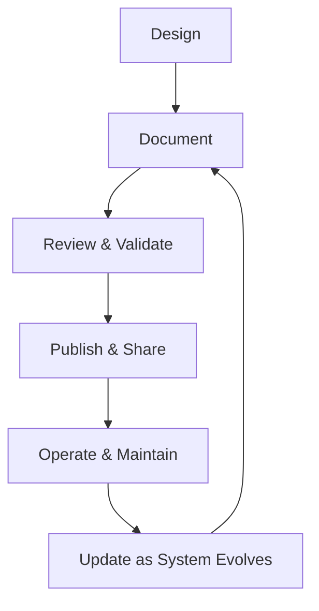

import Tabs from '@theme/Tabs';
import TabItem from '@theme/TabItem';

:::tip Definition
Documentation Architecture describes how technical knowledge is structured, communicated, and maintained across systems, teams, and lifecycles to ensure shared understanding and safe operation.
:::

**When to Use**

- Sharing knowledge across teams or roles  
- Designing APIs, systems, or operational workflows  
- Onboarding new engineers  
- Ensuring operational safety and reducing outages  
- Supporting compliance, audits, or governance  
- Coordinating work across distributed teams  

**When Not to Use**

- Information is volatile and changes daily  
- A simple README or code comment is sufficient  
- The system is experimental or short‑lived  
- Documentation is being used to justify poor design  
- The audience does not need long‑form documentation  

---

## 🎯 What Problem Does This Solve?

Documentation Architecture solves the problem of **knowledge fragmentation**, **tribal knowledge**, and **unsafe operation**.

It enables:

- Shared understanding across teams  
- Faster onboarding  
- Reliable operations through runbooks  
- Consistent API behaviour via contracts  
- Traceability for governance and audits  
- Scalable collaboration without constant meetings  

Documentation is a **system**, not a deliverable — it ensures teams can build, operate, and evolve software safely.

---

## 🧠 Conceptual Model

Documentation spans **four layers**, each serving a different purpose:

### Core Components

#### **1. Product & User Documentation**  
Explains *what the system does*.

#### **2. Architecture & Design Documentation**  
Explains *how the system works*.

#### **3. API & Contract Documentation**  
Explains *how to interact with the system*.

#### **4. Operational Documentation**  
Explains *how to run, debug, and maintain the system*.

### Axes of Variation

- **Audience** → user, engineer, operator, auditor  
- **Purpose** → understanding, interaction, operation, governance  
- **Format** → narrative, diagrams, schemas, contracts  
- **Lifecycle** → static vs frequently updated  
- **Scope** → system‑wide vs component‑specific  

---

### Typical Lifecycle or Flow

**Diagram:**

---

## 🔍 TA Lens

:::info How a TA Evaluates This Concept
- What changes, what stays constant, what becomes a bottleneck  
- Whether documentation reflects reality or has drifted  
- Whether contracts and runbooks are complete and unambiguous  
- Whether diagrams match system behaviour under load  
- Whether documentation supports safe operation and onboarding  
:::

**What happens when:**

- **Data grows** → schemas and data dictionaries become critical  
- **Traffic increases** → operational docs must cover scaling and failure modes  
- **Concurrency rises** → API contracts and sequencing diagrams matter  
- **Resources become constrained** → runbooks guide safe recovery  

---

## 📘 Key Terminology

| Term | Definition |
|------|------------|
| Contract | Agreed behaviour between systems |
| Specification | Formal description of an API or schema |
| Runbook | Step‑by‑step operational instructions |
| Playbook | Strategy for handling classes of incidents |
| ADR | Architecture Decision Record |
| Schema | Structured definition of data |

---

## 🧬 Variants / Types

<Tabs>

<TabItem value="api" label="API & Contract Documentation">

### API & Contract Documentation

**Purpose**  
Define how systems communicate and what they expect.

**Key Characteristics**
- Machine‑readable contracts  
- Strong typing or schema validation  
- Clear request/response structures  

**Behaviour**  
Ensures consistent API behaviour across teams and clients.

**Trade-offs**  
Strict contracts require disciplined versioning.

---

#### OpenAPI (REST)

- Machine‑readable HTTP API specification  
- Used for SDK generation, validation, and portals  

#### GraphQL Schema

- Self‑describing via introspection  
- Strong typing and flexible querying  

#### gRPC / Protobuf

- Binary, schema‑driven  
- High‑performance service‑to‑service communication  

#### SOAP / WSDL (Legacy)

- XML‑based enterprise contracts  
- Strict schema validation  

</TabItem>

<TabItem value="architecture" label="Architecture & System Documentation">

### Architecture & System Documentation

**Purpose**  
Explain how systems are designed, structured, and interact.

**Key Characteristics**
- Components, flows, dependencies  
- Failure modes and scaling behaviour  
- Historical decisions (ADRs)  

**Behaviour**  
Provides shared understanding for design, review, and onboarding.

**Trade-offs**  
Can drift if not maintained.

---

#### Architecture Decision Records (ADRs)

Capture *why* decisions were made.

#### System Design Docs

Describe components, flows, dependencies, and failure modes.

#### Sequence & Flow Diagrams

Explain runtime behaviour and interactions.

</TabItem>

<TabItem value="operational" label="Operational Documentation">

### Operational Documentation

**Purpose**  
Enable safe operation, debugging, and maintenance.

**Key Characteristics**
- Runbooks for known scenarios  
- Playbooks for incident classes  
- SLO/SLA definitions  

**Behaviour**  
Reduces outages and accelerates incident response.

**Trade-offs**  
Requires continuous updates as systems evolve.

---

#### Runbooks

Step‑by‑step instructions for predictable failures.

#### Playbooks

Higher‑level strategies for incident response.

#### SLO/SLA Documentation

Defines availability targets, error budgets, and expectations.

</TabItem>

<TabItem value="product" label="Product & User Documentation">

### Product & User Documentation

**Purpose**  
Explain what the system does and how to use it.

**Key Characteristics**
- User guides  
- Tutorials  
- Release notes  

**Behaviour**  
Supports end‑users and internal consumers.

**Trade-offs**  
Must balance detail with usability.

</TabItem>

<TabItem value="schema" label="Schema & Data Documentation">

### Schema & Data Documentation

**Purpose**  
Define the structure, meaning, and constraints of data.

**Key Characteristics**
- JSON Schema  
- XSD  
- Avro/Protobuf schemas  
- Data dictionaries  

**Behaviour**  
Ensures semantic consistency across pipelines and teams.

**Trade-offs**  
Requires alignment between engineering and analytics.

</TabItem>

</Tabs>

---

## 🧩 System Interactions

:::info How a TA Understands the System
- How documentation interacts with architecture, data, and runtime  
- How documentation supports safe operation under pressure  
- What becomes a bottleneck when systems scale or evolve  
:::

### Local Systems

- OS  
- Runtime  
- Network  
- Storage  
- Concurrency  
- Scaling  

### Remote Systems

- Pods  
- Data Centers  
- API Gateways  
- CI/CD Platforms  
- Knowledge Portals (e.g., Backstage)  

### Questions to ask during reviews or incidents

- Does documentation reflect current reality?  
- Are runbooks complete and actionable?  
- Are API contracts versioned and validated?  
- Are diagrams accurate under load or failure?  
- Is ownership and update responsibility clear?  

---

## 💥 Outputs / Results

:::note Special Considerations
Documentation must be accurate, discoverable, and maintained — stale documentation is dangerous.
:::

### Success Modes

| Result Type | Description |
|-------------|-------------|
| Shared Understanding | Teams align without meetings |
| Reliable Operations | Runbooks prevent outages and mistakes |
| API Reliability | Contracts ensure consistent behaviour |
| Faster Onboarding | New engineers become productive quickly |

### Failure Modes

| Failure Type | Description |
|--------------|-------------|
| Documentation Drift | Docs no longer match reality |
| Ambiguous Contracts | APIs behave inconsistently |
| Missing Runbooks | Incidents escalate unnecessarily |
| Tribal Knowledge | Only a few people understand the system |

---

## 🔗 Related Runbook Concepts

- API Design  
- Data Modelling  
- System Architecture  
- Delivery & Deployment Architecture  
- Configurations & Declarative Systems  
