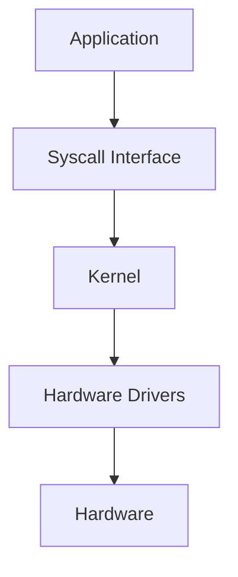

import Tabs from '@theme/Tabs';
import TabItem from '@theme/TabItem';

:::tip Definition
Operating System (OS) Architecture describes how hardware, kernel functions, and user‑space processes are organised to provide safe, efficient, and portable abstractions for running applications.
:::

**When to Use**

- Diagnosing performance, latency, or resource issues  
- Understanding container vs VM vs serverless behaviour  
- Investigating failures below the application layer  
- Designing systems that rely on OS‑level guarantees (I/O, networking)  
- Explaining how runtimes, orchestrators, and processes interact  

**When Not to Use**

- Treating containers as fully isolated VMs  
- Assuming OS behaviour explains purely application‑level bugs  
- Over‑tuning kernel parameters without evidence  
- Using OS concepts when the issue is clearly in the runtime or platform layer  

---

## 🎯 What Problem Does This Solve?

OS Architecture solves the problem of **safe, efficient, and portable execution** on hardware.

Without an OS, applications would need to manage CPU, memory, I/O, and devices directly — an unsafe and error‑prone model.

OS architecture provides:

- **Hardware abstraction** → applications don’t need to understand device specifics  
- **Safe resource sharing** → multiple processes run without corrupting each other  
- **Isolation & security** → prevents workloads from interfering  
- **Scalable multitasking** → efficient scheduling of many processes  
- **Portability** → applications run across different machines and environments  

---

## 🧠 Conceptual Model

### Core Components

#### **Hardware Layer**
- CPU, memory, disks, network interfaces  
- Exposed through controlled abstractions  

#### **Kernel Layer**
- Runs in privileged mode  
- Manages processes, memory, I/O, and device drivers  
- Enforces isolation and security boundaries  

#### **User Space**
- Applications, libraries, runtimes  
- Interact with the kernel via syscalls  

### Axes of Variation

- **Monolithic vs Microkernel vs Hybrid**  
- **Process vs Thread vs Coroutine**  
- **Bare metal vs VM vs Container**  
- **Kernel‑managed vs User‑space managed resources**  

---

### Typical Lifecycle or Flow

**Diagram:**



Or the layered view:

```
+---------------------------+
|        User Space         |
|  Apps | Runtimes | Tools |
+---------------------------+
            ↓ syscalls
+---------------------------+
|          Kernel           |
| Scheduling | Memory | I/O |
+---------------------------+
            ↓ drivers
+---------------------------+
|          Hardware         |
+---------------------------+
```

---

## 🔍 TA Lens

:::info How a TA Evaluates OS Architecture
- Identify whether an issue is application‑level, runtime‑level, or OS‑level  
- Check for resource contention (CPU, memory, I/O, network)  
- Understand isolation boundaries: process, container, VM, host  
- Ask whether a failure relates to syscalls, kernel limits, or user‑space behaviour  
- Map modern abstractions (Kubernetes, serverless) back to OS fundamentals  
:::

**What happens when:**

- **Data grows** → disk I/O and memory pressure increase  
- **Traffic increases** → network stack congestion, socket exhaustion  
- **Concurrency rises** → thread scheduling, lock contention  
- **Resources become constrained** → swapping, OOM kills, throttling  

---

## 📘 Key Terminology

| Term | Definition |
|------|------------|
| Kernel | Privileged core managing processes, memory, and hardware |
| Syscall | Interface for user‑space to request kernel services |
| User Space | Restricted environment where applications run |
| Process | Executing program with isolated memory and resources |
| Thread | Lightweight execution unit within a process |
| Namespace | Isolation mechanism for containers |
| cgroup | Resource control mechanism for CPU, memory, I/O |

---

## 🧬 Variants / Types

<Tabs>

<TabItem value="monolithic" label="Monolithic Kernel">

### Monolithic Kernel

**Purpose**  
Provide high‑performance general‑purpose computing.

**Key Characteristics**
- Kernel includes drivers, filesystems, networking, scheduling  
- Large trusted codebase  
- High performance  

**Behaviour**  
Fast system calls and tight integration.

**Trade-offs**  
Large attack surface; harder to isolate faults.

</TabItem>

<TabItem value="microkernel" label="Microkernel">

### Microkernel

**Purpose**  
Maximise modularity and isolation.

**Key Characteristics**
- Minimal kernel  
- Most services run in user space  
- Smaller attack surface  

**Behaviour**  
Faults in services do not crash the kernel.

**Trade-offs**  
More context switching; potential performance overhead.

</TabItem>

<TabItem value="hybrid" label="Hybrid Kernel">

### Hybrid Kernel

**Purpose**  
Blend microkernel modularity with monolithic performance.

**Key Characteristics**
- Microkernel principles  
- Monolithic‑style performance  
- Flexible architecture  

**Behaviour**  
Balances modularity and speed.

**Trade-offs**  
In practice, often behaves closer to monolithic kernels.

</TabItem>

</Tabs>

---

## 🧩 System Interactions

:::info How a TA Understands the System
- How OS interacts with hardware, runtimes, containers, and orchestrators  
- How OS behaviour changes under pressure  
- What becomes a bottleneck as workloads scale  
:::

### Local Systems

- OS scheduler  
- Memory manager  
- Filesystem  
- Network stack  
- Process/thread model  
- cgroups and namespaces  

### Remote Systems

- Pods  
- VMs  
- Data centers  
- Orchestrators (Kubernetes, ECS)  

### Questions to ask during reviews or incidents

- Is this failure caused by OS limits (ulimits, cgroups)?  
- Is the kernel killing processes (OOMKill)?  
- Is the system I/O bound or CPU bound?  
- Are containers sharing the same kernel resources?  
- Is the network namespace configured correctly?  

---

## 💥 Outputs / Results

:::note Special Considerations
Kernel behaviour varies across OS families; containerised environments share the same kernel.
:::

### Success Modes

| Result Type | Description |
|-------------|-------------|
| Predictable Scheduling | Processes receive fair CPU time |
| Stable Memory Usage | No swapping or OOM kills |
| Healthy I/O Behaviour | Low I/O wait, consistent throughput |
| Reliable Networking | No packet drops or socket exhaustion |

### Failure Modes

| Failure Type | Description |
|--------------|-------------|
| OOM Kill | Kernel terminates processes due to memory pressure |
| High I/O Wait | Disk saturation causes latency spikes |
| Network Congestion | Packet drops, retransmissions, slow connections |
| Kernel Panics | Catastrophic system failure |
| Namespace Misconfig | Containers unable to communicate or access resources |

---

## 🔗 Related Runbook Concepts

- Virtualisation & Hypervisors  
- Container Runtime Architecture  
- Memory Management  
- Filesystems & Storage  
- Networking Fundamentals  
