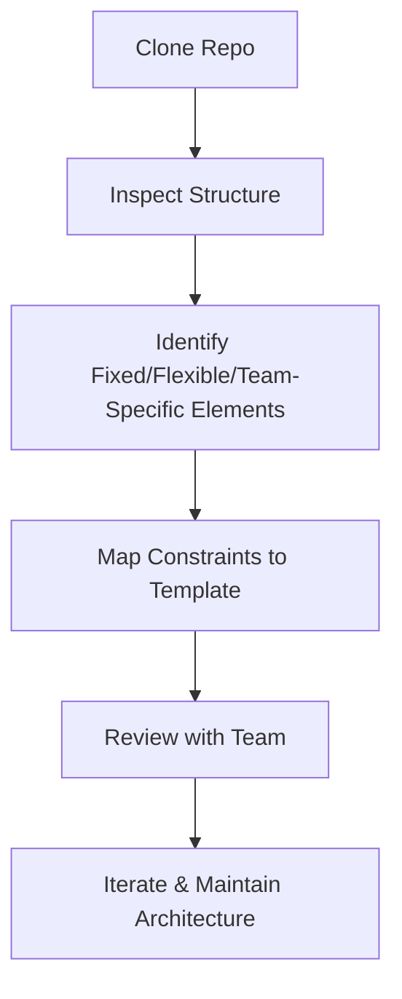

import Tabs from '@theme/Tabs';
import TabItem from '@theme/TabItem';

:::tip Definition
Project Architecture describes how a software project is structured across code, dependencies, tooling, workflows, and team conventions — the system that shapes how engineers build, test, deploy, and operate software.
:::

**When to Use**

- Designing or updating a project template  
- Reviewing a team’s repo to understand constraints  
- Diagnosing structural issues (build failures, dependency drift, CI pain)  
- Identifying fixed vs flexible vs team‑specific elements  
- Ensuring templates support real‑world engineering needs  

**When Not to Use**

- Assuming all teams should follow identical structures  
- Forcing a template onto a team with domain‑specific needs  
- Treating flexible elements as fixed (or vice versa)  
- Over‑engineering structure for small or short‑lived projects  

---

## 🎯 What Problem Does This Solve?

Project Architecture solves the problem of **how work gets done** inside a software project.

It enables:

- **Clarity of constraints** — what must stay stable vs what can change  
- **Template alignment** — ensuring cookiecutter templates match real needs  
- **Risk reduction** — identifying brittle or non‑standard structures early  
- **Faster onboarding** — new engineers understand the project shape quickly  
- **Better requirements** — grounding requirements in engineering reality  

A project’s architecture is the *skeleton* that determines how teams build, test, deploy, and operate software.

---

## 🧠 Conceptual Model

### Core Components

#### **Language & Runtime Constraints**
- Packaging model  
- Directory conventions  
- Build tools  
- Dependency resolution  

#### **Team Workflow**
- CI/CD pipelines  
- Testing strategy  
- Deployment model  
- Observability patterns  

#### **Domain Requirements**
- Data pipelines  
- API boundaries  
- Infrastructure‑as‑code  
- ML workflows  

#### **Organisational Standards**
- Templates  
- Security requirements  
- Naming conventions  
- Internal libraries  

Together, these form the **project skeleton** — the structure that governs how work gets done.

### Axes of Variation

- **Fixed vs Flexible vs Team‑Specific elements**  
- **Monorepo vs Polyrepo**  
- **Strict vs Loose conventions**  
- **Lightweight vs Heavyweight tooling**  
- **Runtime‑driven vs Domain‑driven structure**  

---

### Typical Lifecycle or Flow

**Diagram:**

---

## 🔍 TA Lens

:::info How a TA Evaluates Project Architecture
- Identify **fixed elements** dictated by language, runtime, or organisation  
- Identify **flexible elements** that teams can change with effort  
- Identify **team‑specific elements** that require extension points  
- Look for structural signals: modularity, testability, dependency hygiene  
- Ask whether the architecture supports the team’s domain and workflow  
:::

**What happens when:**

- **Data grows** → repo structure must support pipelines, schemas, storage  
- **Traffic increases** → CI/CD must scale, tests must be layered  
- **Concurrency rises** → build tools and runtimes must handle parallelism  
- **Resources become constrained** → builds slow, dependencies drift, CI bottlenecks appear  

---

## 📘 Key Terminology

| Term | Definition |
|------|------------|
| Fixed Element | A project component that cannot change without major cost |
| Flexible Element | A component that can change with effort and coordination |
| Team‑Specific Element | A domain‑driven component unique to a team’s workflow |
| Extension Point | A template mechanism allowing teams to customise behaviour |
| Project Skeleton | The baseline directory and tooling structure |

---

## 🧬 Variants / Types

<Tabs>

<TabItem value="baseline" label="Baseline Structure">

### Baseline Project Structure

**Purpose**  
Provide a predictable, navigable foundation for engineering work.

**Key Characteristics**
- Source code layout  
- Dependencies and package management  
- Build & packaging tools  
- Testing structure  
- CI/CD pipelines  
- Runtime & deployment configuration  
- Observability hooks  

**Behaviour**  
Defines the default shape of the project.

**Trade-offs**  
Too rigid → slows teams; too loose → creates chaos.

</TabItem>

<TabItem value="fixed" label="Fixed Elements">

### Fixed Elements

**Purpose**  
Represent non‑negotiable constraints imposed by language, runtime, or organisation.

**Key Characteristics**
- Language‑specific directory conventions  
- Build tools (Maven, sbt, Poetry, npm)  
- Packaging models (JAR, wheel, container image)  
- Required internal libraries or security tooling  

**Behaviour**  
Stable across teams; must be supported by templates.

**Trade-offs**  
Rigid but predictable.

---

**Examples**

| Language | Fixed Elements | Why Fixed |
|---------|----------------|-----------|
| Java | Maven/Gradle, `src/main/java`, JAR/WAR | JVM conventions |
| Scala | sbt, multi‑module builds | Compiler + ecosystem |
| Python | `src/` layout, virtualenv/poetry | Packaging + interpreter |
| Node.js | `package.json`, npm/yarn | Runtime + dependency model |

</TabItem>

<TabItem value="flexible" label="Flexible Elements">

### Flexible Elements

**Purpose**  
Allow teams to adapt structure to their workflow.

**Key Characteristics**
- Directory structure  
- Testing framework  
- CI pipeline design  
- Dockerfile patterns  

**Behaviour**  
Can change, but with cost and coordination.

**Trade-offs**  
Flexibility increases autonomy but reduces standardisation.

</TabItem>

<TabItem value="team" label="Team‑Specific Elements">

### Team‑Specific Elements

**Purpose**  
Capture domain‑driven needs unique to a team.

**Key Characteristics**
- ETL folders, schemas, pipeline configs  
- API routing conventions  
- ML model folders, notebooks, experiment tracking  
- Terraform modules, infra scripts  

**Behaviour**  
Require extension points, not standardisation.

**Trade-offs**  
High variability; templates must support customisation.

</TabItem>

</Tabs>

---

## 🧩 System Interactions

:::info How a TA Understands the System
- How project structure interacts with build tools, CI/CD, and runtime  
- How architecture behaves under load (large repos, heavy tests)  
- What becomes a bottleneck as teams scale or add dependencies  
:::

### Local Systems

- OS  
- Runtime  
- Build tools  
- Dependency managers  
- Local testing frameworks  

### Remote Systems

- CI/CD platforms  
- Artifact registries  
- Cloud runtimes  
- Data centers  
- Internal library repositories  

### Questions to ask during reviews or incidents

- What parts of the structure are fixed vs flexible?  
- Does the architecture support the team’s domain?  
- Are dependencies well‑managed or drifting?  
- Are CI/CD pipelines aligned with project shape?  
- Are extension points clearly defined?  

---

## 💥 Outputs / Results

:::note Special Considerations
Historical decisions often explain structural quirks; avoid assuming mistakes.
:::

### Success Modes

| Result Type | Description |
|-------------|-------------|
| Project Map | Clear breakdown of fixed/flexible/team‑specific elements |
| Template Requirements | Structured list of what templates must support |
| Risk Assessment | Identification of brittle or inconsistent structures |
| Extension Points | Areas where teams can safely customise |

### Failure Modes

| Failure Type | Description |
|--------------|-------------|
| Structural Drift | Repo becomes inconsistent or unmaintainable |
| Dependency Drift | Versions diverge, causing build failures |
| CI Pain | Slow, flaky, or brittle pipelines |
| Template Misalignment | Templates fail to support real workflows |

---

## 🔗 Related Runbook Concepts

- OS Architecture  
- Memory Management  
- Build Systems  
- Dependency Management  
- CI/CD Architecture  

