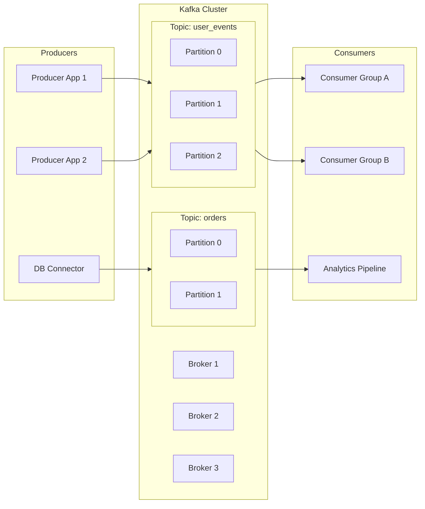

import Tabs from '@theme/Tabs';
import TabItem from '@theme/TabItem';

:::tip Definition
**Apache Kafka** is a **distributed event streaming platform** used to ingest, store, and process high‑volume real‑time data using an append‑only log.
:::

Kafka is primarily concerned with **high‑throughput data integration, real‑time event pipelines, and decoupling producers from consumers**.

Typical examples include:
- Real‑time data pipelines between microservices
- Event‑driven architectures (user activity, payments, orders)
- High‑volume log ingestion and analytics
- Stream processing (fraud detection, monitoring, ETL)

---

## Benefit / What problem does it solve?

Using Kafka enables:

- **Scalable, fault‑tolerant data integration** across many systems
- **Real‑time publish/subscribe messaging** with high throughput
- **Decoupling** between producers and consumers
- **Replayable event logs** for recovery, auditing, and stream processing
- **Fan‑out reads** (many consumers reading the same data independently)

---

## When to use

* You need **real‑time streaming** between multiple systems
* You need **high‑throughput ingestion** (MB/s → GB/s)
* You want **event-driven architecture** or microservice decoupling
* You need **durable logs** that consumers can replay
* You want to avoid N² point‑to‑point integrations

**Do NOT use this tool when:**

* You need **request/response** messaging (use REST or gRPC)
* You need **complex routing** or message transformations (use Kafka Connect or an ESB)
* You need **long-term storage** (Kafka is not a data warehouse)
* You have **low data volume** where simpler queues suffice

---

## TA Skills Checklist

- Understand **topics, partitions, offsets, retention**
- Validate **producer/consumer behaviour** (lag, throughput, retries)
- Review **partitioning strategy** for scalability
- Check **consumer lag metrics** (MAE, MCE)
- Confirm **retention policies** and governance requirements
- Identify **data schema risks** (Kafka does not enforce schemas)
- Validate **delivery semantics** (at‑least‑once vs at‑most‑once)
- Support teams in diagnosing **lag, throughput, and serialization issues**

---

## Key Terminology & Definitions

- **Topic** – A category or feed name where messages are written
- **Partition** – A shard of a topic; each is an independent append‑only log
- **Offset** – A monotonically increasing number identifying each record
- **Producer** – Writes messages to Kafka
- **Consumer** – Reads messages from Kafka
- **Broker** – A Kafka server; multiple brokers form a cluster
- **Consumer Group** – A set of consumers sharing work across partitions
- **Retention** – How long Kafka keeps data (time or size based)
- **Fan‑out** – Many consumers reading the same data independently

---

## Variants / Types

<Tabs>
<TabItem value="messaging" label="Messaging (Pub/Sub)">

- High‑throughput publish/subscribe
- Producers write once; many consumers read independently
- Used for microservices, event-driven systems, logs

**Primary purpose:** decoupling and real‑time communication

</TabItem>

<TabItem value="streaming" label="Stream Processing">

- Continuous processing of events
- Stateful operations (windows, joins, aggregations)
- Tools: Kafka Streams, ksqlDB, Flink

**Primary purpose:** real‑time transformation and enrichment

</TabItem>
</Tabs>

---

## Key Strategies

<Tabs>
<TabItem value="partitioning" label="Partitioning Strategy">

- Choose partition keys deliberately
- Ensure even distribution to avoid hot partitions
- Align partitioning with consumer scaling needs
- Responsibility: SWE + TA validation
- Goal: throughput, parallelism, and predictable ordering

</TabItem>

<TabItem value="retention" label="Retention & Durability Strategy">

- Define retention by time or size
- Ensure compliance with governance (PII, audit)
- Validate storage capacity and broker configuration
- Responsibility: Platform team + TA oversight
- Goal: balance durability, cost, and performance

</TabItem>
</Tabs>

---

## How to Interact With It

- **Access pattern:** Append‑only writes; sequential reads
- **Operations / Interfaces:**
  - Kafka protocol (TCP)
  - Producer/Consumer APIs
  - Kafka CLI tools
  - Kafka Connect
  - Schema Registry (optional)
- **Interaction model:**
  - Applications use Kafka client libraries
  - Consumers subscribe to topics
  - Producers publish events
  - Brokers persist logs

---

## What Do Results Normally Look Like

- Streams of events (key/value byte records)
- Offsets indicating position in the log
- Consumer lag metrics (MAE, MCE)
- Partition-level throughput statistics

**Notes:**
Kafka stores **raw bytes**. Serialization (JSON, Avro, Protobuf) is handled by clients, not Kafka itself.
Ordering is guaranteed **within a partition**, not across partitions.

