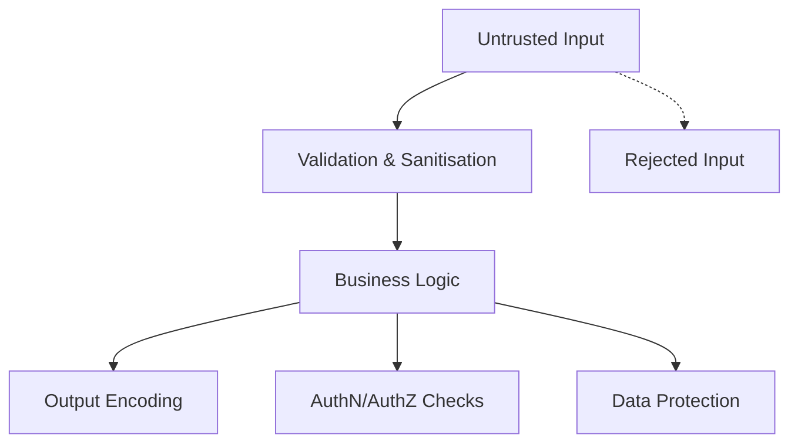

import Tabs from '@theme/Tabs';
import TabItem from '@theme/TabItem';

:::tip Definition
Code Security refers to the patterns, principles, and safeguards that prevent vulnerabilities in software systems by protecting data, preventing misuse, and ensuring safe behaviour under malicious or unexpected conditions.
:::

**When to Use**

- Reviewing API or service designs  
- Evaluating data flows and trust boundaries  
- Assessing risk in new features or integrations  
- Reviewing pull requests for security concerns  
- Handling sensitive data or authentication logic  

**When Not to Use**

- Over‑securing early prototypes  
- Adding controls without understanding risk  
- Assuming internal systems are inherently safe  
- Relying solely on tools instead of patterns and reasoning  

---

## 🎯 What Problem Does This Solve?

Code Security solves the problem of **unsafe behaviour** when untrusted input, malicious actors, or insecure defaults interact with software.

It enables:

| Benefit | Why it matters |
|--------|----------------|
| Protection of data | Prevents leaks, corruption, and unauthorised access |
| Resilience to attacks | Reduces risk of exploitation and downtime |
| Predictable behaviour | Prevents unsafe execution paths |
| Trustworthiness | Ensures systems behave safely under adversarial input |
| Compliance | Supports regulatory and organisational requirements |

---

## 🧠 Conceptual Model

Security issues arise when **untrusted input** interacts with:

- code  
- data stores  
- interpreters  
- file systems  
- networks  
- authentication systems  

### Core Components

- **Input validation**  
- **Output encoding**  
- **Authentication & authorisation**  
- **Data protection**  
- **Error & exception safety**  
- **Dependency & supply‑chain safety**

### Axes of Variation

#### Synchronous vs Asynchronous Risk
- Synchronous → immediate exploitation (SQL injection)  
- Asynchronous → delayed exploitation (poisoned queues, malicious events)

#### Trust Boundaries
Where data crosses from “trusted” to “untrusted.”

#### Attack Surface
All the ways an attacker can interact with the system.

#### Safe Defaults
Systems should fail closed, not open.

---

### Typical Lifecycle or Flow

---

## 🔍 TA Lens

:::info How a TA Evaluates Code Security
- What input is untrusted, and how is it validated?  
- What assumptions does the code make about callers or data?  
- What happens under failure, and is the fallback safe?  
- Are authentication and authorisation boundaries explicit?  
- How is sensitive data stored, transmitted, and logged?  
- What external dependencies or supply‑chain risks exist?  
:::

**What happens when:**

- **Data grows** → more attack surface, more input to validate  
- **Traffic increases** → rate‑limiting, brute‑force protection, auth load  
- **Concurrency rises** → race conditions, session safety  
- **Resources become constrained** → error paths become dangerous  

---

## 📘 Key Terminology

| Term | Definition |
|------|------------|
| Attack Surface | All points where an attacker can interact with the system |
| Threat Model | Assumptions about attacker capabilities |
| Least Privilege | Only the permissions required |
| Secure Defaults | Systems should be safe without configuration |
| Hardening | Reducing attack surface |
| Secret | Sensitive value requiring protection |

---

## 🧬 Variants / Types

<Tabs>

<TabItem value="input" label="Input Validation Pattern">

### Input Validation Pattern

**Purpose**  
Prevent malicious or malformed input from being executed or trusted.

**Key Characteristics**
- Validate type, length, format  
- Reject unexpected characters  
- Prefer allowlists over denylists  

**Behaviour**  
Rejects unsafe input early before it reaches business logic.

**Trade-offs**  
Strict validation may block legitimate edge cases.

</TabItem>

<TabItem value="output" label="Output Encoding Pattern">

### Output Encoding Pattern

**Purpose**  
Prevent untrusted data from being interpreted as code.

**Key Characteristics**
- Escape HTML, SQL, shell, or JSON contexts  
- Encode before rendering  
- Prevent injection attacks  

**Behaviour**  
Ensures output is treated as data, not executable code.

**Trade-offs**  
Incorrect encoding can break UI or logs.

</TabItem>

<TabItem value="auth" label="Authentication & Authorisation Pattern">

### Authentication & Authorisation Pattern

**Purpose**  
Ensure only legitimate users or systems can act.

**Key Characteristics**
- Strong authentication  
- Role‑based or attribute‑based access  
- Least privilege  
- Session management  

**Behaviour**  
Controls who can do what.

**Trade-offs**  
Overly strict rules can block legitimate access.

</TabItem>

<TabItem value="data" label="Data Protection Pattern">

### Data Protection Pattern

**Purpose**  
Protect sensitive data at rest and in transit.

**Key Characteristics**
- Encryption  
- Hashing  
- Key management  
- Secrets isolation  

**Behaviour**  
Prevents exposure of sensitive information.

**Trade-offs**  
Encryption adds operational complexity.

</TabItem>

<TabItem value="error" label="Error & Exception Safety Pattern">

### Error & Exception Safety Pattern

**Purpose**  
Prevent information leakage and unsafe fallback behaviour.

**Key Characteristics**
- Generic error messages  
- No stack traces to users  
- Fail closed, not open  

**Behaviour**  
Ensures errors do not reveal sensitive details.

**Trade-offs**  
Generic errors can reduce debuggability.

</TabItem>

<TabItem value="dependency" label="Dependency & Supply Chain Pattern">

### Dependency & Supply Chain Pattern

**Purpose**  
Prevent vulnerabilities introduced by third‑party code.

**Key Characteristics**
- Version pinning  
- Vulnerability scanning  
- Minimal dependencies  
- Trusted sources  

**Behaviour**  
Reduces risk from external libraries and packages.

**Trade-offs**  
Strict dependency rules may slow development.

</TabItem>

</Tabs>

---

## 🧩 System Interactions

:::info How a TA Understands the System
- How code security interacts with storage, compute, and orchestration  
- How systems behave under malicious load or malformed input  
- What becomes a bottleneck as traffic or attack attempts increase  
:::

### Local Systems

- OS  
- Runtime  
- File system  
- Local secrets stores  
- Logging and error handling  

### Remote Systems

- Authentication providers  
- Secrets managers  
- External APIs  
- Package registries  

### Questions to ask during reviews or incidents

- Where is the trust boundary?  
- What happens if this input is malicious?  
- Are secrets exposed in logs or errors?  
- What happens if authentication fails?  
- Are dependencies pinned and scanned?  

---

## 💥 Outputs / Results

:::note Special Considerations
Security failures often appear as unexpected behaviour rather than explicit errors.
:::

### Success Modes

| Result Type | Description |
|-------------|-------------|
| Clean Input | Unsafe input rejected early |
| Safe Output | No XSS or injection vulnerabilities |
| Controlled Access | Clear permission boundaries |
| Protected Data | No plaintext secrets |
| Safe Errors | No sensitive information leaked |
| Trusted Dependencies | No known CVEs |

### Failure Modes

| Failure Type | Description |
|--------------|-------------|
| Injection | Untrusted input becomes executable code |
| Privilege Escalation | Broken access control |
| Sensitive Data Exposure | Secrets in logs or plaintext |
| Unsafe Fallbacks | Debug modes, verbose errors |
| Supply Chain Attacks | Compromised dependencies |

---

## 🔗 Related Runbook Concepts

- API Contracts  
- Data Protection  
- Authentication & Authorisation  
- Secure Coding Practices  
- Threat Modelling  
