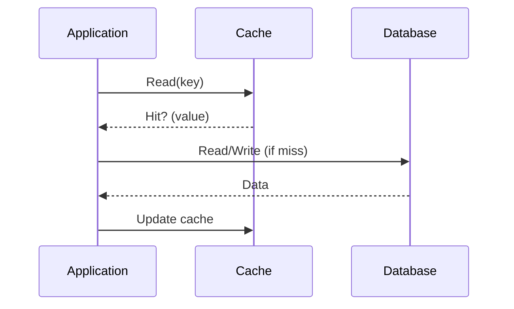

import Tabs from '@theme/Tabs';
import TabItem from '@theme/TabItem';

## 🧠 Theory
This **Theory** page explains how applications store, retrieve, and maintain data across requests, failures, and deployments.  
Persistence is the backbone of every system that needs durable state — user accounts, transactions, logs, analytics, configuration, and more.

Understanding persistence helps you:

- reason about data correctness and consistency  
- anticipate performance bottlenecks  
- diagnose issues in ORMs, caches, and database interactions  
- evaluate architectural trade‑offs  
- communicate clearly with engineers about data flows  

Persistence is not about tools — it is about **how data behaves in a system**.

---

:::tip Definition
**Persistence** is the mechanism by which data outlives the process that created it, ensuring durability across requests, failures, and deployments.
:::

**When to Use**

- When data must survive application restarts  
- When multiple services need shared state  
- When correctness, auditability, or history matter  

**When Not to Use**

- Temporary, per‑request data  
- Ephemeral caches or in‑memory computations  
- Stateless operations that do not require storage  

---

## 🎯 What Problem Does This Solve?

Applications run in memory — and memory disappears when the process ends.  
Without persistence:

- users would lose their data  
- systems could not recover from crashes  
- multi‑step workflows would break  
- distributed systems could not coordinate  

Persistence solves the problem of **durability**: ensuring data remains available and correct across time, failures, and scale.

---

## 🧠 Conceptual Model

### Core Components

- **In‑Memory Objects** — short‑lived, tied to the application runtime  
- **Persistent Storage** — databases, files, logs, distributed stores  
- **JDBC** — low‑level SQL execution  
- **ORMs (Object‑Relational Mappers)** — map objects to database tables  
- **Caching Layers** — fast, ephemeral storage to reduce load  
- **Transactions** — ensure atomic, consistent operations  
- **Consistency Models** — how systems guarantee correctness  

### Axes of Variation

- In‑memory ↔ Durable  
- SQL ↔ NoSQL  
- ORM ↔ Raw queries  
- Strong consistency ↔ Eventual consistency  
- Local storage ↔ Distributed storage  
- Cache‑first ↔ Database‑first  

---

### Typical Lifecycle or Flow

**Diagram(s):**

---

## 🔍TA Lens

:::info How a TA Evaluates This Concept
- Where data lives and how long it lives  
- How reads/writes behave under load  
- How caching affects correctness and freshness  
- How ORMs generate queries and where they leak abstraction  
- How transactions behave under concurrency  
- What becomes a bottleneck as data grows  
:::

**What happens when:**

- **Data grows** → indexes, query plans, ORM inefficiencies surface  
- **Traffic increases** → DB saturation, connection pool exhaustion  
- **Concurrency rises** → deadlocks, race conditions, stale reads  
- **Resources become constrained** → slow queries, cache evictions, timeouts  

---

## 📘 Key Terminology

| Term | Definition |
|------|------------|
| **Persistence** | Ensuring data survives beyond the application process. |
| **JDBC** | Low‑level API for executing SQL directly. |
| **ORM** | Maps objects to database tables automatically. |
| **Caching** | Storing frequently accessed data in fast, ephemeral storage. |
| **Object Lifecycle** | How objects are created, used, and destroyed in memory. |
| **Database Lifecycle** | How data is stored, updated, and persisted over time. |
| **Transactions** | Group of operations that succeed or fail together. |
| **Consistency** | Guarantees about data correctness across reads/writes. |

---

## 🧬 Variants / Types

<Tabs>

<TabItem value="jdbc" label="JDBC">

### JDBC (Direct SQL)

**Purpose**  
Execute SQL directly with full control.

**Key Characteristics**  
- Manual SQL  
- Manual mapping  
- High transparency  

**Behaviour**  
Fast and predictable, but verbose and error‑prone.

**Trade-offs**  
- ✔ Full control  
- ✔ No abstraction leakage  
- ✘ More boilerplate  
- ✘ Harder to maintain  

</TabItem>

<TabItem value="orm" label="ORM">

### ORM (Object‑Relational Mapping)

**Purpose**  
Map objects to database tables automatically.

**Key Characteristics**  
- Automatic SQL generation  
- Entity lifecycle management  
- Declarative relationships  

**Behaviour**  
Accelerates development but can hide performance issues.

**Trade-offs**  
- ✔ Faster development  
- ✔ Cleaner domain models  
- ✘ Hidden queries  
- ✘ N+1 problems, abstraction leakage  

</TabItem>

<TabItem value="cache" label="Caching">

### Caching

**Purpose**  
Reduce load on the database and improve performance.

**Key Characteristics**  
- In‑memory  
- Fast reads  
- Eviction policies  

**Behaviour**  
Improves performance but risks stale data.

**Trade-offs**  
- ✔ Very fast  
- ✔ Reduces DB load  
- ✘ Stale reads  
- ✘ Cache invalidation complexity  

</TabItem>

</Tabs>

---

## 🧩 System Interactions

:::info How a TA Understands the System
Persistence interacts with nearly every part of the system: compute, network, storage, caching, and concurrency.
:::

### Local Systems

- Application runtime (JVM, Python, Node)  
- Connection pools  
- In‑memory caches  
- Transaction managers  
- ORM layers  

### Remote Systems

- Databases (SQL/NoSQL)  
- Distributed caches (Redis, Memcached)  
- Replicas and read‑replicas  
- Data centres / regions  

### Questions to ask during reviews or incidents

- Where does the data actually live?  
- How fresh is the data?  
- What happens if the cache fails?  
- What happens if the DB restarts?  
- Are transactions required?  
- Is the ORM generating inefficient queries?  

---

## 💥 Outputs / Results

:::note Special Considerations
Persistence failures often manifest as performance issues, stale data, or inconsistent state.
:::

### Success Modes

| Result Type | Description |
|-------------|-------------|
| Durable state | Data survives restarts and failures. |
| Predictable queries | SQL behaves consistently under load. |
| Efficient caching | Reduced DB load and faster responses. |

### Failure Modes

| Failure Type | Description |
|-------------|-------------|
| Stale data | Cache not invalidated or inconsistent replicas. |
| Slow queries | Missing indexes, ORM inefficiencies. |
| Deadlocks | Concurrent writes blocking each other. |

---

## 🔗 Related Runbook Concepts

- **Storage Systems**  
- **Communication Patterns**  
- **Frameworks → Libraries → Code**  
- **Design Patterns**  
