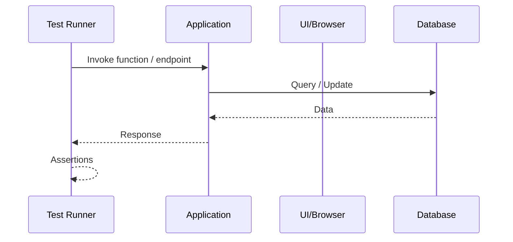

import Tabs from '@theme/Tabs';
import TabItem from '@theme/TabItem';

## 🧠 Theory
This **Theory** page explains the foundational concepts behind software testing — how systems are validated, how UI automation works, why tests fail, and how methodologies like Unit Testing, TDD, and BDD shape software quality.

Understanding testing fundamentals helps you:

- reason about test failures and flakiness  
- anticipate brittleness in UI automation  
- evaluate test coverage and risk  
- communicate clearly with QA and engineers  
- design systems that are easier to test and maintain  

Testing is not about tools — it is about **how systems behave under verification**.

---

:::tip Definition
**Testing Fundamentals** describe how software correctness is validated through automated and manual techniques, ensuring predictable behaviour across changes, environments, and user interactions.
:::

**When to Use**

- Evaluating system reliability  
- Understanding why tests fail or flake  
- Designing testable architectures  
- Communicating with QA, SDETs, and engineers  

**When Not to Use**

- Tool‑specific automation scripts  
- Framework‑specific testing APIs  
- Manual QA instructions  

---

## 🎯 What Problem Does This Solve?

Software changes constantly — features evolve, dependencies update, and systems scale.  
Without testing:

- regressions appear  
- behaviour becomes unpredictable  
- UI breaks silently  
- integrations fail under load  
- confidence collapses  

Testing solves the problem of **verifying correctness**, ensuring systems behave as expected across time, environments, and change.

---

## 🧠 Conceptual Model

### Core Components

- **Unit Tests** — verify small, isolated pieces of logic  
- **Integration Tests** — verify interactions between components  
- **UI Automation** — simulate user behaviour in the browser  
- **Locators** — identify elements in the DOM  
- **Assertions** — validate expected outcomes  
- **Test Runners** — orchestrate execution  
- **Mocks & Stubs** — isolate dependencies  
- **Test Data** — controlled inputs for predictable behaviour  

### Axes of Variation

- Isolated ↔ Integrated  
- Deterministic ↔ Flaky  
- Fast ↔ Slow  
- UI‑level ↔ Logic‑level  
- Behaviour‑driven ↔ Implementation‑driven  

---

### Typical Lifecycle or Flow

**Diagram(s):**

---

## 🔍TA Lens

:::info How a TA Evaluates This Concept
- What changes, what stays constant, what becomes brittle  
- How tests behave under concurrency, load, or UI changes  
- Where failures originate (data, UI, timing, environment)  
- How to interpret logs, screenshots, and stack traces  
- How test architecture affects delivery speed  
:::

**What happens when:**

- **Data grows** → tests slow down, fixtures become heavy  
- **Traffic increases** → race conditions appear in integration tests  
- **Concurrency rises** → flakiness increases  
- **Resources become constrained** → timeouts, stale elements, slow UI  

---

## 📘 Key Terminology

| Term | Definition |
|------|------------|
| **UI Automation** | Automated interaction with the UI to simulate user behaviour. |
| **Locator** | A selector used to identify elements in the DOM. |
| **Flakiness** | Tests that pass or fail unpredictably. |
| **Unit Test** | Tests that verify small, isolated pieces of logic. |
| **TDD** | Test‑Driven Development: write tests before code. |
| **BDD** | Behaviour‑Driven Development: specify behaviour in human‑readable form. |
| **Assertion** | A statement that must be true for the test to pass. |
| **Mock** | A simulated dependency used to isolate behaviour. |

---

## 🧬 Variants / Types

<Tabs>

<TabItem value="ui" label="UI Automation">

### UI Automation

**Purpose**  
Validate user flows by interacting with the UI.

**Key Characteristics**  
- Uses locators (ID, class, CSS, XPath)  
- Simulates clicks, typing, navigation  
- Runs in real or headless browsers  

**Behaviour**  
Sensitive to UI changes, timing, and environment.

**Trade-offs**  
- ✔ High confidence in real behaviour  
- ✔ Validates full user journeys  
- ✘ Slow  
- ✘ Brittle when UI changes  

</TabItem>

<TabItem value="unit" label="Unit Testing">

### Unit Testing

**Purpose**  
Verify small, isolated units of logic.

**Key Characteristics**  
- Fast  
- Deterministic  
- No external dependencies  

**Behaviour**  
Provides strong correctness guarantees for core logic.

**Trade-offs**  
- ✔ Very fast  
- ✔ Easy to debug  
- ✘ Limited scope  
- ✘ Cannot detect integration issues  

</TabItem>

<TabItem value="tddbdd" label="TDD & BDD">

### TDD & BDD

**Purpose**  
Guide development through tests and behaviour specifications.

**Key Characteristics**  
- TDD: Red → Green → Refactor  
- BDD: Given/When/Then  
- Encourages clean design  

**Behaviour**  
Shapes architecture around testability and clarity.

**Trade-offs**  
- ✔ Better design  
- ✔ Clearer requirements  
- ✘ Slower initial development  
- ✘ Requires discipline  

</TabItem>

</Tabs>

---

## 🧩 System Interactions

:::info How a TA Understands the System
Testing interacts with runtime, data, UI, and infrastructure — failures often originate outside the test itself.
:::

### Local Systems

- Runtime (JVM, Node, Python)  
- DOM / browser engine  
- Test runner  
- Mocking frameworks  
- Local DB or in‑memory stores  

### Remote Systems

- APIs  
- Databases  
- Authentication providers  
- Cloud environments  
- CI/CD pipelines  

### Questions to ask during reviews or incidents

- Is the failure deterministic or flaky?  
- Is the locator stable?  
- Is the test environment consistent?  
- Are dependencies mocked or real?  
- Is the test slow due to data or UI?  

---

## 💥 Outputs / Results

:::note Special Considerations
UI tests often fail due to timing, environment, or locator brittleness — not actual defects.
:::

### Success Modes

| Result Type | Description |
|-------------|-------------|
| Stable tests | Predictable, deterministic outcomes. |
| Fast feedback | Quick detection of regressions. |
| High coverage | Confidence in system behaviour. |

### Failure Modes

| Failure Type | Description |
|-------------|-------------|
| Flaky tests | Pass/fail unpredictably due to timing or environment. |
| Brittle locators | UI changes break selectors. |
| Slow suites | Long feedback loops reduce delivery speed. |

---

## 🔗 Related Runbook Concepts

- **UI Automation**  
- **Communication Patterns**  
- **Frameworks → Libraries → Code**  
- **Design Patterns**