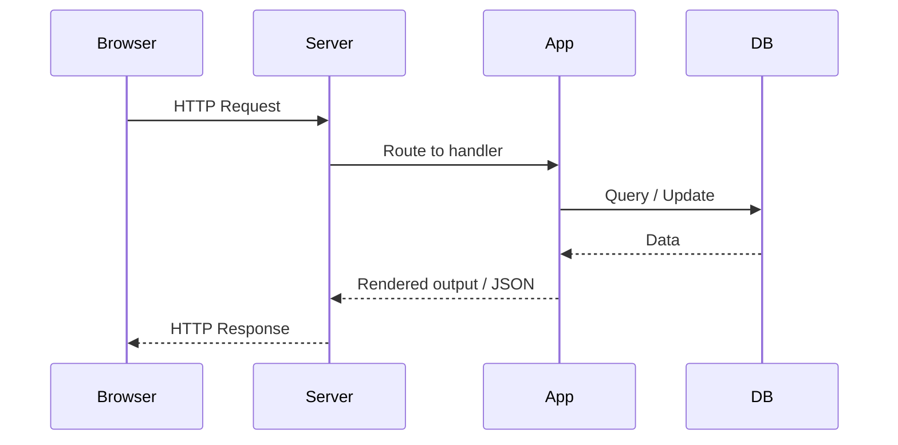

import Tabs from '@theme/Tabs';
import TabItem from '@theme/TabItem';

## 🧠 Theory
This **Theory** page explains the foundational concepts that underpin all web systems: **HTTP**, **state**, **sessions**, and the **request lifecycle**.  
These ideas shape how authentication works, how applications scale, how failures occur, and how users experience your system.

Understanding these fundamentals gives you the mental models to:

- reason about distributed behaviour  
- anticipate bottlenecks and failure modes  
- evaluate architectural decisions  
- communicate clearly with engineers  
- diagnose issues in real systems  

---

:::tip Definition
**Web Fundamentals** describe how web applications communicate, maintain state, and structure their behaviour across stateless HTTP interactions.
:::

**When to Use**

- Understanding how browsers, servers, and APIs interact  
- Analysing authentication, session management, or routing  
- Evaluating front‑end vs back‑end responsibilities  

**When Not to Use**

- Tool‑specific server configuration  
- Framework‑specific behaviour (Spring, Django, React)  
- Low‑level networking (TCP, sockets, DNS)  

---

## 🎯 What Problem Does This Solve?

Web systems must operate over **HTTP**, a stateless protocol that forgets everything between requests.  
To build real applications — logins, dashboards, shopping carts, multi‑step flows — we need mechanisms for:

- maintaining identity  
- persisting state  
- structuring application logic  
- rendering UI  
- scaling across multiple servers  

Web Fundamentals explain **how** these problems are solved and **why** these solutions behave the way they do.

---

## 🧠 Conceptual Model

### Core Components

- **HTTP** — the transport protocol for all web communication  
- **Request/Response Cycle** — the atomic unit of interaction  
- **State** — information that must persist across requests  
- **Sessions** — server‑side memory linked to a user  
- **Cookies** — client‑side storage used to maintain continuity  
- **Web Servers** — software that receives requests and returns responses  
- **Rendering Models** — server‑side vs client‑side  
- **Architectural Patterns** — MVC and related variants  

### Axes of Variation

- Stateless ↔ Stateful  
- Server‑side rendering ↔ Client‑side rendering  
- Single server ↔ Distributed cluster  
- Cookie‑based sessions ↔ Token‑based identity  
- Monolithic architecture ↔ Layered or MVC  

---

### Typical Lifecycle or Flow

**Diagram(s):**

---

## 🔍 TA Lens

:::info How a TA Evaluates This Concept
- What changes, what stays constant, what becomes a bottleneck  
- How state is stored, retrieved, and invalidated  
- How the system behaves under load or across multiple servers  
- How authentication and sessions interact with scaling  
- Where failures occur in the request lifecycle  
:::

**What happens when:**

- **Data grows** → session stores, caches, and DB queries become bottlenecks  
- **Traffic increases** → routing, load balancers, and server concurrency limits matter  
- **Concurrency rises** → session locking, race conditions, and stale state appear  
- **Resources become constrained** → timeouts, dropped connections, and partial renders occur  

---

## 📘 Key Terminology

| Term | Definition |
|------|------------|
| **HTTP** | Stateless protocol used for all web communication. |
| **Request Scope** | Data that exists only for a single request/response cycle. |
| **Session Scope** | Server‑side memory that persists across multiple requests. |
| **Cookies** | Small client‑side storage used to maintain continuity. |
| **Session ID** | Unique identifier linking a user to a server‑side session. |
| **GET** | Retrieves data; parameters appear in the URL. |
| **POST** | Sends data in the request body; used for state‑changing operations. |
| **Web Server** | Software that receives HTTP requests and returns responses. |
| **SSR** | Server‑side rendering: server generates HTML. |
| **CSR** | Client‑side rendering: browser renders UI via JavaScript. |
| **MVC** | Architectural pattern separating Model, View, and Controller. |

---

## 🧬 Variants / Types

<Tabs>

<TabItem value="http" label="HTTP & State">

### HTTP & State

**Purpose**  
Explain how stateless communication supports stateful applications.

**Key Characteristics**  
- Stateless protocol  
- Requires external state management  
- Uses cookies, tokens, or sessions  

**Behaviour**  
Each request is independent; continuity must be explicitly maintained.

**Trade-offs**  
- ✔ Scales horizontally  
- ✔ Simple, predictable protocol  
- ✘ Requires explicit state management  
- ✘ Can introduce security risks if mismanaged  

</TabItem>

<TabItem value="rendering" label="Rendering Models">

### Rendering Models

**Purpose**  
Describe how UI is generated and delivered.

**Key Characteristics**  
- SSR: server generates HTML  
- CSR: browser renders UI  
- Hybrid: mix of both  

**Behaviour**  
Rendering location affects performance, SEO, and user experience.

**Trade-offs**  
- SSR: ✔ fast first load, ✘ more server load  
- CSR: ✔ rich interactivity, ✘ slower initial load  
- Hybrid: ✔ best of both, ✘ more complexity  

</TabItem>

<TabItem value="architecture" label="Architecture">

### Architecture Patterns

**Purpose**  
Explain how web applications structure logic.

**Key Characteristics**  
- MVC: Model, View, Controller  
- Layered: presentation, business, data  
- MVVM: view-model abstraction  

**Behaviour**  
Patterns define how data flows and how responsibilities are separated.

**Trade-offs**  
- ✔ Clear separation of concerns  
- ✔ Easier testing  
- ✘ Can become rigid or over‑engineered  

</TabItem>

</Tabs>

---

## 🧩 System Interactions

:::info How a TA Understands the System
- How HTTP interacts with servers, caches, and databases  
- How state is stored, retrieved, and invalidated  
- How rendering models affect performance and load  
- How architectural patterns shape request flow  
:::

### Local Systems

- OS  
- Runtime (JVM, Node.js, Python)  
- Network stack  
- Storage (session stores, caches, DBs)  
- Concurrency model  
- Scaling mechanisms  

### Remote Systems

- Load balancers  
- API gateways  
- Distributed caches  
- Data centres / regions  

### Questions to ask during reviews or incidents

- Where is state stored?  
- How is the session maintained?  
- What happens if a server restarts?  
- Is the system using sticky sessions?  
- How does rendering affect latency?  
- What happens under high concurrency?  

---

## 💥 Outputs / Results

:::note Special Considerations
State management, session handling, and rendering models directly affect security, performance, and user experience.
:::

### Success Modes

| Result Type | Description |
|-------------|-------------|
| Consistent identity | User remains authenticated across requests. |
| Predictable routing | Requests reach the correct handlers. |
| Stable rendering | UI loads reliably across devices. |

### Failure Modes

| Failure Type | Description |
|-------------|-------------|
| Session loss | Users unexpectedly log out or lose progress. |
| Routing errors | 404/500 responses due to misrouted requests. |
| Rendering failures | Blank screens, partial loads, or JS errors. |

---

## 🔗 Related Runbook Concepts

- **Communication Patterns**  
- **Frameworks → Libraries → Code**  
- **Design Patterns**  
- **Storage Systems**  
