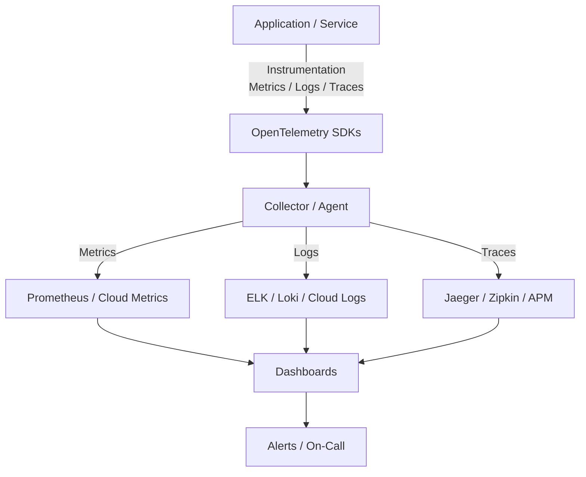

import Tabs from '@theme/Tabs';
import TabItem from '@theme/TabItem';

:::tip Definition
**Observability Architecture** describes how systems expose signals that allow engineers to understand, debug, and improve system behaviour.  
It includes **metrics**, **logs**, **traces**, and **alerts**, forming a complete picture of system health and performance.
:::

Observability is not monitoring — it is the ability to **ask new questions about a system without deploying new code**.

---

## 🎯 What Problem Does This Solve?

Observability enables:

| Benefit | Why it matters |
|--------|----------------|
| **Fast incident detection** | Spot issues before users notice |
| **Root-cause analysis** | Understand *why* failures occur |
| **Performance optimisation** | Identify bottlenecks and regressions |
| **Reliability engineering** | Support SLOs, error budgets, and capacity planning |
| **Operational confidence** | Deploy safely with real-time feedback |

---

## 🧠 Conceptual Model (How Observability Works)

Observability is built on **three core signals**:

### **1. Metrics**  
Numeric measurements over time (latency, errors, throughput).

### **2. Logs**  
Discrete events describing what happened.

### **3. Traces**  
End-to-end request flows across services.

Alerts sit on top of these signals to trigger action.

Together, they answer:

- **What is happening?** (metrics)  
- **What happened?** (logs)  
- **Why did it happen?** (traces)  

---

# 🧬 The Observability Pillars

<Tabs>

<TabItem value="metrics" label="Metrics">

### Metrics — Quantitative Signals

**Definition**  
Numeric measurements collected over time.

**Examples**
- Request latency  
- Error rate  
- CPU/memory usage  
- Queue length  
- Deployment frequency  

### Characteristics
- Aggregated  
- Low cardinality  
- Efficient to store and query  

### Tools
- Prometheus  
- CloudWatch  
- Datadog Metrics  
- OpenTelemetry Metrics  

### TA Lens
Metrics tell you **that** something is wrong, not **why**.

</TabItem>

<TabItem value="logs" label="Logs">

### Logs — Event Records

**Definition**  
Timestamped records of discrete events.

**Examples**
- Errors  
- Warnings  
- Authentication events  
- Business events (order created)  

### Characteristics
- High cardinality  
- Rich detail  
- Expensive to store  

### Tools
- ELK (Elasticsearch, Logstash, Kibana)  
- Loki  
- Cloud Logging  
- Datadog Logs  

### TA Lens
Logs provide **context**, but can overwhelm without structure.

</TabItem>

<TabItem value="traces" label="Tracing">

### Tracing — Request Flow Across Services

**Definition**  
A trace follows a request as it moves through multiple services.

**Examples**
- Distributed microservice calls  
- Slow database queries  
- Downstream dependency failures  

### Characteristics
- Span-based  
- Visual, hierarchical  
- Ideal for debugging latency  

### Tools
- Jaeger  
- Zipkin  
- OpenTelemetry Tracing  
- Datadog APM  

### TA Lens
Traces explain **why** a request was slow or failed.

</TabItem>

<TabItem value="alerts" label="Alerts">

### Alerts — Actionable Signals

**Definition**  
Notifications triggered when metrics or logs breach thresholds.

### Types
- **Static thresholds** (latency > 500ms)  
- **Anomaly detection**  
- **Burn rate alerts** (SLO-based)  
- **Event-driven alerts** (error logs)  

### Characteristics
- Must be actionable  
- Must have clear ownership  
- Must avoid noise  

### Tools
- Alertmanager  
- Grafana Alerting  
- PagerDuty  
- Opsgenie  

### TA Lens
Alerts are not observability — they are the **action layer** built on top of it.

</TabItem>

</Tabs>

---

# 🧭 When to Use Observability

Use observability when:

- Running production systems  
- Debugging distributed architectures  
- Tracking SLOs and error budgets  
- Investigating performance regressions  
- Deploying frequently and safely  

---

# 🚫 When Not to Use

Avoid over-instrumentation when:

- The system is trivial or short-lived  
- Metrics/logs are collected without purpose  
- Alerts lack ownership or action paths  
- Observability becomes noise instead of signal  

---

# 📘 Key Terminology

| Term | Definition |
|------|------------|
| **SLI** | Quantitative measure of service performance |
| **SLO** | Target for an SLI (e.g., 99.9% availability) |
| **Error Budget** | Allowed unreliability within an SLO |
| **Span** | A single operation within a trace |
| **Label/Tag** | Metadata used to filter metrics |
| **Cardinality** | Number of unique label combinations |

---

# 🧩 Observability Architecture

---

# 🧬 Observability Strategies

<Tabs>

<TabItem value="golden" label="Golden Signals">

### The Four Golden Signals
- **Latency**  
- **Traffic**  
- **Errors**  
- **Saturation**  

### Purpose
Fast detection of user-impacting issues.

### TA Lens
If you can only monitor four things, monitor these.

</TabItem>

<TabItem value="slo" label="SLO-Driven Observability">

### SLO Strategy
- Define SLIs  
- Set SLO targets  
- Track error budgets  
- Alert on burn rates  

### Purpose
Balance reliability with delivery velocity.

### TA Lens
SLOs turn observability into a **business-aligned discipline**.

</TabItem>

<TabItem value="structured" label="Structured Logging">

### Structured Logging
- Key-value logs  
- Machine-parsable  
- Consistent schema  

### Purpose
Make logs queryable and reliable.

### TA Lens
Unstructured logs are noise; structured logs are data.

</TabItem>

<TabItem value="distributed" label="Distributed Tracing Strategy">

### Distributed Tracing
- Trace IDs propagate across services  
- Spans show timing and dependencies  
- Visualise bottlenecks  

### Purpose
Debug microservices and latency issues.

### TA Lens
Tracing is essential once you have more than one service.

</TabItem>

</Tabs>

---

# 🔌 How to Interact With Observability Systems

**Access Pattern**
- Dashboards  
- Query languages (PromQL, LogQL)  
- Trace visualisers  
- Alerting UIs  

**Operations / Interfaces**
- `/metrics` endpoints  
- Log emitters  
- Trace instrumentation  
- Alert rules  

**Interaction Model**
- Collect → Store → Query → Visualise → Alert → Act  

---

# 📊 What Results Normally Look Like

- Time-series graphs  
- Heatmaps  
- Trace waterfalls  
- Log streams  
- SLO dashboards  
- Alert notifications  

---

# ⚠️ Common Misunderstandings / Anti‑Patterns

- Alerting on every metric  
- Using logs instead of metrics for high-volume signals  
- High-cardinality metrics causing system overload  
- Alerts without owners  
- Dashboards without purpose  
- Traces without consistent propagation  

---

# 🏗️ Real‑World Examples

- A spike in latency triggers an SLO burn alert  
- A trace reveals a slow downstream dependency  
- A log pattern identifies a misconfigured deployment  
- A dashboard shows CPU saturation before an outage  
- A metric anomaly detects a memory leak early  

---

## 🔗 Related Concepts

- Delivery & Deployment Architecture  
- SRE Practices  
- API Observability  
- Distributed Systems  
- Performance Engineering  
