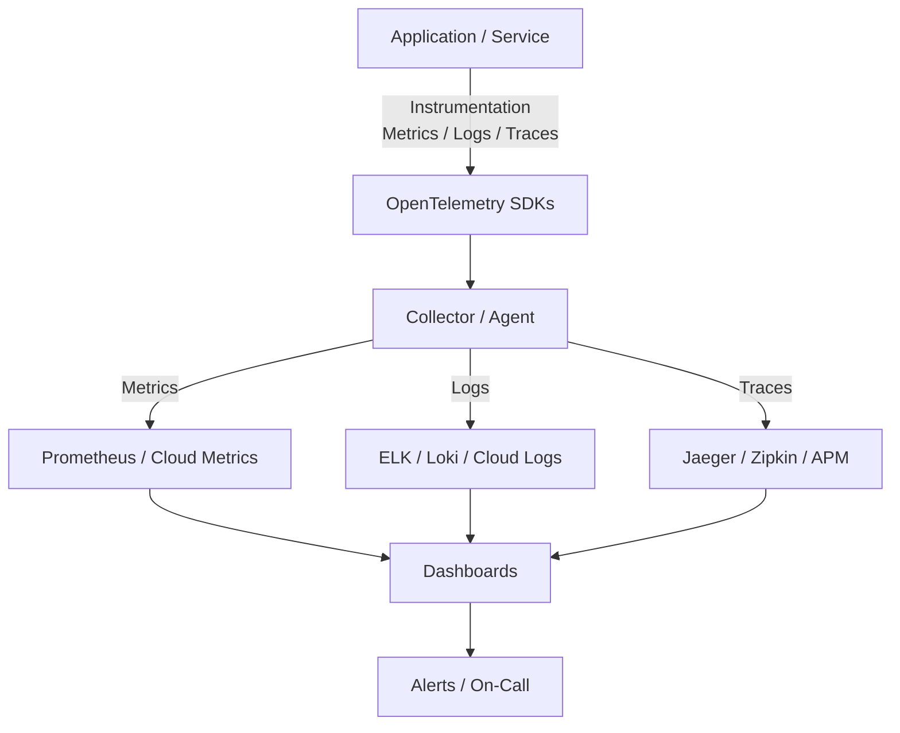
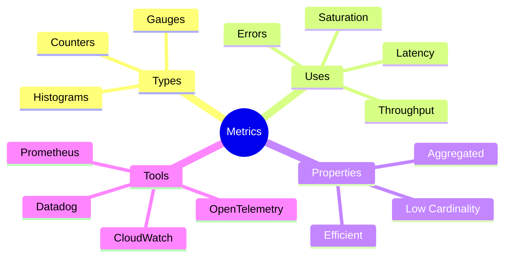
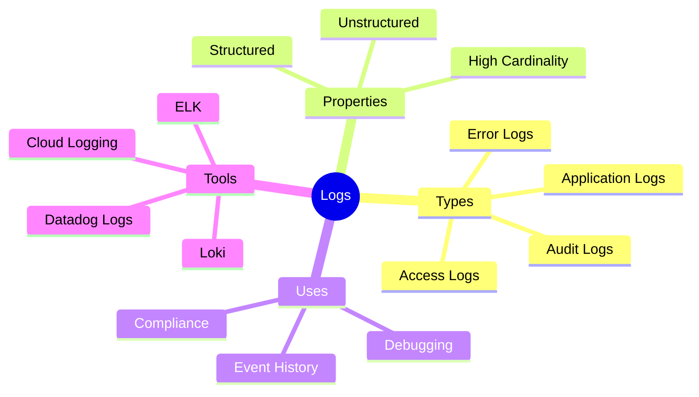
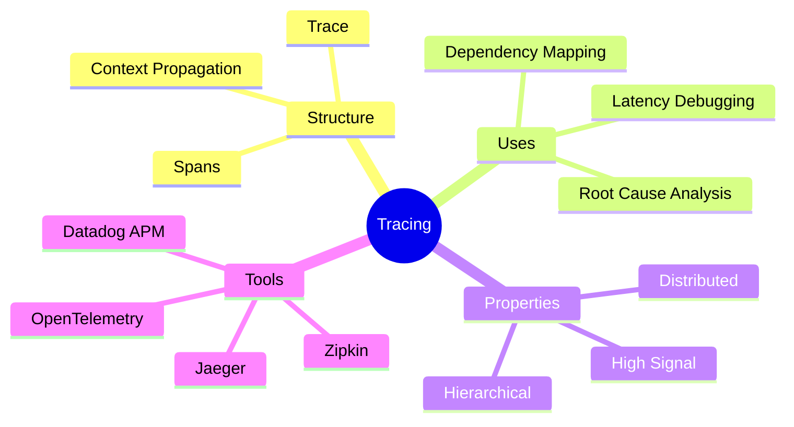
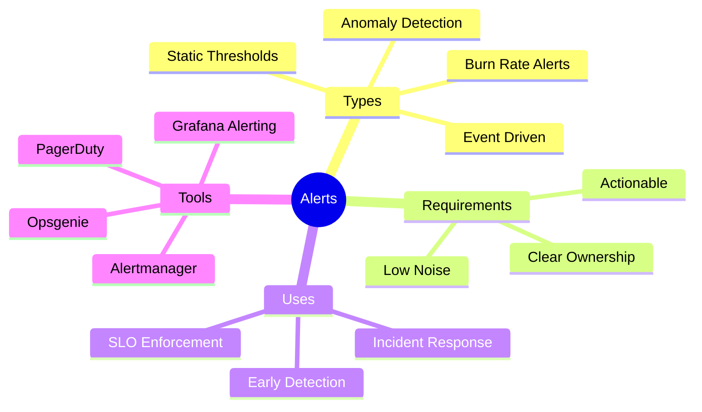

import Tabs from '@theme/Tabs';
import TabItem from '@theme/TabItem';

:::tip Definition
Observability describes how systems expose signals that allow engineers to understand, debug, and improve system behaviour — enabling teams to ask new questions about a system without deploying new code.
:::

---

## **When to Use**

- Running production systems  
- Debugging distributed architectures  
- Tracking SLOs and error budgets  
- Investigating performance regressions  
- Deploying frequently and safely  

## **When Not to Use**

- The system is trivial or short‑lived  
- Metrics/logs are collected without purpose  
- Alerts lack ownership or action paths  
- Observability becomes noise instead of signal  

---

## 🎯 **What Problem Does This Solve?**

Observability solves the problem of **understanding what a system is doing internally by examining its external outputs**.

It enables:

| Benefit | Why it matters |
|--------|----------------|
| Fast incident detection | Spot issues before users notice |
| Root‑cause analysis | Understand *why* failures occur |
| Performance optimisation | Identify bottlenecks and regressions |
| Reliability engineering | Support SLOs, error budgets, and capacity planning |
| Operational confidence | Deploy safely with real-time feedback |

---

## 🧠 **Conceptual Model**

### **Core Components**

Observability is built on three core signals:

- **Metrics** — numeric measurements over time  
- **Logs** — discrete event records  
- **Traces** — end‑to‑end request flows across services  
- **Alerts** — actionable notifications built on top of signals  

Together, they answer:

- **What is happening?** (metrics)  
- **What happened?** (logs)  
- **Why did it happen?** (traces)  

### **Axes of Variation**

- Cardinality (low → high)  
- Cost (cheap → expensive)  
- Detail (coarse → rich)  
- Latency (real‑time → delayed)  
- Purpose (detection → diagnosis → explanation)  

---

### **Typical Lifecycle or Flow**

---

## 🔍 **TA Lens**

:::info How a TA Evaluates This Concept
- What changes, what stays constant, what becomes a bottleneck  
- How the system behaves when under pressure  
- Questions to ask during reviews or incidents  
- Risks, constraints, or trade‑offs to surface  
:::

**What happens when:**

- **Data grows** → logs become expensive, metrics cardinality explodes  
- **Traffic increases** → traces multiply, dashboards lag  
- **Concurrency rises** → contention shows up in latency and saturation  
- **Resources become constrained** → signals degrade or drop  

---

## 📘 **Key Terminology**

| Term | Definition |
|------|------------|
| **SLI** | Quantitative measure of service performance |
| **SLO** | Target for an SLI (e.g., 99.9% availability) |
| **Error Budget** | Allowed unreliability within an SLO |
| **Span** | A single operation within a trace |
| **Label/Tag** | Metadata used to filter metrics |
| **Cardinality** | Number of unique label combinations |

---

## 🧬 **Variants / Types**

<Tabs>

<TabItem value="metrics" label="Metrics">

### Metrics

**Purpose**
Provide fast, low‑cardinality indicators of system health.

**Key Characteristics**
- Aggregated
- Numeric
- Efficient to store and query

**Behaviour**
Metrics reveal *that* something is wrong (latency, errors, saturation).

**Trade-offs**
Low detail; poor for deep debugging.

Mind Map

</TabItem>

<TabItem value="logs" label="Logs">

### Logs

**Purpose**
Provide detailed, high‑cardinality context for events.

**Key Characteristics**
- Rich detail
- Timestamped
- Expensive to store

**Behaviour**
Logs explain *what happened* and provide context for debugging.

**Trade-offs**
High volume; can overwhelm without structure.

Mind Map

</TabItem>

<TabItem value="traces" label="Tracing">

### Tracing

**Purpose**
Explain *why* a request was slow or failed.

**Key Characteristics**
- Span‑based
- Visual and hierarchical
- Ideal for distributed debugging

**Behaviour**
Traces follow a request across services, showing timing and dependencies.

**Trade-offs**
Expensive to collect at high volume.

Mind Map

</TabItem>

<TabItem value="alerts" label="Alerts">

### Alerts

**Purpose**
Notify teams when thresholds or conditions indicate user impact.

**Key Characteristics**
- Actionable
- Owned
- Noise‑controlled

**Behaviour**
Alerts trigger when metrics or logs breach thresholds or burn rates.

**Trade-offs**
Too many alerts → noise; too few → missed incidents.

Mind Map

</TabItem>
</Tabs>

---

## 🧩 **System Interactions**

:::info How a TA Understands the System
- How observability interacts with architecture, data, and runtime  
- How signals behave under pressure  
- What becomes a bottleneck as load increases  
:::

### **Local Systems**

- OS metrics  
- Runtime logs  
- Network latency  
- Storage I/O  
- Concurrency  
- Scaling behaviour  

### **Remote Systems**

- Pods  
- Services  
- Data centres  
- Distributed tracing backends  

### **Questions to Ask**

- Are alerts actionable?  
- Are dashboards answering real questions?  
- Is cardinality under control?  
- Are traces propagating correctly?  

---

## 💥 **Outputs / Results**

:::note Special Considerations
Observability outputs vary by signal type and must be interpreted in context.
:::

### **Success Modes**

| Result Type | Description |
|-------------|-------------|
| Time‑series graphs | Clear trends and anomalies |
| Trace waterfalls | Visual dependency and latency mapping |
| Log streams | Structured, queryable event data |
| SLO dashboards | Error budget tracking |
| Alerts | Actionable notifications |

### **Failure Modes**

| Failure Type | Description |
|-------------|-------------|
| High‑cardinality blowups | Metrics backend overload |
| Missing traces | Broken propagation |
| Noisy alerts | Alert fatigue |
| Log floods | Storage exhaustion |
| Dashboard lag | Query overload |

---

## 🔗 **Related Runbook Concepts**

- API Observability  
- Distributed Systems  
- SRE Practices  
- Performance Engineering  
- Delivery & Deployment Architecture  
