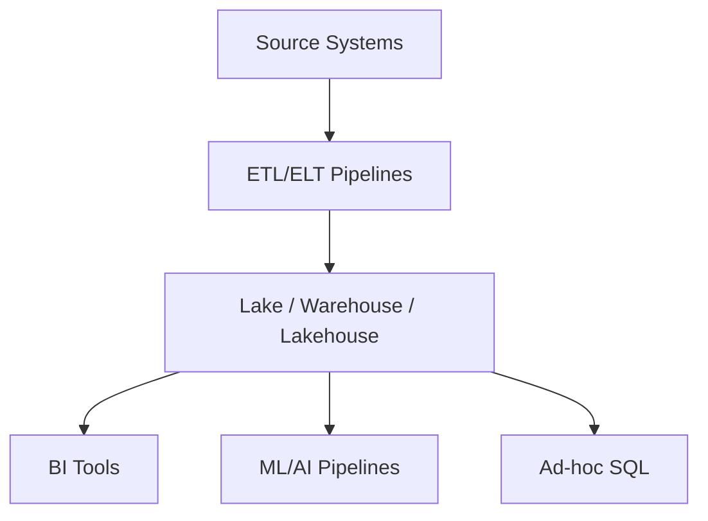

import Tabs from '@theme/Tabs';
import TabItem from '@theme/TabItem';

:::tip Definition
Analytical Storage Systems describe how large volumes of data are stored, organised, and processed to support analytical workloads such as BI, reporting, and decision‑making.
:::

**When to Use**

- You need to run analytical queries over large datasets  
- You need historical or aggregated views  
- You need scalable compute for BI, ML, or ad‑hoc SQL  
- You need separation between OLTP and OLAP workloads  
- You need consistent modelling (facts, dimensions, schemas)  

**When Not to Use**

- You need high‑frequency transactional writes  
- You need millisecond‑latency key‑based lookups  
- You need unstructured storage without governance  
- You need operational storage for application workloads  

---

## 🎯 What Problem Does This Solve?

Analytical Storage Systems solve the problem of **efficiently analysing large datasets** without impacting operational systems.

They provide:

- Fast analytical queries (scans, joins, aggregations)  
- Long‑term historical storage  
- Separation of analytical and transactional workloads  
- Scalable compute for large datasets  
- Consistent modelling for BI and reporting  

These systems are optimised for **read‑heavy analytical workloads**, not transactional updates.

---

## 🧠 Conceptual Model

### Core Components

- **Storage Layer** — files, tables, partitions  
- **Compute Layer** — distributed SQL engines  
- **Modelling Layer** — facts, dimensions, schemas  
- **Ingestion Layer** — ETL/ELT pipelines  
- **Consumption Layer** — BI tools, dashboards, ML pipelines  

### Axes of Variation

- Warehouse vs Lake vs Lakehouse  
- Schema‑on‑write vs Schema‑on‑read  
- Row‑based vs Columnar formats  
- Batch vs Streaming ingestion  
- Centralised vs Decentralised modelling  

---

### Typical Lifecycle or Flow

**Diagram(s):**



---

## 🔍 TA Lens

:::info How a TA Evaluates This Concept
- What changes, what stays constant, what becomes a bottleneck  
- Whether modelling (grain, facts, dimensions) matches analytical needs  
- How ingestion latency affects freshness  
- How partitioning, clustering, and file formats affect performance  
- Whether cost is driven by unnecessary scans or joins  
- Where schema drift or data quality issues originate  
:::

**What happens when:**

- **Data grows** → partitions, clustering, and columnar formats matter  
- **Traffic increases** → compute scaling and caching become critical  
- **Concurrency rises** → warehouses autoscale; lakes rely on engines  
- **Resources become constrained** → queries spill to disk, slow scans  

---

## 📘 Key Terminology

| Term | Definition |
|------|------------|
| OLAP | Analytical processing model |
| Fact Table | Stores measurable events |
| Dimension Table | Stores descriptive attributes |
| ETL/ELT | Data ingestion and transformation |
| Partitioning | Dividing data for efficient scans |
| Columnar Storage | Format optimised for analytics |

---

## 🧬 Variants / Types

<Tabs>

<TabItem value="warehouse" label="Data Warehouses">

### Data Warehouses

**Purpose**  
Provide fast, structured analytical queries with strong modelling.

**Key Characteristics**
- Schema‑on‑write  
- Fact/dimension modelling  
- Columnar storage  
- Distributed compute  
- Strong governance and metadata  

**Behaviour**  
Fast joins, aggregations, and predictable performance.

**Trade-offs**  
Higher cost; less flexible for raw/unstructured data.

---

### Core Concepts

#### Schema Design
- **Star Schema** — fact + denormalised dimensions  
- **Snowflake Schema** — normalised dimensions  
- **Galaxy Schema** — multiple fact tables sharing dimensions  

#### ETL / ELT
- Extract → Transform → Load  
- Or Load → Transform inside the warehouse  

#### OLAP
Supports slicing, dicing, rollups, drill‑downs.

#### Aggregation
Warehouses excel at grouping and summarising metrics.

---

### Exceptions (Not Universal)
- Some warehouses support semi‑structured data  
- Some offer limited ACID support  

</TabItem>

<TabItem value="lake" label="Data Lakes">

### Data Lakes

**Purpose**  
Store raw, semi‑structured, or unstructured data cheaply.

**Key Characteristics**
- Schema‑on‑read  
- Object storage (Parquet, ORC, Avro)  
- Supports batch + streaming ingestion  
- Raw + curated zones  

**Behaviour**  
Highly flexible ingestion; performance depends on file layout.

**Trade-offs**  
Weak governance; slower queries; harder to enforce quality.

---

### Core Concepts

#### Raw vs Curated Zones
- **Raw Zone** — unprocessed data  
- **Curated Zone** — cleaned, structured data  

#### Schema-on-Read
Applied at query time → flexible but risky.

#### Partitioning
Improves performance and reduces scan cost.

---

### When to Use
- Raw/semi‑structured data  
- ML, experimentation, exploratory analytics  
- Shared data access across teams  

### Avoid When
- You need ACID guarantees  
- You need low‑latency lookups  
- You need frequent updates to structured relational data  

---

### Variants
- Cloud Data Lakes  
- On‑Prem Data Lakes (HDFS, Ceph)  

### Strategies
- Raw ingestion  
- Data curation  
- Partitioning & indexing  
- Governance & security  

---

### Architecture Diagram

```mermaid
Source Systems --> Ingestion Pipeline --> Data Lake (Raw)
Data Lake (Raw) --> ETL/ELT --> Curated Data Zone
Curated Data Zone --> Analytics / ML / BI Tools
```

---

### Exceptions (Not Universal)
- Some lakes support ACID‑like behaviour via add‑on layers  
- Some enforce schema‑on‑write for curated zones  

</TabItem>

<TabItem value="lakehouse" label="Lakehouse Architecture">

### Lakehouse Architecture

**Purpose**  
Combine warehouse performance with lake flexibility.

**Key Characteristics**
- ACID transactions on object storage  
- Schema enforcement + evolution  
- Versioned tables / time travel  
- Supports batch + streaming  
- Unified storage + compute  

**Behaviour**  
Warehouse‑like performance with lake‑like flexibility.

**Trade-offs**  
More complex to operate; requires metadata layers.

---

### Core Concepts
- Transaction logs  
- Table formats  
- Schema evolution  
- Compaction and clustering  

### Variants
- Delta  
- Iceberg  
- Hudi  

### Strategies
- Unified storage  
- Transactional tables  
- Time travel  
- Partitioning & clustering  

### Exceptions (Not Universal)
- Not all engines support streaming  
- Not all support full ACID semantics  

</TabItem>

<TabItem value="cloud" label="Cloud Warehouses">

### Cloud Warehouses

**Purpose**  
Provide elastic, serverless analytical compute.

**Key Characteristics**
- Fully managed  
- Automatic scaling  
- Columnar storage  
- Separation of compute and storage  

**Behaviour**  
Very fast for large scans; simple operational model.

**Trade-offs**  
Vendor lock‑in; cost spikes from full scans.

---

### Core Concepts
- OLAP vs OLTP  
- Append‑oriented ingestion  
- Partitioning and clustering  
- Relaxed consistency  

### When to Use
- Large‑scale analytics  
- BI dashboards  
- Historical trend analysis  

### Avoid When
- High‑frequency transactional writes  
- Low‑latency key‑based lookups  
- OLTP workloads  

### Exceptions (Not Universal)
- Some support semi‑structured updates  
- Some support streaming ingestion  

</TabItem>

</Tabs>

---

## 🧩 System Interactions

:::info How a TA Understands the System
- How ingestion interacts with storage and modelling  
- How compute engines behave under load  
- How BI tools and ML pipelines consume data  
- What becomes a bottleneck as data volume grows  
:::

### Local Systems

- File formats (Parquet, ORC, Avro)  
- Query engines (Spark, Presto, DuckDB)  
- Metadata/catalog systems  

### Remote Systems

- Cloud warehouses (BigQuery, Snowflake, Redshift)  
- Data lakes (S3, GCS, ADLS)  
- ETL/ELT orchestrators (Airflow, dbt, Dataflow)  

### Questions to ask during reviews or incidents

- Is the query slow due to modelling or compute?  
- Are partitions aligned with access patterns?  
- Is ingestion causing schema drift or stale data?  
- Are joins exploding due to incorrect grain?  
- Are costs driven by unnecessary full‑table scans?  

---

## 💥 Outputs / Results

:::note Special Considerations
Most performance issues originate in modelling, not the tool.
:::

### Success Modes

| Result Type | Description |
|-------------|-------------|
| Fast Queries | Efficient scans, joins, and aggregations |
| Fresh Data | Ingestion pipelines deliver timely updates |
| Consistent Models | Facts/dimensions reflect business processes |
| Scalable Compute | System handles large datasets gracefully |

### Failure Modes

| Failure Type | Description |
|--------------|-------------|
| Exploding Joins | Incorrect grain or modelling errors |
| Slow Queries | Poor partitioning or excessive scans |
| Schema Drift | Inconsistent ingestion or weak governance |
| Stale Data | Pipeline failures or long refresh cycles |

---

## 🔗 Related Runbook Concepts

- Data Pipeline Quality  
- Data Modelling  
- Application Storage Systems  
- Performance Storage Systems  
- ETL/ELT Pipelines  
