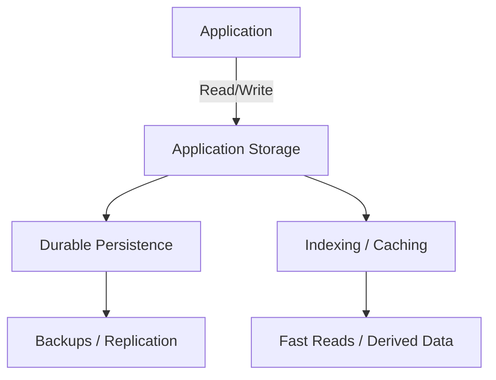

import Tabs from '@theme/Tabs';
import TabItem from '@theme/TabItem';

:::tip Definition
Application Storage Systems are the mechanisms applications use to persist, retrieve, and manage operational data required for day‑to‑day business functionality, correctness, and runtime behaviour.
:::

**When to Use**

- Persisting operational or transactional data  
- Serving authoritative reads and writes  
- Managing configuration, secrets, and runtime state  
- Supporting performance‑critical access patterns  
- Ensuring durability across restarts, failures, and deployments  

**When Not to Use**

- Large‑scale analytical workloads (OLAP)  
- Historical trend analysis or BI reporting  
- Long‑term archival or compliance storage  
- Ultra‑low‑latency caching or search (use performance storage instead)  
- Unstructured data without governance requirements  

---

## 🎯 What Problem Does This Solve?

Application storage solves the problem of **durable, correct, and structured data access** for operational systems.

It enables:

- Durable state that survives restarts and failures  
- Correctness through schemas, constraints, and transactions  
- Structured access patterns for predictable behaviour  
- Operational performance for user‑facing workloads  
- Platform integration via volumes, secrets, and config  
- Lifecycle guarantees such as backups, replication, and retention  

Without application storage, systems cannot maintain state, enforce correctness, or support business operations.

---

## 🧠 Conceptual Model

### Core Components

- **Databases** — relational, document, key/value, time‑series  
- **Platform Storage** — persistent volumes, ephemeral storage, config stores  
- **File & Object Storage** — block devices, file shares, object stores  
- **Performance Storage** — caches, search indices, in‑memory stores  
- **Archival Storage** — long‑term retention for compliance  

### Axes of Variation

- **Operational (OLTP) vs Analytical (OLAP)**  
- **Structured vs Semi‑structured vs Unstructured**  
- **Ephemeral vs Persistent**  
- **Hot vs Cold storage**  
- **Local vs Networked**  
- **Transactional vs Eventually consistent**  

---

### Typical Lifecycle or Flow

**Diagram(s):**

---

## 🔍 TA Lens

:::info How a TA Evaluates This Concept
- What changes, what stays constant, what becomes a bottleneck  
- Whether the storage is authoritative or derived  
- How consistency, durability, and latency guarantees differ  
- How platform storage interacts with containers and orchestration  
- Whether performance issues originate from modelling, indexing, or I/O  
- How storage behaviour changes under load or failure  
:::

**What happens when:**

- **Data grows** → indexing, partitioning, and storage tiering matter  
- **Traffic increases** → read/write amplification, lock contention  
- **Concurrency rises** → transaction conflicts, deadlocks, hotspots  
- **Resources become constrained** → I/O saturation, slow queries, eviction  

---

## 📘 Key Terminology

| Term | Definition |
|------|------------|
| OLTP | Operational transactional processing |
| Persistent Volume | Durable storage attached to containers |
| Ephemeral Storage | Temporary storage tied to container lifecycle |
| Index | Data structure enabling fast lookup |
| Transaction | Atomic, consistent, isolated, durable operation |
| Object Storage | Flat namespace storage for blobs |

---

## 🧬 Variants / Types

<Tabs>

<TabItem value="databases" label="Databases">

### Databases

**Purpose**  
Provide authoritative, durable, structured storage for operational data.

**Key Characteristics**
- ACID transactions  
- Schema enforcement  
- Indexing and constraints  
- Strong consistency (varies by engine)  

**Behaviour**  
Reliable reads/writes, predictable correctness.

**Trade-offs**  
Scaling writes is harder; schema evolution requires care.

</TabItem>

<TabItem value="platform" label="Platform Storage">

### Platform Storage

**Purpose**  
Provide storage abstractions for containers and workloads.

**Key Characteristics**
- Persistent volumes (PVCs)  
- Ephemeral storage  
- Secrets and config stores  
- Network‑attached storage  

**Behaviour**  
Supports runtime needs such as logs, state, and configuration.

**Trade-offs**  
Latency varies; misconfiguration can cause data loss.

</TabItem>

<TabItem value="fileobject" label="File & Object Storage">

### File & Object Storage

**Purpose**  
Store files, blobs, and unstructured data.

**Key Characteristics**
- File shares (NFS, SMB)  
- Block devices  
- Object stores (S3, GCS, Azure Blob)  
- High durability  

**Behaviour**  
Great for large objects, media, backups, and static assets.

**Trade-offs**  
Higher latency; limited transactional semantics.

</TabItem>

<TabItem value="performance" label="Performance Storage">

### Performance Storage

**Purpose**  
Accelerate hot paths and reduce load on primary databases.

**Key Characteristics**
- Caches (Redis, Memcached)  
- Search indices (Elasticsearch, OpenSearch)  
- In‑memory stores  
- Materialised views  

**Behaviour**  
Ultra‑fast reads; derived or denormalised data.

**Trade-offs**  
Staleness, invalidation complexity, eventual consistency.

</TabItem>

<TabItem value="archival" label="Archival Storage">

### Archival Storage

**Purpose**  
Provide long‑term, low‑cost retention for compliance or audit.

**Key Characteristics**
- Cold storage tiers  
- Write‑once‑read‑rarely  
- High durability  
- Long retrieval times  

**Behaviour**  
Optimised for retention, not performance.

**Trade-offs**  
Slow access; limited queryability.

</TabItem>

</Tabs>

---

## 🧩 System Interactions

:::info How a TA Understands the System
- How application storage interacts with compute, networking, and orchestration  
- How storage behaviour changes under load, failure, or scaling  
- What becomes a bottleneck as data or traffic grows  
:::

### Local Systems

- OS filesystem  
- Runtime I/O  
- Local caches  
- Container ephemeral storage  

### Remote Systems

- Databases  
- Object stores  
- Persistent volumes  
- Search clusters  
- Caches  

### Questions to ask during reviews or incidents

- Is this storage authoritative or derived?  
- Is the issue I/O, indexing, or modelling related?  
- Are we hitting storage limits (IOPS, throughput, size)?  
- Is the platform storage configured correctly?  
- Are consistency guarantees aligned with application needs?  

---

## 💥 Outputs / Results

:::note Special Considerations
Application storage must balance correctness, durability, and performance — trade‑offs vary by system.
:::

### Success Modes

| Result Type | Description |
|-------------|-------------|
| Durable State | Data survives restarts and failures |
| Correctness | Schema and constraints enforce valid data |
| Fast Operational Access | Indexed reads and efficient writes |
| Platform Integration | Volumes, secrets, and config behave predictably |

### Failure Modes

| Failure Type | Description |
|--------------|-------------|
| Data Loss | Misconfigured volumes or ephemeral storage misuse |
| Slow Queries | Missing indexes, I/O saturation, poor modelling |
| Consistency Errors | Race conditions, stale caches, replication lag |
| Storage Exhaustion | Disk full, IOPS limits, runaway growth |

---

## 🔗 Related Runbook Concepts

- **PostgreSQL / MySQL / SQL Server**  
- **MongoDB / DynamoDB / Cassandra**  
- **Redis / Memcached**  
- **Elasticsearch / OpenSearch**  
- **Kubernetes Persistent Volumes (PVCs)**  
- **AWS S3 / Azure Blob / GCS**  
- **etcd / Consul**  

