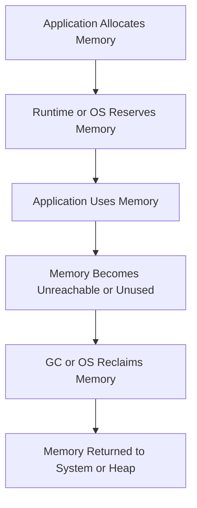

import Tabs from '@theme/Tabs';
import TabItem from '@theme/TabItem';

:::tip Definition
Memory Management is how an operating system, runtime, and container environment allocate, track, and reclaim memory so applications can run safely, efficiently, and at scale.
:::

**When to Use**

- Investigating performance degradation or latency spikes  
- Diagnosing crashes, OOM kills, or memory leaks  
- Understanding runtime behaviour (JVM, Python, Node.js)  
- Evaluating container memory limits or GC tuning  
- Analysing memory pressure in distributed systems  

**When Not to Use**

- Assuming memory issues are always application bugs  
- Treating GC tuning as a first step instead of a last resort  
- Confusing container memory limits with VM‑level isolation  
- Using memory metrics without understanding RSS vs heap vs cgroup limits  

---

## 🎯 What Problem Does This Solve?

Memory is finite, shared, and easy to misuse. Memory management solves the problem of **safe, efficient, and predictable use of memory** across processes, runtimes, and containers.

It enables:

- Safe sharing of memory across processes  
- Efficient allocation for fast execution  
- Automatic cleanup to avoid leaks  
- Isolation in multi‑tenant systems  
- Scalability across many processes on limited hardware  

Without memory management, modern systems would be unstable, unsafe, and unscalable.

---

## 🧠 Conceptual Model

### Core Components

- **Stack** — structured, fast memory for function calls and locals  
- **Heap** — dynamic memory for objects and long‑lived data  
- **Runtime Memory** — GC, interpreter state, object pools  
- **Kernel Memory** — OS buffers, caches, kernel structures  
- **Container Memory** — cgroup‑enforced limits, shared kernel  

### Axes of Variation

- Stack vs heap behaviour  
- Manual vs automatic memory management  
- Runtime‑managed vs OS‑managed memory  
- Container vs VM vs bare‑metal enforcement  
- GC‑based vs reference‑counting vs manual allocation  

---

### Typical Lifecycle or Flow

**Diagram(s):**

---

## 🔍 TA Lens

:::info How a TA Evaluates This Concept
- What changes, what stays constant, what becomes a bottleneck  
- Whether memory pressure is stack, heap, GC, or kernel‑related  
- How runtimes differ in allocation behaviour (JVM vs Python vs Node.js)  
- How container limits map to kernel enforcement (cgroups, OOM killer)  
- Whether memory growth is expected, accidental, or pathological  
- How memory behaviour changes under load or concurrency  
:::

**What happens when:**

- **Data grows** → heap expansion, GC pressure, fragmentation  
- **Traffic increases** → more allocations, more GC cycles  
- **Concurrency rises** → more stacks, more threads, more RSS  
- **Resources become constrained** → OOM kills, swapping, kernel throttling  

---

## 📘 Key Terminology

| Term | Definition |
|------|------------|
| Stack | Fast, structured memory for function calls and locals |
| Heap | Dynamic memory for objects and long‑lived data |
| Garbage Collection (GC) | Automatic memory reclamation |
| OOM Killer | Kernel mechanism that terminates processes under pressure |
| Fragmentation | Free memory scattered into unusable blocks |
| RSS | Resident Set Size — actual memory used in RAM |
| Working Set | Memory actively used by the process |

---

## 🧬 Variants / Types

<Tabs>

<TabItem value="stack" label="Stack">

### Stack

**Purpose**  
Provide fast, structured memory for function calls and local variables.

**Key Characteristics**
- Very fast  
- Deterministic lifecycle  
- Fixed size per thread  

**Behaviour**  
Grows and shrinks predictably with function calls.

**Trade-offs**  
Limited size; deep recursion causes stack overflow.

</TabItem>

<TabItem value="heap" label="Heap">

### Heap

**Purpose**  
Store dynamic objects, arrays, and long‑lived data.

**Key Characteristics**
- Flexible size  
- Slower than stack  
- Requires explicit management or GC  

**Behaviour**  
Grows with allocations; shrinks when memory is reclaimed.

**Trade-offs**  
Leaks, fragmentation, and OOM failures.

</TabItem>

<TabItem value="gc" label="Garbage Collection">

### Garbage Collection

**Purpose**  
Automatically reclaim unreachable heap memory.

**Key Characteristics**
- Mark & sweep  
- Stop‑the‑world pauses  
- Generational GC  
- Object promotion  

**Behaviour**  
Reduces manual memory errors; introduces latency spikes.

**Trade-offs**  
Pause times, jitter, runtime overhead.

</TabItem>

<TabItem value="container" label="Container Memory">

### Container Memory

**Purpose**  
Provide isolated memory limits for workloads.

**Key Characteristics**
- Enforced by cgroups  
- Shared kernel  
- Hard limits trigger OOM kills  

**Behaviour**  
RSS, heap, and kernel memory all count toward the limit.

**Trade-offs**  
Easy to misconfigure; OOM kills can be surprising.

</TabItem>

</Tabs>

---

## 🧩 System Interactions

:::info How a TA Understands the System
- How memory interacts with OS, runtime, containers, and hardware  
- How memory pressure affects CPU, GC, and I/O  
- What becomes a bottleneck as load increases  
:::

### Local Systems

- OS memory manager  
- Runtime heap and GC  
- Stack allocation  
- Kernel caches and buffers  
- cgroup limits  

### Remote Systems

- Pods  
- Containers  
- Virtual machines  
- Distributed runtimes  

### Questions to ask during reviews or incidents

- Is memory pressure coming from heap, stack, or kernel?  
- Is GC causing latency spikes?  
- Is the container hitting its cgroup limit?  
- Is RSS larger than expected heap usage?  
- Is memory growth expected or pathological?  

---

## 💥 Outputs / Results

:::note Special Considerations
Memory behaviour differs significantly between runtimes (JVM vs Python vs Node.js).
:::

### Success Modes

| Result Type | Description |
|-------------|-------------|
| Stable Heap Usage | Predictable allocation and GC cycles |
| Low GC Pause Times | Minimal impact on latency |
| No OOM Events | Memory fits within container/VM limits |
| Efficient Allocation | Minimal fragmentation and overhead |

### Failure Modes

| Failure Type | Description |
|--------------|-------------|
| OOM Kill | Kernel terminates process due to memory pressure |
| GC Thrashing | Excessive GC cycles causing latency spikes |
| Memory Leak | Heap grows without being reclaimed |
| Fragmentation | Free memory unusable due to fragmentation |

---

## 🔗 Related Runbook Concepts

- **JVM Memory Tuning**  
- **Python Memory Profiling**  
- **Node.js Heap & Event Loop Behaviour**  
- **Container Runtime Architecture**  
- **Garbage Collection Algorithms**  
- **Linux OOM Killer & cgroups**  
