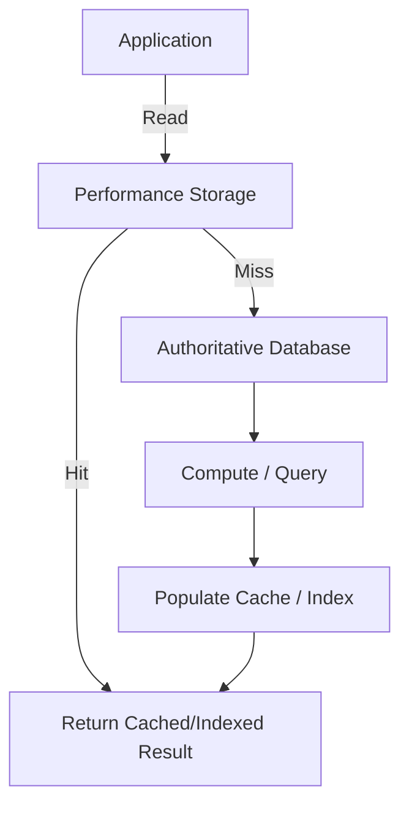

import Tabs from '@theme/Tabs';
import TabItem from '@theme/TabItem';

:::tip Definition
Performance Storage Systems are specialised storage layers optimised for extremely fast access, low latency, and high‑efficiency retrieval, prioritising speed and responsiveness over durability or authoritative correctness.
:::

**When to Use**

- You need ultra‑fast reads on hot paths  
- You need to offload expensive or repetitive database queries  
- You need full‑text or relevance‑based search  
- You need precomputed or denormalised views for fast retrieval  
- You need high‑throughput read workloads  

**When Not to Use**

- You need authoritative, durable, or strongly consistent storage  
- You need transactional guarantees (ACID)  
- You need long‑term persistence  
- You need complex relational updates  
- You need a system of record  

---

## 🎯 What Problem Does This Solve?

Performance Storage Systems solve the problem of **slow or expensive reads** in application workloads.

They provide:

- Low‑latency access for user‑facing operations  
- Reduced load on primary databases  
- Efficient full‑text and relevance‑based search  
- Precomputation of expensive results  
- High throughput for large read volumes  

These systems complement — but do not replace — authoritative storage.

---

## 🧠 Conceptual Model

### Core Components

- **Caches** — ultra‑fast key/value access  
- **In‑memory stores** — low‑latency data structures  
- **Search indices** — inverted indices for text and relevance search  
- **Materialised views** — precomputed results for fast reads  
- **TTL & eviction policies** — control freshness and memory usage  
- **Invalidation mechanisms** — ensure correctness of derived data  

### Axes of Variation

- In‑memory vs on‑disk  
- Key/value vs document vs index  
- Push‑based vs pull‑based invalidation  
- Write‑through vs write‑back vs write‑around caching  
- Strong vs eventual freshness guarantees  

---

### Typical Lifecycle or Flow

**Diagram(s):**

---

## 🔍 TA Lens

:::info How a TA Evaluates This Concept
- What changes, what stays constant, what becomes a bottleneck  
- Whether the performance layer is authoritative or derived  
- How invalidation, TTLs, and freshness are handled  
- Whether cache misses or stale indices explain slow behaviour  
- How search indices or materialised views are updated  
- Whether the performance layer reduces or increases load  
:::

**What happens when:**

- **Data grows** → eviction, memory pressure, index size growth  
- **Traffic increases** → cache hit rate becomes critical  
- **Concurrency rises** → lock contention, thundering herd, stampedes  
- **Resources become constrained** → eviction storms, stale data, slow rebuilds  

---

## 📘 Key Terminology

| Term | Definition |
|------|------------|
| Cache | Fast key/value store for repeated reads |
| In‑memory store | Data structures stored entirely in RAM |
| Search index | Inverted index for full‑text or relevance search |
| Materialised view | Precomputed query result stored for fast reads |
| TTL | Time‑to‑live for cached entries |
| Eviction policy | Strategy for removing entries (LRU, LFU, FIFO) |

---

## 🧬 Variants / Types

<Tabs>

<TabItem value="cache" label="Caching Systems">

### Caching Systems

**Purpose**  
Provide ultra‑fast access to frequently used data.

**Key Characteristics**
- Key/value lookups  
- TTLs and eviction policies  
- Write‑through, write‑back, or write‑around  
- In‑memory or distributed  

**Behaviour**  
Absorbs read spikes and reduces database load.

**Trade-offs**  
Stale data, invalidation complexity, cache stampedes.

</TabItem>

<TabItem value="memory" label="In‑Memory Stores">

### In‑Memory Stores

**Purpose**  
Store data structures entirely in RAM for low‑latency access.

**Key Characteristics**
- Sorted sets, lists, hashes  
- Pub/sub messaging  
- Atomic operations  
- Horizontal scaling  

**Behaviour**  
Extremely fast operations; ideal for counters, sessions, leaderboards.

**Trade-offs**  
Limited durability; memory‑bound capacity.

</TabItem>

<TabItem value="search" label="Search Indices">

### Search Indices

**Purpose**  
Enable full‑text, fuzzy, and relevance‑based search.

**Key Characteristics**
- Inverted indices  
- Tokenisation and stemming  
- Ranking and scoring  
- Distributed search clusters  

**Behaviour**  
Efficient retrieval of documents based on text relevance.

**Trade-offs**  
Indexing cost, eventual consistency, stale results.

</TabItem>

<TabItem value="views" label="Materialised Views">

### Materialised Views

**Purpose**  
Provide precomputed results for fast reads.

**Key Characteristics**
- Derived from authoritative data  
- Periodic or incremental refresh  
- Denormalised structures  
- Optimised for read patterns  

**Behaviour**  
Avoids recomputing expensive queries.

**Trade-offs**  
Staleness, refresh cost, storage overhead.

</TabItem>

</Tabs>

---

## 🧩 System Interactions

:::info How a TA Understands the System
- How performance storage interacts with authoritative databases  
- How invalidation and refresh mechanisms behave under pressure  
- What becomes a bottleneck as traffic or data volume grows  
:::

### Local Systems

- OS memory  
- Runtime data structures  
- Local caches  
- Application‑level caching layers  

### Remote Systems

- Redis / Memcached clusters  
- Elasticsearch / OpenSearch  
- Materialised view stores  
- Downstream databases  

### Questions to ask during reviews or incidents

- Is the issue a cache miss or a stale entry?  
- Is the index up‑to‑date with the source of truth?  
- Is the materialised view refreshing correctly?  
- Is the cache causing thundering herd behaviour?  
- Is the performance layer masking deeper database issues?  

---

## 💥 Outputs / Results

:::note Special Considerations
Performance layers are derived, not authoritative — correctness depends on invalidation and refresh.
:::

### Success Modes

| Result Type | Description |
|-------------|-------------|
| High Hit Rate | Most reads served from cache or index |
| Low Latency | Fast responses for user‑facing operations |
| Reduced DB Load | Primary database handles fewer reads |
| Efficient Search | Full‑text queries return quickly |

### Failure Modes

| Failure Type | Description |
|--------------|-------------|
| Cache Miss Storm | Many misses overload the database |
| Stale Index | Search results do not reflect current data |
| Invalidated Views | Materialised views out of sync |
| Eviction Storm | Memory pressure causes rapid churn |

---

## 🔗 Related Runbook Concepts

- **Redis** — in‑memory key/value store used for caching, counters, sessions
- **Memcached** — lightweight distributed cache for simple key/value access
- **Caffeine** — high‑performance JVM in‑process cache
- **ElasticSearch / OpenSearch** — distributed search indices for full‑text and relevance search
- **Solr** — enterprise search platform built on Lucene
- **Materialised Views (Postgres / BigQuery / Snowflake)** — precomputed query results for fast reads
- **CDNs (CloudFront, Akamai, Fastly)** — global edge caching for static assets
- **Hazelcast / Ignite** — distributed in‑memory data grids
- **RocksDB / LevelDB** — embedded high‑performance key/value stores
