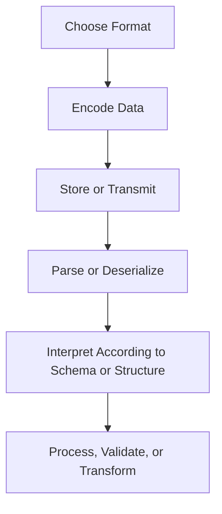

import Tabs from '@theme/Tabs';
import TabItem from '@theme/TabItem';

:::tip Definition
File Types & Data Formats define how information is encoded, structured, and represented for storage, transmission, configuration, or processing.
:::

**When to Use**

- Choosing how systems exchange or persist data  
- Designing APIs, pipelines, or integrations  
- Selecting formats for analytics, messaging, or configuration  
- Ensuring interoperability across languages and platforms  
- Enforcing schemas or validating structure  

**When Not to Use**

- When discussing storage engines (use Storage Systems pages)  
- When modelling domain entities (use Data Modelling)  
- When describing communication semantics (use Communication Patterns)  
- When formats are used as transport rather than structure (e.g., HTTP)  

---

## 🎯 What Problem Does This Solve?

File types solve the problem of **how data is represented** so that systems can:

| Benefit | Why it matters |
|--------|----------------|
| Correct parsing | Prevents misinterpretation between systems |
| Interoperability | Enables cross‑language and cross‑platform communication |
| Performance optimisation | Choose formats suited for analytics, messaging, or configuration |
| Schema enforcement | Ensures data integrity and predictable structure |
| Debuggability | Human‑readable formats simplify troubleshooting |

---

## 🧠 Conceptual Model

### Core Components

- **Encoding** → text vs binary  
- **Structure** → schema‑less vs schema‑enforced  
- **Orientation** → row‑based vs columnar  
- **Purpose** → configuration, messaging, analytics, documentation  

### Axes of Variation

#### Text vs Binary
- **Text** → human‑readable, easy to debug  
- **Binary** → compact, fast, schema‑driven  

#### Schema‑less vs Schema‑enforced
- JSON, CSV → flexible but error‑prone  
- Protobuf, Avro, XSD → strict structure, safer evolution  

#### Row‑based vs Columnar
- CSV → row‑oriented  
- Parquet → column‑oriented for analytics  

#### Configuration vs Data vs Code
- YAML/TOML → configuration  
- JSON/XML → structured data  
- SQL/GraphQL → schema or query definitions  

---

### Typical Lifecycle or Flow

---

## 🔍 TA Lens

:::info How a TA Evaluates File Types
- What guarantees are required (schema, ordering, types)?  
- Is human readability important?  
- Is performance or payload size critical?  
- Will the format evolve over time?  
- Does the system require strict validation?  
- Is the data for operational use or analytics?  
:::

**What happens when:**

- **Data grows** → binary formats outperform text  
- **Traffic increases** → payload size becomes critical  
- **Schemas evolve** → compatibility rules matter  
- **Systems integrate** → interoperability becomes a constraint  

---

## 📘 Key Terminology

| Term | Definition |
|------|------------|
| Serialization | Converting objects into a storable/transmittable format |
| Schema | Structure definition for data |
| Columnar | Data stored by column for analytical workloads |
| Row‑based | Data stored row‑by‑row for operational workloads |
| Markup | Text with embedded structure (XML, HTML) |
| Configuration File | Format used to define system behaviour |

---

## 🧬 Variants / Types

<Tabs>

<TabItem value="serialization" label="Serialization & Messaging Formats">

### Serialization & Messaging Formats

**Purpose**  
Encode structured data for storage or transmission.

---

### JSON (`.json`)
Human‑readable key/value structured data.

**Use When**
- REST APIs  
- Configuration  
- Logging/debugging  
- Cross‑language communication  

**Characteristics**
- Lightweight  
- Flexible  
- No enforced schema  
- Text‑based  
- Supports arrays, objects, primitives  

---

### XML (`.xml`)
Markup‑based structured data with optional schemas.

**Use When**
- Enterprise integrations  
- Document‑centric data  
- Systems requiring strict validation  

**Characteristics**
- Verbose  
- Supports namespaces  
- Often paired with XSD  
- Text‑based  

---

### Protobuf (`.proto`)
Compact, schema‑driven binary format.

**Use When**
- High‑performance services  
- gRPC  
- Low‑latency communication  

**Characteristics**
- Strong schema  
- Very small payloads  
- Fast serialization  
- Binary‑based  

---

### Avro (`.avsc`)
Schema‑based binary format used in data pipelines.

**Use When**
- Event streaming  
- Schema evolution  
- Kafka ecosystems  

**Characteristics**
- Self‑describing  
- Efficient for ingestion pipelines  
- Binary‑based  

</TabItem>

<TabItem value="config" label="Configuration & Infrastructure Files">

### Configuration & Infrastructure Files

**Purpose**  
Define system behaviour, environment settings, and infrastructure.

---

### YAML (`.yaml`, `.yml`)
Human‑friendly configuration.

**Use When**
- Kubernetes manifests  
- CI/CD pipelines  
- Application config  

**Characteristics**
- Indentation‑based  
- Easy to read  
- Easy to mis‑indent  

---

### TOML (`.toml`)
Minimal, strongly‑typed configuration.

**Use When**
- Tooling config  
- Python/Rust project metadata  

**Characteristics**
- Predictable parsing  
- Less ambiguous than YAML  

---

### ENV (`.env`)
Key‑value environment variables.

**Use When**
- Local development  
- Injecting secrets/config at runtime  

**Characteristics**
- Simple  
- No structure beyond key/value  

</TabItem>

<TabItem value="schema" label="Programming & Schema Definition Files">

### Programming & Schema Definition Files

**Purpose**  
Define structure, contracts, or executable logic.

---

### SQL (`.sql`)
Schema and query definitions for relational databases.

**Use When**
- Table creation  
- Migrations  
- Query logic  

---

### GraphQL (`.graphql`)
Schema and query language for APIs.

**Use When**
- Client‑driven data fetching  
- Typed API contracts  

---

### XSD (`.xsd`)
Schema definition for XML.

**Use When**
- Validating XML structure  
- Enforcing strict document rules  

**Characteristics**
- Defines elements, attributes, types  
- Supports namespaces  
- Used in enterprise and government systems  

</TabItem>

<TabItem value="docs" label="Documentation & Markup">

### Documentation & Markup

**Purpose**  
Represent text, documentation, or rendered content.

---

### Markdown (`.md`)
Lightweight markup for documentation.

**Use When**
- READMEs  
- Knowledge bases  
- Static sites  

---

### HTML (`.html`)
Markup language for web content.

**Use When**
- Web pages  
- UI rendering  

</TabItem>

<TabItem value="analytics" label="Data & Analytics Formats">

### Data & Analytics Formats

**Purpose**  
Store tabular or analytical data efficiently.

---

### CSV (`.csv`)
Plain‑text tabular data.

**Use When**
- Imports/exports  
- Simple pipelines  
- Interoperability  

**Characteristics**
- Human‑readable  
- No schema  
- Error‑prone for complex data  

---

### Parquet (`.parquet`)
Columnar, compressed format for analytics.

**Use When**
- Data lakes  
- BigQuery/Spark/Hive  
- Large‑scale analytical workloads  

**Characteristics**
- Highly compressed  
- Columnar  
- Schema‑aware  
- Binary‑based  

</TabItem>

</Tabs>

---

## 🧩 System Interactions

:::info How a TA Understands the System
- How formats interact with storage, compute, and pipelines  
- How parsing, encoding, and schema validation behave under load  
- What becomes a bottleneck as data volume or complexity grows  
:::

### Local Systems

- Parsers  
- Runtime encoders/decoders  
- File systems  
- CLI tools  

### Remote Systems

- APIs  
- Message brokers  
- Data lakes  
- Schema registries  

### Questions to ask during reviews or incidents

- Is the format appropriate for the workload?  
- Is schema evolution safe?  
- Are we over‑using text formats for large data?  
- Are consumers tolerant of missing or extra fields?  
- Is the format validated before processing?  

---

## 💥 Outputs / Results

:::note Special Considerations
File formats determine how data is interpreted — incorrect choice leads to silent failures.
:::

### Success Modes

| Result Type | Description |
|-------------|-------------|
| Correct Parsing | Systems interpret data consistently |
| Schema Compatibility | Producers and consumers evolve safely |
| Efficient Processing | Formats match workload (analytics vs operational) |
| Interoperability | Multiple systems can read/write the same format |

### Failure Modes

| Failure Type | Description |
|--------------|-------------|
| Schema Drift | Producers and consumers disagree on structure |
| Parsing Errors | Invalid or ambiguous formats |
| Performance Degradation | Using text formats for large analytical workloads |
| Data Loss | Incorrect encoding/decoding or truncation |

---

## 🔗 Related Runbook Concepts

- Analytical Storage Systems  
- Application Storage Systems  
- Performance Storage Systems  
- Kafka & Event Streaming  
- Schema Registries  
- Data Pipeline Quality  
- Communication Patterns  
