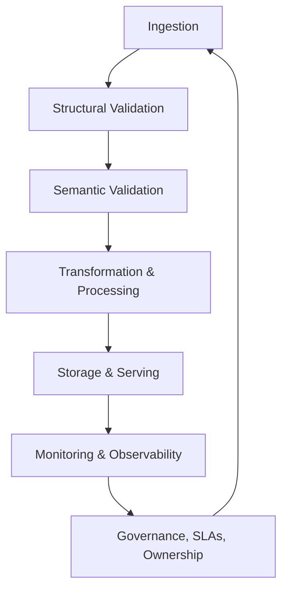

import Tabs from '@theme/Tabs';
import TabItem from '@theme/TabItem';

:::tip Definition
Data Pipeline Quality refers to the practices, rules, and controls that ensure data is accurate, complete, consistent, timely, and fit for purpose as it flows through ingestion, transformation, storage, and consumption layers.
:::

**When to Use**

- Designing or reviewing data pipelines  
- Ensuring data is trustworthy for analytics, ML, or reporting  
- Defining SLAs, validation rules, and governance  
- Investigating data incidents or silent failures  
- Establishing quality controls across ingestion, transformation, and storage  

**When Not to Use**

- When discussing storage engines (use Analytical or Application Storage Systems)  
- When modelling domain entities (use Data Modelling)  
- When evaluating pipeline orchestration (use ETL/ELT Pipelines)  
- When focusing solely on schema (use Schema & Structural Quality)  

---

## 🎯 What Problem Does This Solve?

Data Pipeline Quality solves the problem of **trustworthy, reliable, and predictable data flow** across systems.

High‑quality pipelines enable:

| Benefit | Why it matters |
|--------|----------------|
| Trustworthy data | Decisions rely on accurate, complete, consistent inputs |
| Reliable pipelines | Failures are detected early and handled predictably |
| Stable downstream systems | Prevents breakage in dashboards, ML models, and APIs |
| Faster debugging | Clear lineage and observability reduce MTTR |
| Governance & accountability | Ownership and SLAs ensure long‑term quality |

Poor quality pipelines create silent failures, incorrect metrics, and business risk.

---

## 🧠 Conceptual Model

Data quality spans **four layers**, each reinforcing the others:

### Core Components

#### **1. Structural Quality**  
Does the data conform to expected schema and types?

#### **2. Semantic Quality**  
Does the data make sense in the business domain?

#### **3. Operational Quality**  
Is the pipeline behaving correctly under load and over time?

#### **4. Organisational Quality**  
Are ownership, SLAs, and governance clearly defined?

### Axes of Variation

- **Schema vs Semantics** → technical vs business correctness  
- **Batch vs Streaming** → different quality risks and guarantees  
- **Strict vs Flexible Validation** → block vs warn  
- **Reactive vs Proactive Quality** → detection vs prevention  

---

### Typical Lifecycle or Flow

---

## 🔍 TA Lens

:::info How a TA Evaluates This Concept
- Identify where quality breaks: schema, semantics, operations, or governance  
- Understand how pipelines behave under load, retries, or late data  
- Ask whether SLAs, lineage, and ownership are explicit  
- Surface risks around freshness, duplication, or inconsistent metrics  
:::

**What happens when:**

- **Data grows** → volume anomalies, distribution drift  
- **Traffic increases** → freshness delays, backpressure  
- **Concurrency rises** → duplicate writes, ordering issues  
- **Resources become constrained** → partial ingestion, stalled pipelines  

---

## 📘 Key Terminology

| Term | Definition |
|------|------------|
| Structural Quality | Schema, types, constraints, referential integrity |
| Semantic Quality | Business meaning, domain rules, metric correctness |
| Freshness | How up‑to‑date data is relative to SLAs |
| Idempotency | Ability to reprocess without duplication |
| Lineage | Trace of where data came from and how it changed |
| Drift | Unexpected changes in schema, distribution, or semantics |

---

## 🧬 Variants / Types

<Tabs>

<TabItem value="structural" label="Structural & Schema Quality">

### Structural & Schema Quality

**Purpose**  
Ensure data adheres to expected technical structure.

**Key Characteristics**
- Schema enforcement  
- Type validation  
- Referential integrity  
- Schema evolution rules  

**Behaviour**  
Breaks loudly when structure changes unexpectedly.

**Trade-offs**  
Strict enforcement prevents silent errors but may block ingestion.

</TabItem>

<TabItem value="operational" label="Operational Quality">

### Operational Quality

**Purpose**  
Ensure pipelines behave correctly day‑to‑day.

**Key Characteristics**
- Freshness checks  
- Volume & distribution monitoring  
- Anomaly detection  
- Idempotency  
- Error handling  

**Behaviour**  
Reveals pipeline health, not just data correctness.

**Trade-offs**  
Operational checks require good observability and baselines.

</TabItem>

<TabItem value="semantic" label="Semantic & Business Quality">

### Semantic & Business Quality

**Purpose**  
Ensure data aligns with business meaning.

**Key Characteristics**
- Business rules  
- Metric definitions  
- Domain constraints  
- Cross‑dataset consistency  

**Behaviour**  
Silent errors often originate here.

**Trade-offs**  
Requires domain expertise and clear definitions.

</TabItem>

<TabItem value="pipeline" label="Pipeline & Processing Quality">

### Pipeline & Processing Quality

**Purpose**  
Protect data quality during ingestion and transformation.

**Key Characteristics**
- Ingestion validation  
- Transformation integrity  
- Deduplication  
- Ordering guarantees  
- Checkpointing & recovery  

**Behaviour**  
Ensures pipelines do not introduce loss, distortion, or duplication.

**Trade-offs**  
Stronger guarantees may reduce throughput.

</TabItem>

<TabItem value="observability" label="Monitoring & Observability">

### Monitoring & Observability

**Purpose**  
Provide visibility into data quality and pipeline health.

**Key Characteristics**
- Profiling  
- Freshness checks  
- Volume monitoring  
- Drift detection  
- Alerting  

**Behaviour**  
Turns unknown failures into observable signals.

**Trade-offs**  
Requires investment in metrics, logs, and lineage.

</TabItem>

<TabItem value="governance" label="Governance & Organisational Quality">

### Governance & Organisational Quality

**Purpose**  
Ensure long‑term accountability and clarity.

**Key Characteristics**
- Ownership  
- Metadata & lineage  
- SLAs  
- Incident management  
- Documentation  

**Behaviour**  
Prevents quality from degrading over time.

**Trade-offs**  
Requires cross‑team alignment and process maturity.

</TabItem>

</Tabs>

---

## 🧩 System Interactions

:::info How a TA Understands the System
- How data quality interacts with ingestion, transformation, and storage  
- How pipelines behave under retries, backpressure, or late data  
- What becomes a bottleneck as data volume or complexity grows  
:::

### Local Systems

- Validation engines  
- Transformation logic  
- Local profiling tools  
- Schema enforcement libraries  

### Remote Systems

- Data warehouses  
- Streaming platforms  
- Metadata stores  
- Orchestration systems  
- Lineage and governance tools  

### Questions to ask during reviews or incidents

- Where did the quality failure originate?  
- Is the issue structural, semantic, operational, or organisational?  
- Are SLAs being met?  
- Is lineage clear enough to trace the issue?  
- Are retries causing duplicates or ordering issues?  

---

## 💥 Outputs / Results

:::note Special Considerations
Quality failures often appear as silent errors unless observability is strong.
:::

### Success Modes

| Result Type | Description |
|-------------|-------------|
| Quality Reports | Summaries of checks, failures, and trends |
| Freshness Guarantees | Data arrives within SLA windows |
| Stable Metrics | Consistent definitions across teams |
| Reliable Pipelines | No duplicates, ordering issues, or partial writes |
| Clear Lineage | Easy to trace data flow and transformations |

### Failure Modes

| Failure Type | Description |
|--------------|-------------|
| Schema Breakage | Unexpected structural changes |
| Duplicate Records | Missing idempotency or retry logic |
| Late or Missing Data | Freshness or ingestion failures |
| Incorrect Metrics | Semantic or cross‑dataset inconsistencies |
| Drift | Unexpected changes in schema or distribution |

---

## 🔗 Related Runbook Concepts

- Data Modelling  
- ETL/ELT Pipelines  
- Analytical Storage Systems  
- Observability  
- Governance & Lineage  
- Idempotency  
