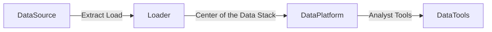
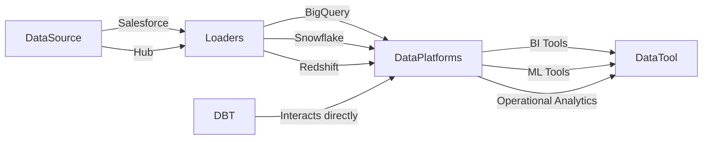

# DBT

import Tabs from '@theme/Tabs';
import TabItem from '@theme/TabItem';

DBT's only function is to take code, compile it to SQL, and then run against your database.
It is designed to handle the transformation layer of the "extract-load-transform" framework for data platforms. DBT is the 
transformation interface between the code we write (stored and managed in a git repository) and the sample data we have to work with
(sited and transformed in your data platform)

When dbt run is executing, dbt is wrapping the select statement in the correct DDL/DML to build that model as a table/view.
If that model already exists in the data warehouse, dbt will automatically drop that table or view before building the new 
database object. *Note: If you are on BigQuery, you may need to run dbt run --full-refresh for this to take effect.

dbt can build your data warehouse into any of these schemas. dbt is a tool for how to build these rather than enforcing what to build.

### Objectives
- Explain structure of traditional data teams
- Explain how advances in tech enabled transition from ETL to ELT
- Explain the role of analytics engineer and the modern data team
- Explain how dbt fits into the modern data stack
- Understand the structure of a dbt project

<Tabs>
<TabItem value="start" label="Start with DBT" default>

## Anatomy

- dbt_project.yml
  - Needed in order to run
  - Configurations
  - Paths for features
  - Project Name

## Writing

- SQL
- JINJA (Python sub-type)

## Shortcuts

__ = Lists common commands to tryout. 
ref = Pull information from a model that has been materialised in the warehouse. ref {'Name of Model to be used'}

## Naming Conventions

- Sources (src) refer to the raw table data that have been built in the warehouse through a loading process. (We will cover configuring Sources in the Sources module)
- Staging (stg) refers to models that are built directly on top of sources. These have a one-to-one relationship with sources tables. These are used for very light transformations that shape the data into what you want it to be. These models are used to clean and standardize the data before transforming data downstream. Note: These are typically materialized as views.
- Intermediate (int) refers to any models that exist between final fact and dimension tables. These should be built on staging models rather than directly on sources to leverage the data cleaning that was done in staging.
- Fact (fct) refers to any data that represents something that occurred or is occurring. Examples include sessions, transactions, orders, stories, votes. These are typically skinny, long tables.
- Dimension (dim) refers to data that represents a person, place or thing. Examples include customers, products, candidates, buildings, employees.
- Note: The Fact and Dimension convention is based on previous normalized modeling techniques.

## Testing

In dbt, there are two types of tests - generic tests and singular tests:
Generic tests are written in YAML and return the number of records that do not meet your assertions. These are run on specific columns in a model.
Singular tests are specific queries that you run against your models. These are run on the entire model.
dbt ships with four built in tests: unique, not null, accepted values, relationships.
Unique tests to see if every value in a column is unique
Not_null tests to see if every value in a column is not null
Accepted_values tests to make sure every value in a column is equal to a value in a provided list
Relationships tests to ensure that every value in a column exists in a column in another model (see: referential integrity)
Generic tests are configured in a YAML file, whereas singular tests are stored as select statements in the tests folder.
Tests can be run against your current project using a range of commands:
dbt test runs all tests in the dbt project
dbt test --select test_type:generic
dbt test --select test_type:singular
dbt test --select one_specific_model

</TabItem>
<TabItem value="example" label="Example" default>

## Example Project

- src_stripe.yml = configuration file that tells DBT about Stripe payment raw tables brought in by the loader tool.

from source 'stripe','payment'
- DBT can generate docs using config files: dbt docs generate sdf

</TabItem>
<TabItem value="modern" label="Modern" default>

## DBT and the Modern Data Stack

| Features        | Description                                                                                                                                                                                                                                               |
|-----------------|-----------------------------------------------------------------------------------------------------------------------------------------------------------------------------------------------------------------------------------------------------------|
| Develop: SQL    | Transformation Pipelines: Modular code in models as SQL Select statements. When writing models, you are building dependencies between models to tranform data over time. DAG (Directed Acyclic Graph) - assembled while various models are being created. |
| Test & Document | Check primary keys are unique/not null while writing transformations. Documentation is integrated - no new tabs.                                                                                                                                          |
| Deploy          | Set up environment for automated runs, known as jobs.                                                                                                                                                                                                     |
    

</TabItem>
  <TabItem value="history" label="History" default>

DBT can help bridge the gap in capabilities to improve team performance

| Data Analyst                                                          | Data Engineer                                                                      |
|-----------------------------------------------------------------------|------------------------------------------------------------------------------------|
| Business Decision Makers to query the tables the data engineers build | Building database infrastructure and managing ETL process so analysts can query it |
| Excel, SQL, Dashboards, Reporting                                     | ETL, Orchestration (SQL, Python, Java etc.)                                        |
| Knows what to build                                                   | How to build it                                                                    |

 ---
    
## Change of work process

| Action                                                             | Traditional                                                                                                                                                                                                   | New                                                                                                                                                                                                                              |
|--------------------------------------------------------------------|---------------------------------------------------------------------------------------------------------------------------------------------------------------------------------------------------------------|----------------------------------------------------------------------------------------------------------------------------------------------------------------------------------------------------------------------------------|
| **Modelling:** Shaping data from raw data to final transform data. | Data Engineers are usually responsible for building tables representing source data  and building tables/view to transform data step by step until you  have final tables/views ready for organisational use. | Models are SQL select statements in DBT project. Each represents 1 piece of modular piece of logic that transforms raw data. These are SQL files under the models folder. Each model maps 1:1 with table/view in data warehouse. |
| **Transformation:** Transform step is moved                        | ETL                                                                                                                                                                                                           | ELT                                                                                                                                                                                                                              |
 |                                                                    | Handled by Data Engineers                                                                                                                                                                                     | Data Engineers & Analytics Engineers                                                                                                                                                                                             |
|                                                                    | Extracted from Database                                                                                                                                                                                       | Warehouse (Database & Supercomputer) (Extract & Load)                                                                                                                                                                            |
|                                                                    | Transformations applied                                                                                                                                                                                       | Transformations applied                                                                                                                                                                                                          |
|                                                                    | Loaded back                                                                                                                                                                                                   |                                                                                                                                                                                                                                  |
|                                                                    | Other tools, languages, skills used for Orchestration                                                                                                                                                         | Scalable compute/storage, Reduce transfer time                                                                                                                                                                                   |

---

## Change in workplace roles

| Data Engineers                                | Analytics Engineers                                                         | Data Analysts                                            |
|-----------------------------------------------|-----------------------------------------------------------------------------|----------------------------------------------------------|
|  Build custom data ingestion integrations     | Provide clean, transformed data ready for analysis                          | Deep insights work - why did churn spike last month?     |
| Manage overall pipeline orchestration         | Apply software engineering practices to analytics code                      | Work with business users to understand data requirements |
| Develop and deploy machine learning endpoints | Maintain data documentation & definitions                                   | Build critical dashboards                                |
| Build and maintain the data platform          | Train business users on how to use a data platform data visualisation tools | Forecasting                                              |
| Data warehouse performance optimisation       |||

</TabItem>

</Tabs>

- What are DBT Models
- What are DBT Sources
- What difference does it make for lineage

