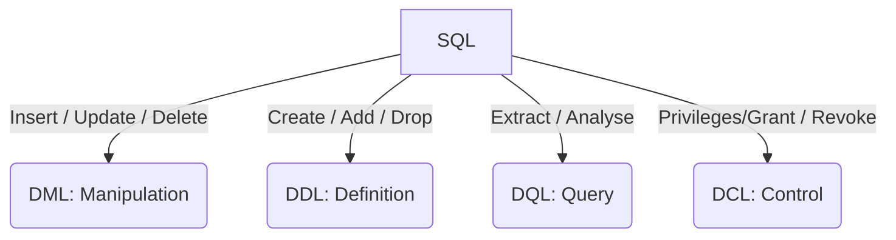

import Tabs from '@theme/Tabs';
import TabItem from '@theme/TabItem';

:::tip SQL
SQL is the foundational medium for interacting with relational databases, enabling data definition, manipulation, querying, and control.

- **Year developed:** 1974  
- **Primary purpose:** Querying, transforming, and managing structured data  
- **Target problem:** Extracting insights, enforcing structure, and maintaining relational integrity  
:::

---

## 🗺️ Context

### History
SQL (Structured Query Language) was developed by **Donald Chamberlin** and **Raymond Boyce** at IBM in the 1970s.  
It became the ANSI and ISO standard for relational databases and remains the backbone of transactional and analytical systems.

### Strengths & Limitations

**Strengths**
- Declarative: describe *what* you want, not *how*  
- Highly optimised by database engines  
- Standardised across vendors  
- Excellent for analytics, reporting, and relational modelling  

**Limitations**
- Vendor dialect differences (Postgres vs MySQL vs Oracle vs BigQuery)  
- Not suited for unstructured data  
- Complex queries can become unreadable  
- Performance tuning requires deep understanding of indexes and execution plans  

### TA‑Relevant Insights
- SQL reveals how data is structured, related, and consumed  
- Understanding joins, aggregates, and subqueries is essential for debugging data issues  
- SQL is often the “truth layer” in analytics and reporting  
- Many system boundaries are defined by database schemas  

---

## 🧠 Mental Model

### How to think in this environment
- SQL is **set‑based**, not procedural  
- Queries describe *desired results*, not step‑by‑step logic  
- The database engine decides the optimal execution path  
- Tables represent **entities**, joins represent **relationships**  
- Aggregations operate on **groups**, not rows  

### Ecosystem
- RDBMS: PostgreSQL, MySQL, Oracle, SQL Server  
- Cloud warehouses: BigQuery, Snowflake, Redshift  
- Tools: JDBC, ORM frameworks, BI tools  
- Concepts: ACID, indexing, query optimisation, schemas  

---

## 📚 Core Concepts



### **DBMS vs RDBMS vs BigQuery**

| DBMS | RDBMS | GCP BigQuery |
|------|--------|--------------|
| **Database Management System** | **Relational Database Modelling System** | **Data Warehouse** |
| CRUD operations | Enforces relational structure | Columnar storage for analytics |
| Flexible | Structured (rows & columns) | Tables & Views |
| No schema enforced | Keys define relationships | SQL interface |
| MongoDB, Redis | MySQL, PostgreSQL, Oracle | BigQuery tables, views |

### **Normalisation**
Ensures optimal structure and reduces duplication.

- **1NF:** Atomic values, no repeating groups  
- **2NF:** 1NF + full dependency on primary key  
- **3NF:** 2NF + no transitive dependencies

### **Views**
Virtual tables built from queries.  
Useful for abstraction, security, and simplifying complex logic.

---

## 🔁 Common Patterns

### Idioms
- `SELECT … FROM … WHERE …`  
- `JOIN` for relationships  
- `GROUP BY` for aggregates  
- `HAVING` for filtered aggregates  
- Subqueries for nested logic  
- `table.col1 || ' ' || table.col2` for concatenation  
- `SYSDATE` and `TO_CHAR()` for date formatting  

### Pitfalls
- Forgetting `GROUP BY` when using aggregates  
- Misusing `WHERE` vs `HAVING`  
- Cartesian joins from missing `ON` clauses  
- Using `SELECT *` in production  
- Not aliasing subqueries  

---

## 🧪 Examples

### **Basic SQL Commands**

```roomsql
-- CREATE TABLE
CREATE TABLE table_name (
    column1 NUMBER(6),
    column2 NUMBER(6),
    CONSTRAINT column1_column2_pk PRIMARY KEY (column1, column2)
);

-- DROP TABLE
DROP TABLE table_name;

-- INSERT
INSERT INTO table_name (column1, column2)
VALUES (value1, value2);

-- UPDATE
UPDATE table_name
SET column1 = value
WHERE condition;

-- DELETE
DELETE FROM table_name
WHERE condition;

COMMIT;
ROLLBACK;
```

### **Concatenation**

```roomsql
table.columnName || ' ' || otherColumnName AS NewName
```

### **Date Formatting**

```roomsql
SYSDATE
TO_CHAR(SYSDATE, 'DD-MM-YY HH24:MI:SS')
```

<Tabs>
<TabItem value="select" label="SELECT">

## SELECT

### SELECT
**Why used:** To retrieve specific data from a table.
**Example:** *Get all products in the catalogue.*

```sql
SELECT product_id, name, price
FROM products;
```

---

### SELECT DISTINCT
**Why used:** To remove duplicate values from results.
**Example:** *List unique customer countries.*

```sql
SELECT DISTINCT country
FROM customers;
```

---

### SELECT with WHERE
**Why used:** To filter rows based on conditions.
**Example:** *Find orders over £100.*

```sql
SELECT order_id, total_amount
FROM orders
WHERE total_amount > 100;
```

---

### SELECT with ORDER BY
**Why used:** To sort results.
**Example:** *Sort products by price descending.*

```sql
SELECT name, price
FROM products
ORDER BY price DESC;
```

---

### SELECT with LIMIT
**Why used:** To restrict the number of returned rows.
**Example:** *Show the top 5 most expensive products.*

```sql
SELECT name, price
FROM products
ORDER BY price DESC
LIMIT 5;
```

</TabItem>
<TabItem value="filtering" label="Filtering">

## Filtering & Conditions

### WHERE with AND / OR
**Why used:** To combine multiple conditions.
**Example:** *Find active UK customers.*

```sql
SELECT *
FROM customers
WHERE country = 'UK'
  AND status = 'ACTIVE';
```

---

### BETWEEN
**Why used:** To filter within a numeric or date range.
**Example:** *Find orders placed this week.*

```sql
SELECT *
FROM orders
WHERE order_date BETWEEN '2026-05-01' AND '2026-05-07';
```

---

### IN
**Why used:** To match against a list of values.
**Example:** *Find orders in specific statuses.*

```sql
SELECT *
FROM orders
WHERE status IN ('PENDING', 'PROCESSING');
```

---

### LIKE
**Why used:** To perform pattern matching on text.
**Example:** *Search for customers whose name starts with “Re”.*

```sql
SELECT *
FROM customers
WHERE name LIKE 'Re%';
```

---

### IS NULL / IS NOT NULL
**Why used:** To check for missing values.
**Example:** *Find products without a category assigned.*

```sql
SELECT *
FROM products
WHERE category_id IS NULL;
```

</TabItem>
<TabItem value="joins" label="Joins">

## Joins

### INNER JOIN
**Why used:** To return rows that match in both tables.
**Example:** *Get orders with their customer details.*

```sql
SELECT o.order_id, c.name
FROM orders o
INNER JOIN customers c
    ON o.customer_id = c.customer_id;
```

---

### LEFT JOIN
**Why used:** To return all rows from the left table, even if no match exists.
**Example:** *List all customers, including those with no orders.*

```sql
SELECT c.name, o.order_id
FROM customers c
LEFT JOIN orders o
    ON c.customer_id = o.customer_id;
```

---

### RIGHT JOIN
**Why used:** To return all rows from the right table.
**Example:** *List all orders, even if the customer record is missing.*

```sql
SELECT c.name, o.order_id
FROM customers c
RIGHT JOIN orders o
    ON c.customer_id = o.customer_id;
```

---

### FULL OUTER JOIN
**Why used:** To return all rows from both tables.
**Example:** *Combine two datasets with partial overlap.*

```sql
SELECT *
FROM table_a
FULL OUTER JOIN table_b
    ON table_a.id = table_b.id;
```

---

### CROSS JOIN
**Why used:** To produce every combination of rows (Cartesian product).
**Example:** *Generate all size–colour combinations for a product.*

```sql
SELECT s.size, c.color
FROM sizes s
CROSS JOIN colors c;
```

</TabItem>
<TabItem value="aggregations" label="Aggregations">

## Aggregations

### COUNT
**Why used:** To count rows.
**Example:** *Count number of active users.*

```sql
SELECT COUNT(*) AS active_users
FROM users
WHERE status = 'ACTIVE';
```

---

### SUM
**Why used:** To total numeric values.
**Example:** *Calculate total revenue.*

```sql
SELECT SUM(total_amount) AS revenue
FROM orders;
```

---

### AVG
**Why used:** To compute average values.
**Example:** *Average order value.*

```sql
SELECT AVG(total_amount) AS avg_order_value
FROM orders;
```

---

### MIN / MAX
**Why used:** To find smallest or largest values.
**Example:** *Find cheapest and most expensive product.*

```sql
SELECT MIN(price) AS cheapest, MAX(price) AS most_expensive
FROM products;
```

---

### GROUP BY
**Why used:** To aggregate data by category.
**Example:** *Total revenue per customer.*

```sql
SELECT customer_id, SUM(total_amount) AS revenue
FROM orders
GROUP BY customer_id;
```

---

### HAVING
**Why used:** To filter aggregated results.
**Example:** *Customers who spent more than £500.*

```sql
SELECT customer_id, SUM(total_amount) AS revenue
FROM orders
GROUP BY customer_id
HAVING SUM(total_amount) > 500;
```

</TabItem>
<TabItem value="subqueries" label="Subqueries">

## Subqueries

### Subquery in WHERE
**Why used:** To filter using results from another query.
**Example:** *Find customers who placed at least one order.*

```sql
SELECT *
FROM customers
WHERE customer_id IN (
    SELECT customer_id
    FROM orders
);
```

---

### Subquery in SELECT
**Why used:** To compute derived values.
**Example:** *Show each product with its total sales.*

```sql
SELECT p.product_id,
       p.name,
       (SELECT SUM(quantity)
        FROM order_items oi
        WHERE oi.product_id = p.product_id) AS total_sold
FROM products p;
```

---

### Subquery in FROM (Derived Table)
**Why used:** To simplify complex logic.
**Example:** *Get top‑spending customers.*

```sql
SELECT customer_id, revenue
FROM (
    SELECT customer_id, SUM(total_amount) AS revenue
    FROM orders
    GROUP BY customer_id
) t
WHERE revenue > 500;
```

</TabItem>
<TabItem value="dml" label="Insert / Update / Delete">

## Data Manipulation

### INSERT
**Why used:** To add new rows.
**Example:** *Add a new product.*

```sql
INSERT INTO products (name, price)
VALUES ('Notebook', 4.99);
```

---

### UPDATE
**Why used:** To modify existing rows.
**Example:** *Update product price.*

```sql
UPDATE products
SET price = 5.49
WHERE product_id = 101;
```

---

### DELETE
**Why used:** To remove rows.
**Example:** *Delete inactive users.*

```sql
DELETE FROM users
WHERE status = 'INACTIVE';
```

</TabItem>
<TabItem value="ddl" label="Create / Alter / Drop">

## Data Definition

### CREATE TABLE
**Why used:** To define a new table.
**Example:** *Create a product table.*

```sql
CREATE TABLE products (
    product_id INT PRIMARY KEY,
    name VARCHAR(100),
    price DECIMAL(10,2)
);
```

---

### ALTER TABLE
**Why used:** To modify an existing table.
**Example:** *Add a new column.*

```sql
ALTER TABLE products
ADD COLUMN stock INT DEFAULT 0;
```

---

### DROP TABLE
**Why used:** To permanently delete a table.
**Example:** *Remove a deprecated table.*

```sql
DROP TABLE old_logs;
```

</TabItem>

</Tabs>

---

## 📝 Glossary

- **DDL** — Data Definition Language  
- **DML** — Data Manipulation Language  
- **DQL** — Data Query Language  
- **DCL** — Data Control Language  
- **View** — virtual table  
- **Join** — combine rows from multiple tables  
- **Aggregate** — COUNT, SUM, AVG, MIN, MAX  
- **Subquery** — query inside another query  
